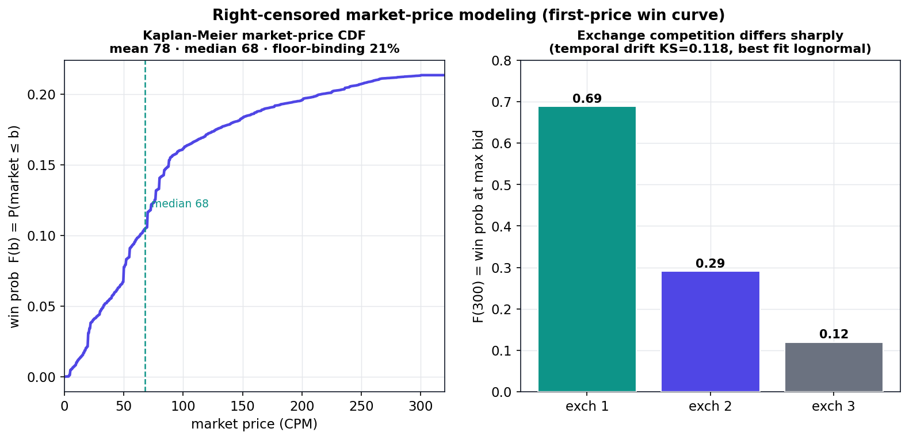
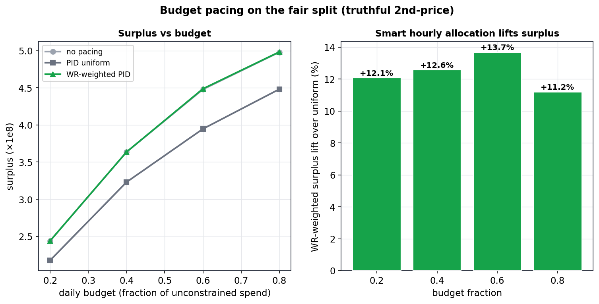
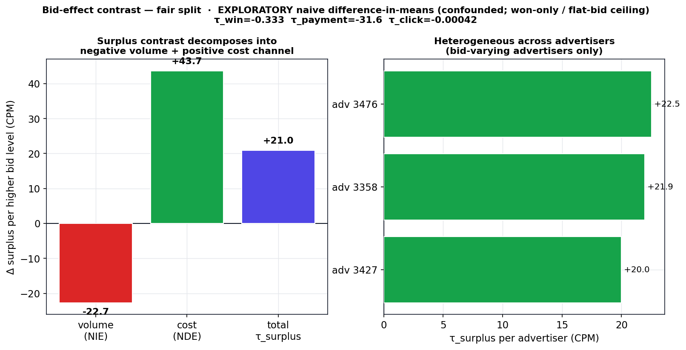

# 실시간 입찰(RTB)에서의 Win Selection Bias 디바이어싱

[🇺🇸 English](README.md) · 🇰🇷 **한국어**


> 경매로 인해 검열(censored)된 데이터에서 doubly-robust 3-tower 모델(`ESCM²-WC`)로 unbiased
> click-through rate를 복원하고, 그것이 정말로 더 나은 입찰로 이어지는지를 **정직하게** 측정한 프로젝트.
> 핵심 메시지는 **methodological rigor + falsification**이다. 모든 주장은 committed artifact에 못 박혀
> 있고, 첫 결과는 artifact로 판명되어 철회되었으며, 최종 verdict는 *선형 모델 대비 robust, 강한 GBM 대비
> not robust*로 보고된다.

<p align="center">
  
</p>

---

### 🧭 시간으로 둘러보기

| ⏱️ 30초 | 🔎 5분 | 🧪 30분 | ♻️ 재현 |
|---|---|---|---|
| [TL;DR](#-tldr-30초) · [핵심 결과 요약](#-핵심-결과-요약) | [문제](#문제--win-selection-bias) · [방법](#접근--escmwc) · [철회](#정직한-연구-아크) · [결과](#결과-5분) | [핵심 인사이트](#-핵심-인사이트) · [한계와 교훈](#-한계와-교훈) · [부록](#-부록) · [`technical_report.md`](docs/technical_report.md) | [빠른 시작](#빠른-시작--figure-재현) · [저장소 맵](#저장소-맵) · [`NUMBERS_LEDGER.md`](docs/NUMBERS_LEDGER.md) |

---

## ⏱️ TL;DR (30초)

실시간 입찰에서 bidder는 자신의 bid가 경매에서 **이겼을(won)** 때에만 click을 관측할 수 있다. winner만으로
click 모델을 학습하면 **selection-biased**되고, 편향된 pCTR은 곧 편향된 bid를 의미한다. 이 프로젝트는
unbiased pCTR을 복원하기 위해 **doubly-robust 디바이어싱 모델**(`ESCM²-WC`)을 만들고, 유일하게 중요한 질문을
던진다. **그것이 더 나은 입찰 의사결정을 만들어 내는가?**

- **Ranking — 그렇다.** *공정한(fair)* split에서 디바이어싱은 입찰이 쓰는 대상을 이긴다(winners-only AUC
  **0.658 > LGB 0.632 > LR 0.554**). 전체 ablation 사다리(LR → LGB → ESMM-WC → IPW → DR)가 하나의 split
  위에서 닫혔다.
- **Calibration — 완전히 해결.** Cross-fit isotonic이 global bias를 0으로 만들고(IEB **0.597 → 0**),
  광고주별 map이 잔차를 닫는다(**0.226 → 0.0006**). 둘 다 rank-preserving이다.
- **Bidding value — verdict가 갈린다.** Realized-surplus 이득은 **선형 LR 대비 robust**(광고주 5/5, CI가
  0 제외)이지만 **강한 GBM 대비 NOT robust**다. 그 우위는 광고주별로 이질적이며(**Cochran's Q I²=0.82**),
  5개 중 1개 광고주에서만 유의하고, 그 하나를 빼면 음수로 뒤집힌다.

> **이 프로젝트의 서사는 정직함이다.** 첫 헤드라인("neural 디바이어싱이 AUC에서 baseline을 이긴다")은
> **split artifact로 철회**되었다 — 우리 자신의 root-cause audit으로 잡아냈다 — 그리고 calibration과
> bidding surplus를 중심으로 다시 짜였다. 모든 숫자는 [`docs/NUMBERS_LEDGER.md`](docs/NUMBERS_LEDGER.md)에
> 살아 있다.

## 🎯 핵심 결과 요약

| # | 결과 | 값 | Split | 상태 |
|---|---|---|---|---|
| 1 | Winners-only AUC (neural / LGB / LR) | **0.658** / 0.632 / 0.554 | fair | canonical |
| 2 | Global calibration (neural winners IEB) | 0.597 → **0.000** | fair | canonical |
| 3 | 광고주별 잔차 IEB | 0.226 → **0.0006** | fair | canonical |
| 4 | **LR** 대비 decision value (truthful 2p) | **+27.4M**, CI [17.7M, 37.8M] ✓ | fair | **robust** |
| 5 | **LGB** 대비 decision value (truthful 2p) | +9.4M, CI [−11.1M, 40.7M] ✗ | fair | **not robust** (I²=0.82) |
| 6 | Full-inventory value V(π), neural | **4.39e8**, ≥99.26% exact | fair | canonical |
| 7 | 최적 bid-shading 전략 | truthful, surplus **5.13e8** | fair | canonical |
| 8 | Budget pacing (WR-weighted vs uniform) | **+11–14%** surplus | fair | canonical |
| 9 | CATE bid-effect / SCM bid→surplus | τ_surplus +21 / −0.066 (robust refutation) | fair | **exploratory** |

---

## 문제 — win selection bias

<p align="center">
  
</p>

bid는 **Bid → Win → Click** 퍼널을 통과한다. **129.5M** bid 중 **30.6M**만 경매에서 이겨
(impression이 되고, win rate ≈ 24%) 그 위에서만 click이 관측된다(**~23K**, CTR ≈ 0.075%). *진(lost)*
bid의 click 결과는 검열되므로, winner에서 측정할 수 있는 CTR은 모집단 CTR이 아니다. `P(click | win) ≠
P(click)`이다. 이 편향된 pCTR을 가치 추정 `V = pCTR × CPC`에 넣으면 bid도 편향된다. **디바이어싱**은
bidder가 가격을 매겨야 할 unbiased pCTR을 복원하는 것을 목표로 한다.

입찰이 향하는 시장은 heavy-tailed이고 right-censored다.

<p align="center">
  
</p>

Market price는 median **68** / mean **78** CPM, floor binding **21%**다. Kaplan-Meier win-rate 곡선
(max bid 300에서 right-censored)과 exchange별로 뚜렷이 다른 경쟁(F(300) = 0.69 / 0.29 / 0.12)이 이후의
bid-shading 모델을 이끈다.

## 접근 — `ESCM²-WC`

<p align="center">
  
</p>

[ESMM](https://arxiv.org/abs/1804.07931) / [ESCM²](https://arxiv.org/abs/2204.05125)를
impression→click→conversion 퍼널에서 **bid→win→click**으로 적응시켜, 공유 embedding trunk가 세 tower에
들어간다.

| Tower | 예측 | 역할 |
|---|---|---|
| **Win Tower** | `P(win \| x)` | 디바이어싱을 위한 propensity **이자** bid shading을 위한 win-rate 모델 (dual-purpose) |
| **CTR Tower** | `P(click \| win, x)` | doubly-robust(DR) weight로 학습되는 디바이어싱된 pCTR |
| **Imputation Tower** | `δ̂` (CTR error) | 추정량을 *doubly robust*하게 만드는 control variate |

DR 보정(`ŵ = win / P̂(win)`, clipped)은 propensity 모델 *또는* outcome 모델 중 하나만 맞아도 unbiased다.
**ESMM joint constraint** `P(click,win) = P(win)·P(click|win)`이 tower들을 묶는다. ablation 사다리는
**Biased LGB → ESMM-WC → ESCM²-WC (IPW) → ESCM²-WC (DR)**다.

## 정직한 연구 아크

<p align="center">
  
</p>

재설계 이전 프로그램은 prediction AUC를 쫓았고 디바이어싱이 logistic regression에 *진다*고 보고했다.
Root-cause audit은 그것이 **evaluation artifact**임을 보였다. train/test 광고주가 서로 disjoint였기 때문에
"LR 0.714"는 단 하나의 unseen 광고주에 올라탄 결과였고(그 광고주를 빼면 *모든* 모델이 ≈0.499, 즉 chance로
무너졌다). **공정한(fair)** 광고주별 시간 split에서는 artifact가 사라지고(LR 0.714→0.554, LGB
0.479→0.632), 방어 가능한 thesis는 raw ranking이 아니라 **calibration → bidding surplus**가 된다.

<p align="center">
  
</p>

---

## 결과 (5분)

### 1 · Ranking과 ablation 사다리

<p align="center">
  
</p>

공정한 split에서 모든 neural 디바이어싱 변형은 **~0.66 winners-only AUC**에 군집한다(모두 LR 0.554를 이기고,
LGB 0.632와 같거나 그 위). raw calibration은 크게 들쭉날쭉하지만(ESMM-WC IEB −37.8) **모든 rung이 IEB ≈ 0
으로 recalibrate된다**. DR은 AUC를 최고로 만들기 때문이 아니라 calibration→decision 파이프라인 때문에
primary 모델이다 — 깔끔한 monotone이 아니라 *군집된* 사다리에 대한 정직한 읽기다.

### 2 · Calibration — global 다음 광고주별, 완전히 해결

<p align="center">
  
</p>

Neural winners pCTR은 과소예측한다(IEB 0.597, 모든 decile이 낮음). **Cross-fit isotonic**(K=5, leak-free)이
global bias를 rank-preserving하게 0으로 만들고, **광고주별** map이 잔차를 **0.0006**까지(세 자릿수) 밀어내며
심지어 global AUC도 끌어올린다. Training-stage calibration은 테스트했고 **negative**다(ranking을 무너뜨리지
않고 calibrate하는 train-time knob이 없음). 저렴한 post-hoc isotonic이 답이다.

### 3 · Decision value — 선형 대비 robust, 강한 GBM 대비 아님

<p align="center">
  
</p>

Recalibrate된 pCTR을 실제 지불 가격 위의 **second-price** 경매에 가격으로 넣어(모델 간 mean value를 동일화)
realized surplus를 얻는다. 2p-optimal `truthful` 전략에서 neural은 **LR을 +27.4M**로 이기지만(cluster CI
[17.7M, 37.8M], **0 제외**) **LGB는 단 +9.4M**로만 이긴다(CI [−11.1M, 40.7M], **0 포함**). 이 페이지 맨
위의 forest plot이 *왜*인지를 해소한다. neural−LGB 우위는 **광고주별로 이질적**이고(I²=0.82, p=0.0002),
5개 중 2개에서 양수, 1개에서만 CI 유의(adv 3427, +13.9M)이며, **leave-one-advertiser-out은 평균을 음수로
뒤집는다**(−1.1M). **정직한 결론: 디바이어싱은 선형 모델 대비 입찰을 개선한다. 강한 GBM 대비로는 겉보기
이득이 단 한 광고주에서 나온 것이며 robust하지 않다.**

### 4 · Full-inventory value — won-only 한계는 거의 묶이지 않는다

<p align="center">
  
</p>

19.4M개 test bid 전체에 대해 second-price로 value를 투영한다. truthful bid는 logged flat bid보다 *아래*에
있어 각 정책은 *관측된* 부분집합을 다시 이긴다 — **모든 모델 value의 ≥99.26%가 exact**다(≤0.74%만 modeled).
Full-inventory gap은 won-only 결과와 일관된다(neural−LR +22.0M ✓, neural−LGB +9.7M ✗).

### 5 · Bid-shading 전략

<p align="center">
  
</p>

공정한 split에서 `truthful`(2p-optimal)이 realized surplus를 **5.13e8**로 최고로 만든다. 선형 α-sweep은
고전적인 win-rate/cost tradeoff를 그린다(α가 커질수록 surplus ↑, ROI ↓). Win Tower의 win-rate 모델
(AUC ≈ 0.91)과 exchange-conditional market CDF가 optimal/dual-regime 전략을 이끈다.

### 6 · Budget pacing

<p align="center">
  
</p>

24시간 주기에 대한 PID budget-pacing 컨트롤러. **WR-weighted hourly allocation은 budget 수준 전반에서
uniform pacing 대비 surplus를 +11–14% 끌어올린다** — 단순히 균등하게 쓰는 게 아니라 고가치 시간대로 더
똑똑하게 배분한 결과다.

### 7 · Causal 탐색 (CATE + SCM/DAG) — *hypothesis-generating*

<p align="center">
  
</p>
<p align="center">
  
</p>

bid를 treatment로 보고, naive within-advertiser 대조와 DoWhy backdoor 추정 둘 다 **bid → surplus ≈ −0.066**
(overpayment 효과; refutation 검정 모두 robust)과 *음의* volume 채널(τ_win < 0)을 찾는다. 이것들은
**confounded이고 exploratory**다 — iPinYou의 flat-bid logging과 won-only 검열은 신뢰할 만한 causal 추정을
데이터 천장에 묶어 둔다(문서화된 P1 NO-GO). causal claim이 아니라 hypothesis-generating으로 정직하게 보고한다.

### 8 · Serving

FastAPI bidder가 LR pCTR 모델 + exchange-conditional market CDF를 로드하고 전체 루프
(request → 30 features → pCTR → `V = pCTR × CPC` → bid shading → response)를 train/serve-skew 가드와 함께
**sub-100ms**로 돌린다. `src/serving/app.py` 참고.

---

## 💡 핵심 인사이트

- **진짜 효과 vs measurement artifact.** 철회(그리고 오해를 부르는 cluster mean을 대체한 heterogeneity
  분석)가 이 프로젝트의 핵심 역량이다 — "디바이어싱이 이긴다"가 언제 진짜인지(vs LR), 언제 단 한 광고주인지
  (vs LGB)를 아는 것.
- **Calibration ≠ ranking.** raw calibration은 모델 간 IEB −38에서 +0.6까지 걸쳐 있지만, 모두 ≈0으로
  recalibrate되고 ranking은 거의 불변이다 — post-hoc isotonic이 옳고 저렴한 도구다.
- **데이터에는 천장이 있다.** Flat-bid logging은 lost-inventory value와 bid-causal-effect를 식별 불가능하게
  만든다. 우리는 관측 가능한 것(policy value의 ≥99%)을 보고하고 나머지는 exploratory로 라벨링한다.

## ⚠️ 한계와 교훈

| 이슈 | 근거 | 완화 / 정직한 프레이밍 |
|---|---|---|
| Won-only surplus는 하한 | lost inventory 검열됨; F(b\|x)는 13% cell에서만 calibrate (P1 **NO-GO**) | policy value의 ≥99.26%가 exact; aggressive-policy value는 여기서 검정 불가 |
| 낮은 cluster power | 광고주 5개; MDE ~11.5M ≫ 관측 mean ~1.9M | 단일 cluster mean이 아니라 heterogeneity(I²=0.82) 보고 |
| neural−LGB not robust | 5개 중 2개 양수, CI-sig 1개; LOAO는 음수로 뒤집힘 | "디바이어싱이 이긴다"가 아니라 정직한 verdict로 기술 |
| CATE / SCM 미식별 | flat-bid + 검열됨; τ_win은 직관에 반함 | **exploratory / hypothesis-generating**으로 라벨링 |
| Ablation이 AUC에서 monotone 아님 | ESMM-WC 0.674 > DR 0.658 | DR은 AUC가 아니라 calibration/decision 때문에 primary; 있는 그대로 보고 |

## 🧪 부록

- **Ablation grid** (5개 rung 전체의 winners-AUC + IEB raw→recal) — [`NUMBERS_LEDGER.md §K`](docs/NUMBERS_LEDGER.md).
- **Sensitivity** — decision value는 CPC sweep {1e5, 2e5, 4e5}와 max-bid {300, 600}에서 부호 안정
  (`stage_b2_surplus.json`); bid-shading α-sweep과 pacing budget-sweep는 §L/§M.
- **Refutation 검정** — SCM bid→{surplus,win}은 random-common-cause / placebo / data-subset 통과 (§O).
- **Market modeling** — KM CDF, exchange-conditional, temporal drift KS=0.118, lognormal fit (§ market).
- 전체 evaluation contract: [`docs/evaluation_protocol.md`](docs/evaluation_protocol.md) (frozen).

---

## 저장소 맵

```
rtb_ipinyou/
├── src/
│   ├── data/ · features/                      bz2 logs → unified Parquet, 30 features
│   ├── models/    base · esmm_wc · escm2_wc    공유 trunk + Win/CTR/Imputation towers (DR/IPW)
│   ├── debiasing/ win_propensity · diagnostics propensity, ESS/overlap/positivity
│   ├── metrics/   calibration · cluster_inference  cross-fit isotonic, segment maps, Q/I²/MDE
│   ├── bidding/   shading · simulator · policy_value · pacing  shading + surplus eval + PID pacing
│   ├── causal/    cate · scm                   CATE, DAG refutation (exploratory)
│   ├── win_rate/  nonparametric · survival     Kaplan-Meier market CDFs
│   └── serving/   app.py                       FastAPI RTB bidder (<100ms)
├── scripts/
│   ├── train.py · preprocess.py · build_features.py
│   ├── stage_a/   recalibrate · stage_b2_surplus · power_analysis · policy_value ·
│   │              ablation_ladder · bidding_fair · pacing_fair · cate_fair · scm_fair
│   └── portfolio/ make_figures.py · make_diagrams.py
├── results/stage_a/  *.json ledgers + *_summary.md       (canonical, frozen)
├── results/figures/portfolio/  12 hero figures (committed JSON에서 재생성)
├── docs/   technical_report · evaluation_protocol · NUMBERS_LEDGER · GLOSSARY · archive/
└── assets/ *.svg concept diagrams (EN + .ko)
```

## 빠른 시작 — figure 재현

포트폴리오 figure/diagram은 **committed result JSON에서** 재생성된다 — 학습이나 데이터 접근 불필요:

```bash
pip install -e ".[dev]"                       # 또는: pip install matplotlib numpy
python scripts/portfolio/make_figures.py      # → results/figures/portfolio/*.png  (12 figures)
python scripts/portfolio/make_diagrams.py     # → assets/*.svg (+ .ko)
```

강화된 실험은 공정한 split 위에서 재실행된다(CPU, committed prediction에서):
`python scripts/stage_a/{bidding_fair,pacing_fair,cate_fair,scm_fair,ablation_ladder}.py`. 전체 파이프라인
(preprocess → features → train → evaluate): [`docs/scripts_tutorial.md`](docs/scripts_tutorial.md).

## 기술 스택

JAX/Flax (neural towers, SPMD multi-GPU) · LightGBM (baselines + propensity) · scikit-learn (isotonic,
diagnostics) · EconML / DoWhy (causal) · Hydra + Typer (config/CLI) · matplotlib (figures). Python 3.12.

## 데이터셋 & 출처

[**iPinYou** RTB dataset](http://contest.ipinyou.com/) (2013, seasons 2–3), iPinYou가 연구용으로
라이선스하며 여기에 **재배포하지 않는다**(`.gitignore` 참고). 방법: Ma et al., *ESMM* (SIGIR 2018);
Wang et al., *ESCM²* (SIGIR 2022). Causal tooling: Athey & Wager causal forests; Chernozhukov et al. DML;
DoWhy.

## 참고문헌

- Ma et al., *Entire Space Multi-Task Model (ESMM)*, SIGIR 2018.
- Wang et al., *ESCM²: Entire Space Counterfactual Multi-Task Model*, SIGIR 2022.
- Athey & Wager, *Generalized Random Forests*, 2018 · Chernozhukov et al., *Double/Debiased ML*, 2018.
- Zhang et al., *Real-Time Bidding Benchmarking with the iPinYou Dataset*.

## 라이선스

코드는 [MIT License](LICENSE) 하에 있다. iPinYou 데이터셋은 **포함되지 않으며** iPinYou의 약관을 따른다.
