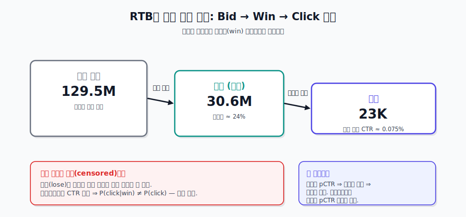
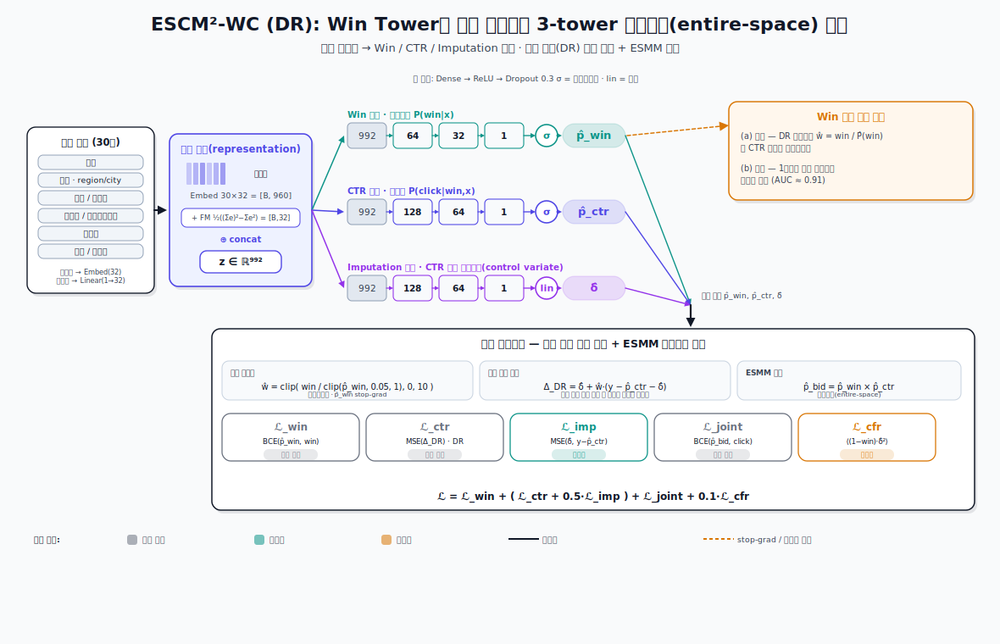
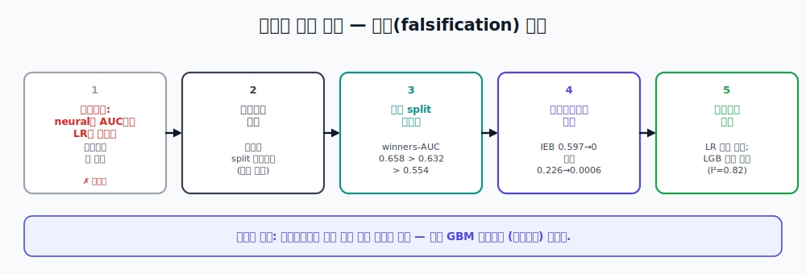

# RTB 승리 선택 편향(Win Selection Bias) 디바이어싱

[English](README.md) · **한국어**

> 경매로 검열된(censored) 데이터에서 비편향 클릭률을 복원하는 이중 강건(doubly-robust) 3-tower 모델 —
> 그리고 그것이 *정말로* 더 나은 입찰로 이어지는지에 대한 정직한 측정.

<p align="center">
  
</p>

---

## 한눈에 (30초)

RTB에서 입찰자는 자신의 입찰이 경매에서 **낙찰(win)**되었을 때만 클릭을 관측한다. 낙찰자만으로 클릭 모델을
학습하면 **선택 편향**이 생기고, 편향된 pCTR은 곧 편향된 입찰을 낳는다. 이 프로젝트는 비편향 pCTR을 복원하는
**이중 강건 디바이어싱 모델**(`ESCM²-WC`)을 만들고, 입찰자에게 유일하게 중요한 질문을 던진다 —
**그래서 더 나은 입찰 결정을 내리는가?**

우리 스스로의 실수 두 개를 바로잡은 뒤의 정직한 답:

- **랭킹 — 그렇다.** *공정(fair)* split에서 디바이어싱은 입찰과 직결된 대상에서 승리한다
  (낙찰자 한정 AUC **0.658 > LGB 0.632 > LR 0.554**).
- **캘리브레이션 — 완전히 해결.** 교차적합 등위(cross-fit isotonic) 재보정이 전역 편향을 0으로 만들고
  (IEB **0.597 → 0**), 광고주별 매핑이 잔차를 닫는다(**0.226 → 0.0006**). 둘 다 순위 보존.
- **입찰 가치 — 갈린 결론(split verdict).** 디바이어싱의 실현 잉여 이득은 **선형 LR baseline 대비 강건**
  (광고주 5/5, 클러스터 CI가 0 제외)하지만 **강한 GBM(LGB) 대비로는 강건하지 않다** — 그 우위는 광고주마다
  이질적(**Cochran Q I²=0.82**)이고, 5개 중 1개 광고주에서만 유의하며, 그 광고주를 빼면 음수로 뒤집힌다.

> **이 프로젝트의 진짜 주제:** *실제 효과*와 *측정 아티팩트*를 구별하는 규율. 첫 헤드라인("neural
> 디바이어싱이 AUC에서 baseline을 이긴다")은 split 아티팩트로 **철회**되었고 — 우리 자신의 근본원인 감사로
> 적발 — 캘리브레이션과 입찰 잉여 중심으로 재정의되었다. 모든 수치는
> [`docs/NUMBERS_LEDGER.md`](docs/NUMBERS_LEDGER.md)의 커밋된 산출물에 고정되어 있다.

---

## 문제 — 승리 선택 편향

<p align="center">
  
</p>

입찰은 **입찰 → 낙찰 → 클릭** 퍼널을 거친다. **1억 2,950만** 입찰 중 **3,060만**만 낙찰되어(노출이 되고),
그 위에서만 클릭(**약 2.3만**, CTR ≈ 0.075%)을 관측한다. *패찰*한 입찰의 클릭 결과는 검열되므로, 낙찰자에서
측정한 CTR은 모집단 CTR이 아니다: `P(click | win) ≠ P(click)`. 이 편향된 pCTR을 가치 `V = pCTR × CPC`에 넣으면
입찰도 편향된다. **디바이어싱**은 입찰자가 실제로 가격을 매겨야 할 비편향 pCTR 복원을 목표로 한다.

## 접근 — `ESCM²-WC` (이중 강건, 3-tower)

<p align="center">
  
</p>

[ESMM](https://arxiv.org/abs/1804.07931) / [ESCM²](https://arxiv.org/abs/2204.05125)를 노출→클릭→전환
퍼널에서 **입찰→낙찰→클릭**으로 적응시켜, 공유 임베딩+MLP 트렁크를 세 타워로 분기한다:

| 타워 | 예측 | 역할 |
|---|---|---|
| **Win 타워** | `P(win \| x)` | 디바이어싱 성향점수 **그리고** 비드 셰이딩 낙찰률 모델 (이중 활용) |
| **CTR 타워** | `P(click \| win, x)` | 이중 강건(DR) 가중치로 학습한 비편향 pCTR |
| **Imputation 타워** | `δ̂` (CTR 오차) | 추정량을 *이중 강건*하게 만드는 오차 모델 |

**이중 강건(DR)** 보정(`w = win / P̂(win)`, 클리핑)은 성향점수 *또는* 결과 모델 중 하나만 맞아도 비편향이며,
**ESMM 결합 제약** `P(click,win) = P(win)·P(click|win)`이 타워들을 묶는다. Ablation 사다리는
**Biased LGB → ESMM-WC → ESCM²-WC (IPW) → ESCM²-WC (DR)**.

## 정직한 연구 아크

<p align="center">
  
</p>

<p align="center">
  
</p>

재설계 이전 프로그램은 예측 AUC를 좇았고 디바이어싱이 로지스틱 회귀에 *진다*고 보고했다.
[근본원인 감사](docs/NUMBERS_LEDGER.md#c-the-retraction--the-original-negative-result-was-an-artifact)는
이것이 **평가 아티팩트**임을 보였다: train/test 광고주가 분리되어 있어 "LR 0.714"는 보지 못한 단일 광고주에
올라탄 값이었고(그 광고주를 제외하면 *모든* 모델이 ≈0.499, 우연 수준으로 붕괴). **공정**한 광고주별 시간 split
에서는 아티팩트가 사라지고(LR 0.554로 하락, LGB 0.632로 상승), 방어 가능한 명제는 **캘리브레이션 → 입찰 잉여**가
된다(원시 랭킹이 아니라).

---

## 결과 (5분)

### 1 · 랭킹 — 디바이어싱이 입찰 대상에서 승리

<p align="center">
  
</p>

공정 split에서 neural은 **낙찰자 한정 AUC**(`P(click | win)` — 입찰자가 정렬하는 대상: **0.658** vs
LGB 0.632, LR 0.554)에서 앞선다. 쉬운 음성(easy negative)이 지배하는 전체입찰 AUC에서는 뒤지지만(LGB 0.720),
그것은 입찰이 사용하는 대상이 아니다.

### 2 · 캘리브레이션 — 전역 그리고 광고주별, 완전 해결

<p align="center">
  
</p>

neural 모델은 낙찰자 pCTR을 과소예측한다(10/10 분위 모두 낮음, IEB 0.597). **교차적합 등위 재보정**
(K=5, 누수 없음, GPU 0)은 세 모델 모두의 전역 편향을 순위 보존하며 0으로 만든다. 단일 전역 매핑은 광고주별
편향(잔차 최대 0.226)을 못 고치므로, **광고주별 등위 매핑**이 잔차를 **0.0006**으로 — 세 자릿수 — 끌어내리고
전역 AUC까지 끌어올린다. 학습 단계 캘리브레이션은 검증 결과 **음성**(어떤 학습 노브도 랭킹을 무너뜨리지 않고는
캘리브레이션하지 못함)이며, 값싼 사후 등위 보정이 정답이다.

### 3 · 입찰 가치 — 선형 대비 강건, 강한 GBM 대비로는 아님

<p align="center">
  
</p>

재보정된 pCTR을 **2차가격** 경매에 실제 지불가격으로 가격화하면(모델 간 평균 가치를 동일화해 차이가 순수
랭킹+슬라이스 캘리브레이션이 되도록) 실현 잉여가 나온다. 2차가격 최적 `truthful` 전략에서 neural은
**LR을 +27.4M**(클러스터 CI [17.7M, 37.8M], **0 제외**)로 이기지만 **LGB는 +9.4M**(클러스터 CI
[−11.1M, 40.7M], **0 포함**)로만 앞선다.

이 페이지 상단의 forest plot이 *왜*인지를 보여준다: neural−LGB 우위는 **광고주마다 이질적**이고
(Cochran Q I²=0.82, p=0.0002), 5개 중 2개에서 양수, 1개(3427, +13.9M)에서만 유의하며, **광고주 1개 제외 시
평균이 음수로 뒤집힌다**(3427 제외 → −1.1M). 반면 neural−LR 우위는 5개 모두 양수다. **정직한 결론:
디바이어싱은 선형 모델 대비 입찰을 개선한다; 강한 GBM 대비로는 명백한 이득이 단일 광고주일 뿐 강건한 효과가
아니다.**

### 4 · 전체 인벤토리 가치 — 낙찰자 한정 한계는 거의 묶이지 않는다

<p align="center">
  
</p>

낙찰자 한정 잉여는 검열된 추정량이므로, 전체 1,940만 테스트 입찰에 대해 2차가격으로 **전체 인벤토리** 가치를
투영한다. truthful 입찰가가 로깅된 고정 입찰가보다 *낮으므로* 각 정책은 *관측된* 부분집합을 재낙찰한다:
**모든 모델 가치의 ≥99.26%가 정확값**(≤0.74%만 모델 추정). 전체 인벤토리 격차는 낙찰자 한정 결과와 **일치**한다
— neural−LR +22.0M (CI 0 제외), neural−LGB +9.7M (CI 0 포함).

---

## 정직한 한계

- **낙찰자 한정 평가는 보수적 하한이다.** 진짜 *패찰* 인벤토리(로깅된 고정 입찰가보다 높은 공격적 입찰)는
  여기서 검정 불가: 고정 입찰가 로깅이 맥락 시장 모델 `F(b|x)`를 식별 불가능하게 만든다(13% 셀만 보정 —
  문서화된 **NO-GO**).
- **낮은 클러스터 검정력.** 광고주 클러스터 CI는 **광고주 5개**(공유 어휘 모집단 전체)에만 기반한다. 설계의
  MDE(~11.5M)가 관측된 광고주별 평균(~1.9M)을 초과하므로, 작은 동질적 neural−LGB 효과가 존재해도 검출되지
  못한다.
- **잡음이 아닌 이질성.** neural−LGB 산포는 진짜 광고주 간 이질성(I²=0.82)이므로 단일 클러스터 평균은 잘못된
  요약이다 — 점추정이 아니라 분포로 보고한다.

이는 설계상 앞에 명시한다; 이 프로젝트의 가치는 *정직한 범위 설정*이지 부풀린 승리가 아니다.

---

## 저장소 구조

```
rtb_ipinyou/
├── src/
│   ├── data/         parser.py · unifier.py            (bz2 로그 → 통합 Parquet)
│   ├── features/     engineering.py                    (30개 피처, 타깃 인코딩)
│   ├── models/       base.py · esmm_wc.py · escm2_wc.py (공유 트렁크 + 타워, DR/IPW 손실)
│   ├── debiasing/    win_propensity.py · diagnostics.py (성향점수, ESS/중첩)
│   ├── metrics/      calibration.py                     (cross_fit_isotonic, 세그먼트 매핑)
│   ├── bidding/      shading.py · simulator.py · policy_value.py (비드 셰이딩 + 잉여 평가)
│   ├── causal/       cate.py · scm.py                   (CATE, DAG refutation)
│   └── distributed/  mesh.py · data_loader.py · checkpoint.py (JAX SPMD)
├── scripts/
│   ├── preprocess.py · build_features.py · train.py
│   ├── stage_a/      recalibrate · stage_b2_surplus · stage4_calibration · segment_calibration · policy_value · power_analysis
│   └── portfolio/    make_figures.py · make_diagrams.py   (본 포트폴리오 figure/다이어그램)
├── results/
│   ├── stage_a/      *.json ledger + *_summary.md       (정본, frozen)
│   └── figures/      분석 figure + portfolio/           (큐레이션된 hero figure)
├── docs/             technical_report.md · evaluation_protocol.md · NUMBERS_LEDGER.md · GLOSSARY.md
└── assets/           *.svg 개념 다이어그램 (EN + .ko)
```

## 빠른 시작 — 포트폴리오 figure 재현

포트폴리오 figure와 다이어그램은 **커밋된 결과 JSON에서만** 생성된다 — 모델 학습이나 데이터 접근 불필요:

```bash
pip install -e ".[dev]"                       # 또는: pip install matplotlib numpy
python scripts/portfolio/make_figures.py      # → results/figures/portfolio/*.png
python scripts/portfolio/make_diagrams.py     # → assets/*.svg (+ .ko)
```

전체 연구 파이프라인(전처리 → 피처 → 학습 → 평가)은
[`docs/scripts_tutorial.md`](docs/scripts_tutorial.md)에 문서화되어 있다.

## 심화 자료

| 문서 | 내용 |
|---|---|
| [`docs/technical_report.md`](docs/technical_report.md) | 전체 방법 + 결과 기술 (30분 레이어) |
| [`docs/NUMBERS_LEDGER.md`](docs/NUMBERS_LEDGER.md) | 모든 헤드라인 수치 → 커밋된 출처 + 교정 사항 |
| [`docs/evaluation_protocol.md`](docs/evaluation_protocol.md) | 동결된 불변 평가 계약 |
| [`docs/GLOSSARY.md`](docs/GLOSSARY.md) | 이중언어 용어 기준 (디바이어싱, IEB, I², DR/IPW, …) |
| [`results/stage_a/README.md`](results/stage_a/README.md) | 기계 판독 산출물 색인 |

## 기술 스택

JAX/Flax (neural 타워, SPMD 멀티 GPU) · LightGBM (baseline + 성향점수) · scikit-learn (등위, 진단) ·
Hydra + Typer (config/CLI) · matplotlib (figure). Python 3.12.

## 데이터셋 & 출처

[**iPinYou** RTB 데이터셋](http://contest.ipinyou.com/) (2013, 시즌 2–3). 데이터셋은 iPinYou가 연구용으로
라이선스하며 **본 저장소에 재배포하지 않는다**(`.gitignore` 참조). 방법은 Ma et al., *ESMM* (SIGIR 2018)과
Wang et al., *ESCM²* (SIGIR 2022)에서 적응.

## 라이선스

코드는 [MIT License](LICENSE)로 배포된다. iPinYou 데이터셋은 본 라이선스에 **포함되지 않으며** iPinYou 약관을
따른다.
