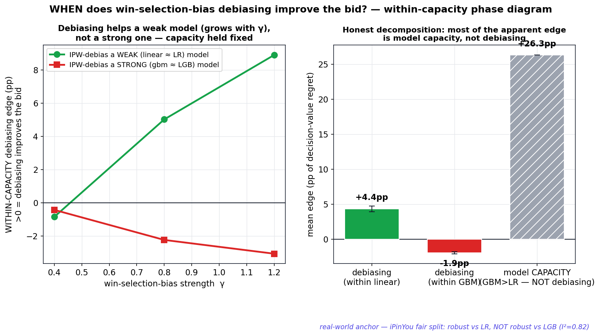
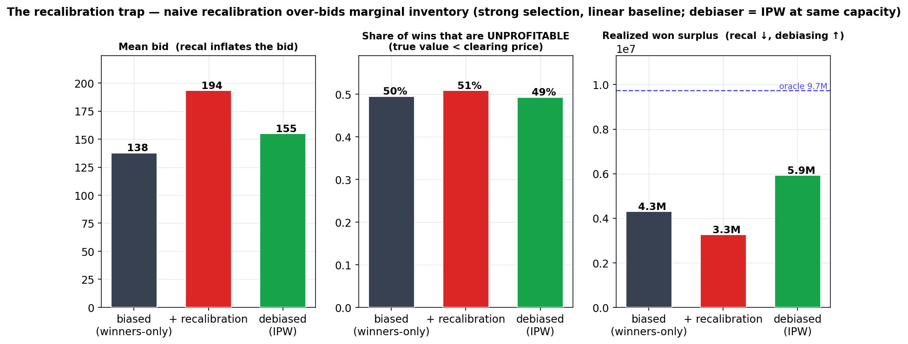

# 디바이어싱은 *언제* 입찰을 바꾸는가?

[🇺🇸 English](README.md) · 🇰🇷 **한국어**


> **Decision-layer 질문.** RTB의 win-selection-bias 디바이어싱은 이미 *풀린 방법*이다
> (ESMM/ESCM², win-tower-as-propensity). 열린 질문은 **그게 *언제* 입찰을 실제로 바꾸는가** — AUC가 아니라
> 의사결정 가치로 — **그리고 편향 모델을 단순 recalibration하면 왜 full inventory에서 역효과인가**이다.
> 통제 가능한 **semi-synthetic testbed**(ground-truth pCTR + *관측 가능한* lost inventory, 실 iPinYou 시장
> 통계 calibration)로 **regime phase diagram**을 그리되, 디바이어싱 효과를 **모델 용량에서 분리**한다.
> 실제 iPinYou 결과가 그 *음성 절반*이다.

<p align="center">
  
</p>

---

### 🧭 시간으로 탐색

| ⏱️ 30초 | 🔎 5분 | 🧪 30분 | ♻️ 재현 |
|---|---|---|---|
| [TL;DR](#-tldr-30초) · [주장 한눈에](#-주장-한눈에) | [질문](#질문--decision-layer) · [C1 phase diagram](#c1--경쟁자-강도가-payoff를-지배-within-capacity) · [C2 recalibration trap](#c2--recalibration-trap) | [`methods.md`](methods.md) · [`review.md`](review.md) · [정직한 scope](#-정직한-scope) | [`MANIFEST.md`](MANIFEST.md) · [`repro/`](repro/) · [Foundation → `old/`](#foundation--ipinyou-연구-old) |

---

## ⏱️ TL;DR (30초)

bidder는 *이긴* 입찰에서만 click을 본다. winners로만 pCTR을 학습 → selection bias → 편향된 입찰.
디바이어싱은 *모델*을 고친다 — 그런데 그게 입찰 *의사결정*을 바꾸는가, 그리고 언제인가? iPinYou 실데이터는
이 질문에 답할 수 없다(flat-bid 로깅이 lost inventory를 검열). 그래서 lost inventory가 **관측 가능한**
testbed를 만들고, 결정적으로 **모델 용량을 고정**해 디바이어싱 효과가 "더 센 모델이 이긴다"와 섞이지 않게 한다.

- **C1 — 경쟁자 강도가 payoff를 지배 (within capacity).** 모델 클래스를 고정하면, IPW 디바이어싱은
  **약한(linear ≈ LR)** 모델을 돕는다 — 의사결정 regret 평균 **+4.4pp**, selection이 셀수록 증가
  (강한 selection에서 **+15.4pp**) — 그러나 **강한(GBM ≈ LGB)** 모델은 **못 돕는다**(**−1.9pp**). 이는
  실제 iPinYou 부호(robust vs LR, NOT vs LGB, I²=0.82)와 일치. GBM-debiaser를 linear baseline과 비교해 나오는
  훨씬 큰 **+26.3pp**는 **디바이어싱이 아니라 모델 용량** — 별도 보고하며 디바이어싱 결과로 쓰지 않는다.
- **C2 — Recalibration trap.** 편향 모델을 그냥 recalibration하면 **입찰가가 부풀고**(이 셀 137.8→193.5;
  seed 평균 **+42.7%**), *unprofitable* inventory를 더 따내 surplus가 **하락**(4.31M→3.26M). 원칙적인 IPW
  디바이어싱은 레벨 인플레 없이 surplus를 **회복**(5.92M). 5/5 seeds robust.

> **기여는 새 방법이 아니라 characterization** — *real but thin* — 이라서 디바이어싱이 **도움이 안 되는**
> 영역을 명시하는 것이 본질이다. 진짜 **DR** 추정량까지 구현해, 이 testbed에서 **DR이 단순 IPW를 못 이겼음**
> (−2.6pp)을 숨기지 않고 보고한다. 모든 수치는 committed witness JSON에 고정([`MANIFEST.md`](MANIFEST.md)),
> [`repro/`](repro/)가 재확인한다.

## 🎯 주장 한눈에

| # | 주장 | 헤드라인 (within capacity) | Witness | 상태 |
|---|---|---|---|---|
| C1 | 디바이어싱 edge는 경쟁자 강도에 의존 | IPW **+4.4pp** vs 약 / **−1.9pp** vs 강 (capacity gap **+26.3pp** 별도) | `witnesses/phase_diagram.json` | **확인** (합성, 10 seeds) |
| C2 | recalibration이 marginal inventory를 과입찰 | surplus **4.31M→3.26M**(recal) vs **5.92M**(IPW), 5/5 seeds | `witnesses/recal_trap.json` | **확인** (합성) |
| — | 진짜 DR이 IPW를 **못 이김** | linear 내 **−2.6pp** (숨기지 않고 보고) | `witnesses/phase_diagram.json` | 정직 음성 |
| ⚓ | 실세계 anchor (음성 절반) | robust vs LR, **NOT** vs LGB, **I²=0.82** | [`old/`](old/) (iPinYou fair-split) | canonical |

---

## 질문 — decision layer

디바이어싱 *방법*은 **Foundation**(선점)이다: win-tower-as-propensity (MTAE, CIKM'21),
ESMM/ESCM² 추정량 (SIGIR'18/'22), "디바이어싱이 평균적으로 입찰을 돕는다" (BGD, KDD'16). 어떤 선행도 그
보정이 **언제** 입찰 *의사결정*을 바꾸는지, **얼마나 강한** 경쟁자 대비인지를 plot하지 않았다 — 그리고 그
지점이 실제 iPinYou 프로젝트가 천장에 부딪힌 곳이다: flat-bid 로깅이 lost inventory를 검열해 결정적 반사실이
대부분 셀에서 **관측 불가**다.

그래서 이를 **통제 가능한 semi-synthetic testbed**([`methods.md`](methods.md))로 옮긴다: features
x ∈ ℝ⁸ → **nonlinear** ground-truth pCTR; **market price = iPinYou median(68 CPM) calibration lognormal**;
win-selection-bias knob (강도 γ, 이질성 θ); 그리고 — 핵심 — **click + price가 모든 입찰(낙찰·패찰)에 대해
관측된다.** metric = full-inventory **decision-value regret**.

## C1 — 경쟁자 강도가 payoff를 지배 (within capacity)

디바이어싱을 용량에서 분리하기 위해 **고정된 모델 클래스 안에서** 디바이어싱하고 같은 capacity에서
`regret(biased) − regret(debiased)`를 비교한다. capacity gap(GBM이 LR을 이김)은 *별도* 보고 — 디바이어싱 아님.

| | within **linear** (≈ LR) | within **GBM** (≈ LGB) |
|---|---|---|
| **IPW 디바이어싱 edge** (평균, 10 seeds) | **+4.4pp** | **−1.9pp** |
| ↳ selection 강도 γ = 0.4 → 0.8 → 1.2 | −0.8 → +5.0 → **+8.9pp** | ≈ 0 / 약간 − |
| ↳ 강한 selection 셀 (γ=1.2, θ=0) | **+15.4pp** | — |
| 모델 **CAPACITY** gap (lin-biased − gbm-biased) | **+26.3pp** — *디바이어싱 아님* | — |

고정 모델 클래스 안에서 IPW 디바이어싱은 **selection이 약하지 않으면** *약한* 모델을 돕고(약한 selection에선
≈0/약간 음수) selection이 셀수록 커지지만, **강한 GBM은 못 돕는다**(−1.9pp). 이 비대칭은 iPinYou fair-split 결론 — *robust vs LR, NOT robust vs LGB,
I²=0.82* — 과 **부호가 같다**(단 실제 메커니즘=광고주 이질성은 다르므로 "같은 방향"이라 하고 "메커니즘 동일"은
주장하지 않는다). figure는 **+26.3pp capacity gap을 회색 별도 막대**로 그려 디바이어싱 효과로 오인되지 않게 한다.

## C2 — Recalibration trap

솔깃한 해법 — 편향 모델을 recalibration — 은 **함정**이다. 강한 selection + linear baseline
(`recal_trap.json:linear_strong`, γ=1.2):

<p align="center">
  
</p>

| | biased | + recalibration | debiased (IPW) | oracle |
|---|---|---|---|---|
| mean bid | 137.8 | **193.5** ↑ | 154.8 | — |
| unprofitable-win share | 0.495 | **0.509** | 0.493 | — |
| won surplus | 4.31M | **3.26M** ↓ | **5.92M** | 9.74M |

recalibration은 예측의 *레벨*을 올려 입찰가를 부풀리고(이 셀 137.8→193.5; seed 평균 **+42.7%**),
true value < clearing price인 *marginal* inventory를 따내 surplus가 **하락**(4.31M→3.26M)한다. IPW
디바이어싱은 레벨 인플레 없이 *shape*를 고쳐 surplus를 **회복**(5.92M; linear는 비선형 oracle 9.74M에 도달 못함).
**Robust:** 5 seeds에서 recal은 surplus를 낮추고(5/5) IPW는 높였다(5/5). 강한 GBM 대비
(`recal_trap.json:gbm_strong`)에선 trap이 약하다 — C1과 일관.

---

## 🔬 정직한 scope

이 연구는 `[sketch · 합성검증]`이다. 솔직히 말하면([`review.md`](review.md)):

- **방향교정.** 이전 버전은 "+24.2pp 디바이어싱 edge vs linear"를 헤드라인으로 썼는데 이는 **용량과
  디바이어싱을 혼동**한 것이다. 이번 버전은 **within-capacity** 디바이어싱(+4.4 / −1.9pp)을 분리하고 capacity
  gap(+26.3pp)을 별도로 보고한다. 조용히 고치지 않고 교정을 명시한다.
- **방법이 아니다.** 새 추정량/식별 결과가 아니다 — Foundation. 기여는 디바이어싱이 *언제/왜* 입찰을 바꾸는지를
  **competitor-strength** 축에서 **특성화**한 것이다.
- **음성 영역을 보고한다.** 디바이어싱은 강한 GBM을 **못 이기고**, 진짜 **DR은 IPW를 못 이겼다**(−2.6pp),
  recalibration이 보편적으로 나쁜 것도 아니다. 실 iPinYou anchor도 동등 비중.
- **Semi-synthetic.** 일반화는 phase diagram의 *경계*에 한정, truthful 2nd-price 중심.
- **Full result로 가는 경로:** ESCM²-WC neural anchor (GPU), Open-Bandit-Dataset OPE sanity anchor,
  recalibration 과입찰 조건의 작은 정리, strategy/budget 축.

## Foundation — iPinYou 연구 (`old/`)

동기가 된 선행 연구는 [**`old/`**](old/)에 있다: 실 iPinYou RTB 데이터의 **win-selection-bias 디바이어싱
포트폴리오** 전체 — ESCM²-WC (doubly-robust 3-tower), calibration 스토리(global IEB 0.597 → 0; 광고주별
잔차 → 0.0006), 그리고 **정직한 연구 arc**(첫 AUC 헤드라인을 split artifact로 retraction). 그 결정적이고
*정직한* 결론 — **디바이어싱의 입찰 가치는 linear LR 대비 robust지만 강한 GBM 대비 NOT robust (I²=0.82)** —
가 바로 이 testbed가 부호로 재현하는 실세계 **음성 절반**이다. 거기서의 데이터 천장(검열된 lost inventory)이 이
연구를 관측 가능한 testbed로 옮긴 *이유*다.

## 저장소 맵

```
README.md / README.ko.md   ← flagship front (EN / KO twin)
concept.md                 ← 1-pager: 동기 → 검증 가능 주장
methods.md                 ← testbed · models · results (수치 = witness JSON)
review.md                  ← 정직한 scoping · 선행연구 위치 · full paper 경로
MANIFEST.md                ← canonical 맵: witness JSON → 주장 → figure
witnesses/                 ← 본 연구
  phase_diagram.py + .json     C1 (within-capacity competitor-strength sweep, 10 seeds)
  recal_trap.py + .json        C2 (recalibration trap, 5-seed robustness)
  probe_*.py + .json           de-risk probe (GO)
  figures/make_figures.py      JSON → figure
repro/check.py             ← green harness: JSON에서 C1 + C2 재확인
old/                       ← Foundation: iPinYou 디바이어싱 연구 (실세계 anchor)
```

## ♻️ 재현

```bash
pip install -r requirements.txt
python witnesses/phase_diagram.py      # → witnesses/phase_diagram.json  (10 seeds)
python witnesses/recal_trap.py         # → witnesses/recal_trap.json
python witnesses/figures/make_figures.py
python repro/check.py                  # GREEN — canonical JSON에서 C1 + C2 재확인
```

모든 수치는 witness JSON에서 verbatim, figure·표는 거기서 재생성된다. 주장 → witness → figure 맵은
[`MANIFEST.md`](MANIFEST.md) 참조.
