# First-Price Bid Optimization: iPinYou RTB 사례 연구

## 요약

본 보고서는 Real-Time Bidding (RTB) 환경에서 First-price 입찰 최적화의 방법론과 실험 결과를 기술한다. iPinYou RTB 데이터셋의 4,228,166건 won impression에 대해 7개 bidding 전략을 오프라인 시뮬레이션으로 비교하였다.

**핵심 공식:**

```
bid(x) = V(x) × shade(x) × pace(t)
```

- `V(x)`: Impression value = debiased_pCTR × CPC_target
- `shade(x)`: Market price CDF 기반 최적 bid shading factor
- `pace(t)`: PID controller 기반 budget pacing multiplier

**주요 결과:**

- **iPinYou flat-bid baseline**: Surplus **-805M** CPM (10.14× overpayment, ROI 0.74)
- **Dual-regime shading (best)**: Surplus **+128M** CPM (2.77× overpayment, ROI 3.26)
- **Optimal KM shading**: Surplus +119M CPM (3.44× overpayment, **ROI 3.36**)
- **핵심 발견**: Floor-aware dual-regime shading이 가장 높은 surplus 달성. Win rate를 100%에서 38%로 줄이는 대신 surplus를 **933M CPM 개선** (negative → positive)

---

## 1. 서론: RTB와 Bid Optimization

### 1.1 RTB 생태계

RTB(Real-Time Bidding)는 웹페이지의 광고 노출(impression)을 실시간 경매로 거래하는 메커니즘이다. 사용자가 웹페이지를 방문하면, 그 순간 광고 자리(ad slot)에 대한 경매가 진행되어 가장 높은 입찰가를 제시한 광고주의 광고가 표시된다. 이 전 과정이 **100ms 이내**에 완료된다.

**주요 참여자:**

| 역할 | 명칭 | 기능 |
|------|------|------|
| 광고주 대리인 | DSP (Demand-Side Platform) | 광고주를 대신해 입찰가 결정 |
| 매체 대리인 | SSP (Supply-Side Platform) | 매체의 광고 자리를 경매에 등록 |
| 거래소 | ADX (Ad Exchange) | DSP와 SSP를 연결, 경매 진행 |

DSP의 핵심 과제는 각 bid request에 대해 "이 impression에 얼마를 지불할 것인가"를 실시간으로 결정하는 것이다. 이것이 **bid optimization** 문제의 본질이다.

### 1.2 Second-Price에서 First-Price으로의 전환

경매 메커니즘에 따라 최적 bidding 전략이 근본적으로 달라진다.

**Second-Price Auction (과거 주류, ~2017):**

낙찰자가 **2등 입찰가**를 지불한다. 이 경우 자신의 진짜 가치(value)만큼 정직하게 입찰하는 것이 이론적 최적 전략이다 (truthful bidding). 100을 입찰하고 2등이 70이면, 70만 지불하여 30의 이윤(surplus)을 얻는다.

```
Second-price 예시:
  내 가치: 100 CPM
  내 입찰: 100 CPM (= 가치, truthful)
  2등 입찰: 70 CPM
  → 낙찰, 지불 = 70, surplus = 30 ✓
```

**First-Price Auction (현재 주류, 2019~):**

낙찰자가 **자신의 입찰가 그대로** 지불한다. 이 경우 가치만큼 입찰하면 이윤이 0이 된다. Google Ad Exchange가 2019년 first-price으로 전환한 것이 결정적 전환점이었다 (Ou et al., 2024).

```
First-price 예시 (문제):
  내 가치: 100 CPM
  내 입찰: 100 CPM (= 가치, truthful)
  → 낙찰, 지불 = 100, surplus = 0 ← 이윤 없음!

First-price 예시 (해결):
  내 가치: 100 CPM
  내 입찰: 70 CPM (= 가치 × 0.7, shaded)
  2등 입찰: 60 CPM
  → 낙찰, 지불 = 70, surplus = 30 ✓
```

이처럼 first-price에서는 가치보다 낮게 입찰해야 이윤을 확보할 수 있다. 이를 **bid shading**이라 한다.

### 1.3 iPinYou 데이터셋

iPinYou 데이터셋은 2013년 중국 DSP의 실제 RTB 로그로, bid optimization 연구의 사실상 표준 벤치마크이다 (Ou et al., 2024; Zhang et al., 2014).

| 항목 | 값 |
|------|-----|
| **총 Bids** | 129,493,498 (Season 2+3) |
| **Impressions (Won)** | 30,589,137 (Win Rate 23.67%) |
| **Clicks** | 23,058 (CTR 0.0752%) |
| **Test Set** | 19,424,025 bids, 4,234,318 won |
| **iPinYou 입찰 방식** | Flat-bid: 277 또는 294 CPM (2종류만) |
| **Market Price** | Median 68, Mean 78, P90 166, P95 214 CPM |
| **Floor Price** | Median 40 CPM, 32.24% floor binding |
| **Ad Exchange** | 4개 (Exchange 1~4) |
| **Test Advertisers** | 4개 (2259, 2261, 2821, 2997) |

iPinYou의 flat-bid 전략은 모든 impression에 277 또는 294 CPM을 동일하게 입찰한다. Market price 중앙값이 68 CPM인 점을 고려하면 **평균 4배 이상의 overpayment**이 발생하며, 이는 bid optimization의 필요성을 극명히 보여준다.

### 1.4 프로젝트 구조

본 프로젝트는 3단계 파이프라인으로 구성된다:

```
SP1: Prediction (완료)          SP2: Win Rate (완료)          SP3: Bid Optimization (본 보고서)
─────────────────────          ─────────────────────          ──────────────────────────────
ESCM²-WC(DR) model             Kaplan-Meier CDF               Value → Shading → Pacing
  → debiased pCTR                → market price F(b)            → optimal bid(x)
  → Win Tower (AUC 0.91)         → exchange-conditional          → surplus maximization
```

SP1에서 얻은 **debiased pCTR** (win selection bias 보정)이 impression value의 핵심이며, SP2에서 추정한 **market price CDF**가 최적 bid shading의 입력이다.

---

## 2. 방법론: Impression Value 계산

### 2.1 Value의 정의

Impression value V(x)는 "이 광고 노출이 광고주에게 얼마의 가치가 있는가"를 나타낸다. CPC (Cost-Per-Click) 캠페인에서는:

```
V(x) = pCTR(x) × CPC_target
```

- **pCTR(x)**: impression x에 대한 predicted click-through rate
- **CPC_target**: 광고주가 클릭 1회에 지불하는 최대 금액

본 프로젝트에서 CPC_target = **200,000 CPM/click** (= 클릭 1회당 200 CPM 기준)으로 설정하였다. 이는 평균 CTR 0.08%일 때 V_TRUE = 0.0008 × 200,000 = **160 CPM**으로, market price 중앙값 68 CPM과 비교하여 합리적인 수준이다.

### 2.2 Debiased pCTR의 중요성

CTR 예측 모델의 **calibration**(보정 정확도)이 입찰 최적화에 결정적이다. Calibration이 나쁜 모델은 pCTR을 과대/과소 추정하여 V(x)를 왜곡하고, 이는 직접적으로 overbidding 또는 underbidding으로 이어진다.

SP1에서 확인한 calibration 영향:

| 모델 | IEB (calibration error) | Overbid 배수 | 경제적 영향 |
|------|----------------------|-------------|-----------|
| **ESCM²-WC(DR)** | **0.014** (best) | 1.0× (oracle) | Surplus 최대 |
| LR CTR_all | 0.122 | 8.7× | Surplus 2.2% 손실 |
| LGB CTR (biased) | 0.362 | 25.9× | Surplus 2.2% 손실 |
| ESMM-WC | 1.335 | 95× | Surplus 14.7% 손실 |

ESCM²-WC(DR) 모델은 IEB 0.014으로 거의 완벽한 calibration을 보이며, biased LGB 모델 (winners-only 학습) 대비 **25.9배 적은 overbidding**을 달성한다. 이 결과는 "AUC가 높은 모델 ≠ bidding에 최적인 모델"이라는 중요한 시사점을 제공한다.

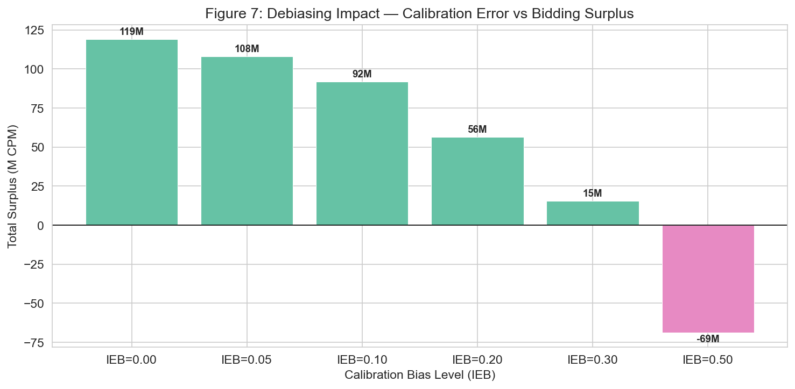
*Figure 1. Calibration bias (IEB)가 bidding surplus에 미치는 영향. IEB가 클수록 V(x)를 과대추정하여 surplus가 감소한다.*

### 2.3 V(x) 분포 분석

ESCM²-WC(DR)의 debiased pCTR로 계산한 impression value 분포:

| 통계 | V(x) (CPM) | Market Price 비교 |
|------|-----------|-----------------|
| Mean | 96.9 | 시장가 평균(78) 대비 24% 높음 |
| Median | 73.1 | 시장가 중앙값(68) 대비 7.5% 높음 |
| Std | 96.3 | 높은 분산 (CTR 예측의 불확실성) |
| V > Market Median (68) | 52.6% | 절반 이상의 impression이 잠재적 수익 |

V(x) 분포가 market price 분포와 겹치는 영역이 넓을수록 bid shading의 여지가 크다. V(x) > market_price인 impression에서만 bidding하면 모든 win이 positive surplus를 생성한다.

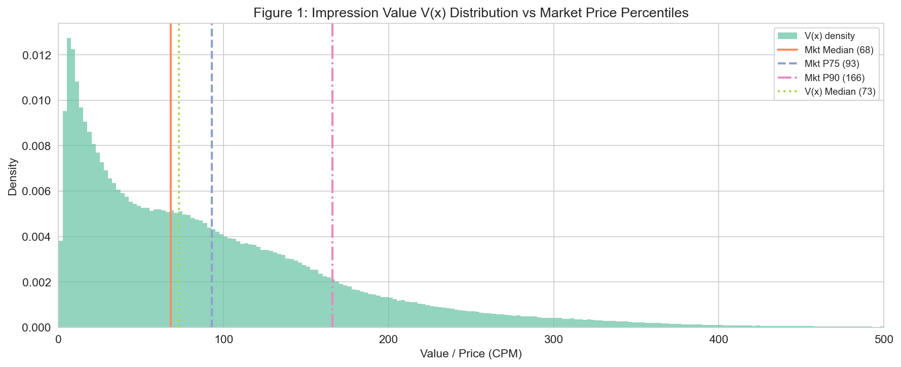
*Figure 2. Impression value V(x) 분포와 market price 백분위수 비교. 수직선은 market price 중앙값(68), P75(93), P90(166).*

---

## 3. 방법론: Bid Shading

### 3.1 왜 Bid Shading이 필요한가

First-price auction에서 입찰자의 목표는 **expected surplus** (기대 이윤)를 최대화하는 것이다:

```
Expected Surplus = (V - bid) × P(Win | bid)
                   ─────────   ───────────
                    마진         낙찰 확률
```

- `bid`를 올리면: 낙찰 확률 ↑, 마진 ↓
- `bid`를 낮추면: 낙찰 확률 ↓, 마진 ↑

두 상반된 효과의 균형점이 **최적 bid**이다.

### 3.2 Market Price CDF: 경쟁 환경 이해

최적 bid를 계산하려면 "bid b로 입찰했을 때 낙찰될 확률"을 알아야 한다. 이것이 market price CDF(누적분포함수)이다:

```
F(b) = P(market_price ≤ b) = "bid b 이상이면 낙찰될 확률"
```

iPinYou 데이터에서 market price CDF는 **Kaplan-Meier** 추정으로 구한다. Won impression은 market_price(= payprice)가 관측된 "event"이고, lost impression은 market_price > bidprice인 "right-censored" 관측이다. 생존 분석의 censoring 처리가 핵심이다.

**iPinYou Market Price CDF 특성:**

| 지표 | 전체 | Exchange 1 | Exchange 2 | Exchange 3 |
|------|------|-----------|-----------|-----------|
| F(300) | 21.3% | 68.8% | 29.1% | 11.9% |
| Median | ∞ (미도달) | 153 CPM | ∞ | ∞ |
| 분포 형태 | 우측 heavy tail | 상대적 경쟁 약 | 중간 | 경쟁 치열 |

F(300) = 21.3%는 "300 CPM을 입찰해도 낙찰 확률이 21.3%에 불과"함을 의미한다. 전체 CDF의 median이 무한대인 것은 heavy right-censoring (76%의 lost bids에서 market_price가 관측되지 않음) 때문이다.

### 3.3 최적 입찰 공식 (Distribution-Based Shading)

Distribution-based shading (Ou et al., 2024, Sec 6.2.1)은 market price CDF를 이용하여 expected surplus를 최대화하는 bid를 수치적으로 계산한다:

```
b* = argmax_b  (V - b) × F(b)
     subject to  min_bid ≤ b ≤ V
```

이 함수 (V - b) × F(b)는 통상적으로 **단일 전역 최대값**(unique global maximum)을 가지며, log-normal, gamma, truncated-normal 분포에서 이론적으로 증명되었다 (Pan et al., 2020; Wang et al., 2021).

본 프로젝트에서는 KM CDF 위에서 1,000개 bid 후보를 grid search하여 argmax를 구한다. 4.2M impression에 대해 약 6초의 연산 시간이 소요된다.

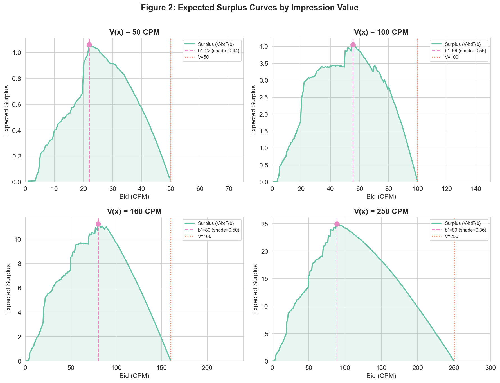
*Figure 3. V = 50, 100, 160, 250 CPM에서의 expected surplus curve (V - b) × F(b). 각 V에 대해 optimal bid b*가 표시되어 있다. V가 클수록 optimal bid도 높지만, shading factor (b*/V)는 감소한다.*

### 3.4 Linear Shading

Distribution-based 방식 외에 가장 널리 사용되는 실무적 접근법은 **linear shading**이다 (Ou et al., 2024, Eq.5):

```
b = α × V(x),  α ∈ (0, 1)
```

α = 1이면 truthful bidding (surplus 0), α가 작을수록 aggressive shading이다.

**Alpha 민감도 분석** (본 프로젝트 실험 결과):

| α | Win Rate | Clicks | Surplus (M CPM) | ROI |
|---|----------|--------|----------------|-----|
| 0.4 | 27.4% | 1,332 | 117.7 | **3.44** |
| 0.5 | 32.6% | 1,516 | 112.4 | 2.77 |
| 0.6 | 37.1% | 1,702 | 100.1 | 2.38 |
| 0.7 | 41.3% | 1,844 | 83.4 | 2.07 |
| 0.8 | 45.1% | 1,980 | 63.7 | 1.84 |
| 0.9 | 48.7% | 2,142 | 41.5 | 1.70 |
| 1.0 | 51.8% | 2,266 | 17.7 | 1.56 |

α = 0.4~0.5 구간이 Pareto optimal zone으로, ROI와 surplus 모두에서 효율적이다. 그러나 distribution-based optimal shading (ROI 3.36, surplus 119M)이 linear α=0.4 (ROI 3.44, surplus 118M)보다 더 높은 surplus를 달성하며, market 구조를 반영하는 이점이 있다.

### 3.5 Shading Factor 분석

Optimal shading factor (shade = b*/V)는 V(x)에 따라 달라진다:

- **V가 작을 때** (V ≈ market price): 보수적 shading (shade ≈ 0.5~0.6). Win이 중요하므로 value 가까이 입찰.
- **V가 클 때** (V >> market price): 공격적 shading (shade ≈ 0.2~0.3). 마진이 충분하므로 낮게 입찰해도 이윤.

이는 경제학의 직관과 일치한다: 가치가 높은 재화일수록 할인 여지가 크다.

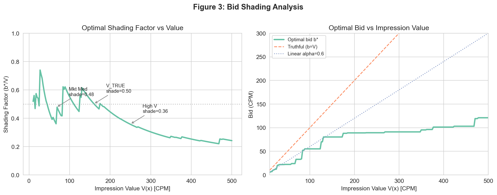
*Figure 4. Optimal shading factor (b*/V)와 optimal bid as function of V. V가 클수록 shading factor가 감소하며 (더 aggressive shading), optimal bid는 완만하게 증가한다.*

### 3.6 Exchange-Conditional Shading

4개 ad exchange는 경쟁 강도가 크게 다르다. 동일한 V(x)에 대해서도 exchange에 따라 optimal bid가 **2~8배** 차이난다:

| Exchange | F(300) | Median | 경쟁 수준 | 최적 전략 |
|----------|--------|--------|---------|----------|
| Exchange 1 | 68.8% | 153 CPM | 약 (가장 경쟁 적음) | 공격적 shading 가능 |
| Exchange 2 | 29.1% | ∞ | 중간 | 중간 수준 shading |
| Exchange 3 | 11.9% | ∞ | 강 (가장 경쟁 치열) | 보수적, 높은 bid 필요 |
| Exchange 4 | N/A | N/A | N/A | Overall CDF fallback |

Exchange 1에서는 300 CPM 입찰로 68.8% 확률로 낙찰되지만, Exchange 3에서는 같은 입찰로 11.9%에 불과하다. Exchange-conditional shading은 이러한 이질성을 활용하여 exchange별로 다른 shading factor를 적용한다.

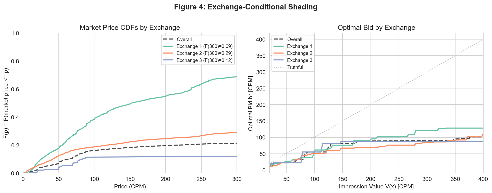
*Figure 5. Exchange별 KM CDF 비교와 exchange-conditional optimal bid.*

### 3.7 Dual-Regime Shading

본 프로젝트의 EDA에서 발견된 핵심 패턴: won impression의 **약 50.7%**에서 market price가 floor price(최저 경매가)에 근접한다 ("floor binding"). 이 구간에서는 경쟁이 아닌 floor price가 지불가를 결정하므로, 일반적인 shading과 다른 전략이 필요하다.

**Dual-Regime 설계:**

```
if floor-bound (slotprice > 0 and slotprice > V × 0.1):
    bid = floor_price × 1.05    ← floor 바로 위에 입찰 (overpayment 최소화)
else:
    bid = optimal_bid(V, CDF)   ← 표준 distribution-based shading
```

- **Floor-bound regime (50.7%)**: Market price ≈ floor이므로, floor보다 약간 높게 입찰하면 낙찰 가능하면서 overpayment을 최소화한다.
- **Competitive regime (49.3%)**: Floor가 없거나 미미한 경우, 표준 optimal shading을 적용한다.

이 이중 체제(dual-regime) 전략이 실험에서 **최고 surplus (+127.7M)**을 달성했으며, overpayment ratio 2.77로 모든 전략 중 **최저**였다.

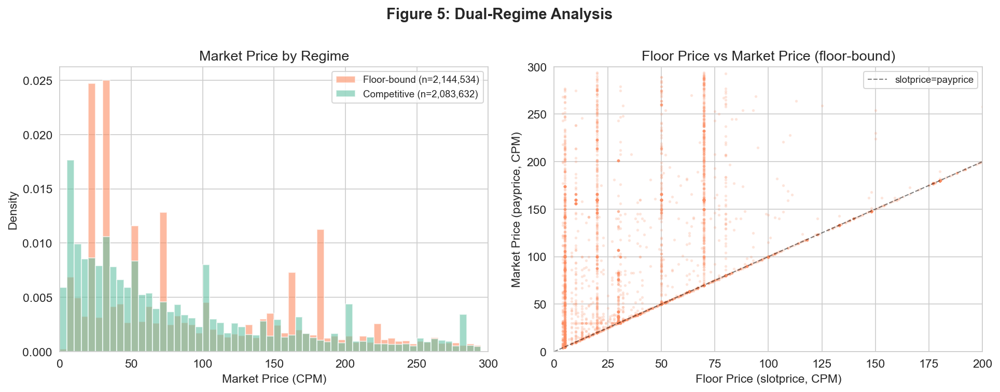
*Figure 6. Floor-bound vs Competitive regime의 market price 분포와 shading 전략 비교.*

---

## 4. 방법론: Budget Pacing

### 4.1 왜 예산 관리가 필요한가

광고주는 일일 예산 한도가 있다. 예산 관리 없이 입찰하면 두 가지 문제가 발생한다:

1. **조기 소진**: 오전에 모든 예산을 소진하면 오후의 더 가치 있는 impression 기회를 놓친다.
2. **비효율적 분배**: 경쟁이 치열한(= market price가 높은) 시간대에 예산을 낭비하면, 경쟁이 약한 시간대에 더 많은 impression을 확보할 수 있었던 기회를 잃는다.

### 4.2 PID Controller

본 프로젝트는 **PID (Proportional-Integral-Derivative) Controller**를 예산 관리에 적용한다 (Ou et al., 2024, Sec 5.1.2, Eq.10). PID는 제어 이론에서 가장 널리 사용되는 피드백 제어기로, 광고 업계에서도 budget pacing의 표준 접근법이다.

**PID 원리 (직관적 설명):**

에어컨의 온도 조절과 유사하다:
- **목표**: 하루 예산을 24시간에 걸쳐 균등하게 소진
- **관측**: 매 시간 실제 소진액
- **제어**: 과소 소진이면 입찰 강도↑, 과다 소진이면 입찰 강도↓

```
error(t) = ideal_spent(t) - actual_spent(t)

PID output:
  ϕ = Kp × error           (현재 오차에 비례하여 보정)
    + Ki × Σ error          (누적 오차를 보상)
    + Kd × Δerror/Δt        (오차 변화 추세를 예측)

multiplier = clip(1 + ϕ / normalization, [0.3, 2.0])
```

- error > 0 (과소 소진) → multiplier > 1 → 입찰 강화
- error < 0 (과다 소진) → multiplier < 1 → 입찰 억제
- multiplier는 [0.3, 2.0] 범위로 클리핑하여 극단적 행동 방지

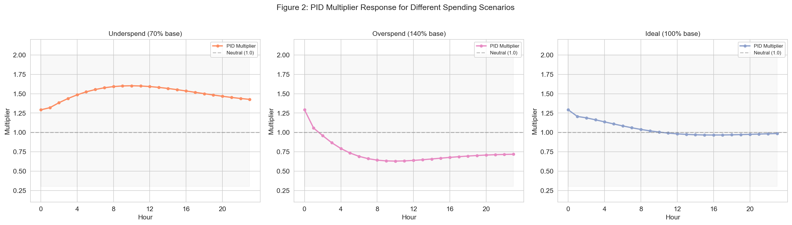
*Figure 7. PID controller의 동작 메커니즘. 3가지 시나리오 (과소/과다/이상적 소진)에서의 multiplier 반응.*

### 4.3 시간대별 Win Rate 패턴

iPinYou 데이터의 시간대별 win rate는 뚜렷한 **U-shape 패턴**을 보인다:

```
시간대별 Win Rate (EDA 확인):
  새벽 (0-5시):  ~43% (경쟁 약, 효율적 예산 사용)
  오전 (6-11시): ~15-25% (경쟁 증가)
  오후 (12-17시): ~8.6% (경쟁 최고, 비효율적)
  저녁 (18-23시): ~15-30% (경쟁 완화)
```

이 패턴을 활용한 **WR-weighted pacing**은 경쟁이 낮은 시간대에 예산을 집중하여 동일 예산으로 더 많은 impression을 확보한다.

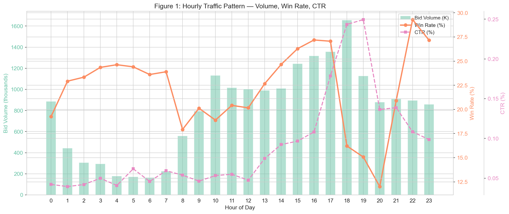
*Figure 8. 시간대별 bid volume, win rate, CTR. Win rate의 U-shape 패턴이 뚜렷하며, 새벽(0-5시)의 높은 win rate가 WR-weighted pacing의 근거이다.*

### 4.4 통합 입찰 공식

최종 입찰가는 3개 독립 모듈의 곱으로 산출된다:

```
bid(x) = V(x) × shade(x) × pace(t)
         ────   ────────   ────────
         ① 가치   ② 최적 할인  ③ 예산 조절
```

1. **V(x)** ← SP1 prediction model (ESCM²-WC(DR) debiased pCTR × CPC_target)
2. **shade(x)** ← SP2 market price CDF (KM estimate, argmax (V-b)×F(b))
3. **pace(t)** ← Budget controller (PID, 시간대별 multiplier)

3개 모듈이 독립적이므로, 각각을 개별적으로 개선하거나 교체할 수 있다 (modular design).

---

## 5. 실험 설계

### 5.1 Won-Only 시뮬레이션

iPinYou 데이터에서 lost bids의 market_price는 관측되지 않으므로 (right-censored), **won impressions만으로 시뮬레이션**한다. 이는 가장 defensible한 접근법이다.

| 항목 | 값 |
|------|-----|
| 시뮬레이션 대상 | Won impressions (payprice > 0) |
| 표본 수 | 4,228,166 |
| Total clicks | 4,482 |
| Auction type | **First-price** (bid = payment if win) |
| Market price | payprice (관측된 2nd highest bid) |

시뮬레이션에서 `bid ≥ market_price`이면 낙찰, first-price에서 `payment = bid`이다.

### 5.2 비교 전략

| # | 전략 | 설명 | 출처 |
|---|------|------|------|
| 1 | **iPinYou Flat** | 원본 flat-bid (277/294 CPM) | Baseline |
| 2 | **Truthful** | bid = V(x) | 경제 이론 (surplus = 0 기대) |
| 3 | **Linear α=0.8** | bid = 0.8 × V(x) | Ou et al. Eq.5 |
| 4 | **Linear α=0.6** | bid = 0.6 × V(x) | 민감도 분석 |
| 5 | **Optimal KM** | argmax (V-b) × F_km(b) | Ou et al. Sec 6.2.1 |
| 6 | **Optimal Exchange** | Exchange별 CDF 적용 | 본 프로젝트 |
| 7 | **Dual-Regime** | Floor-aware + competitive | 본 프로젝트 (EDA-driven) |

### 5.3 평가 지표

| 지표 | 정의 | 의미 |
|------|------|------|
| Win Rate | n_wins / n_bids | 낙찰 비율 |
| Total Clicks | Σ click × win | 획득 클릭 수 |
| Total Surplus | Σ (V - payment) × win | 총 경제적 이윤 (CPM) |
| Overpayment Ratio | mean((bid - market) / market) for wins | 시장가 대비 초과 지불 배수 |
| Avg CPC | total_spend / total_clicks | 클릭당 평균 비용 |
| ROI | (clicks × CPC_target) / total_spend | 투자 수익률 |

---

## 6. 결과

### 6.1 핵심 전략 비교

| 전략 | Win Rate | Clicks | Surplus (M CPM) | Overpayment | Avg CPC (K) | ROI |
|------|----------|--------|-----------------|-------------|-------------|-----|
| **iPinYou Flat** | **100.0%** | **4,482** | **-805.1** | 10.14× | 271.0 | 0.74 |
| Truthful | 51.8% | 2,266 | +17.7 | 5.79× | 127.8 | 1.56 |
| Linear α=0.8 | 45.1% | 1,980 | +63.7 | 5.25× | 108.4 | 1.84 |
| Linear α=0.6 | 37.1% | 1,702 | +100.1 | 4.58× | 83.9 | 2.38 |
| Optimal KM | 33.2% | 1,480 | +119.0 | 3.44× | 59.5 | **3.36** |
| Optimal Exchange | 33.7% | 1,486 | +120.8 | 3.38× | 61.7 | 3.24 |
| **Dual-Regime** | 37.9% | 1,608 | **+127.7** | **2.77×** | 61.3 | 3.26 |

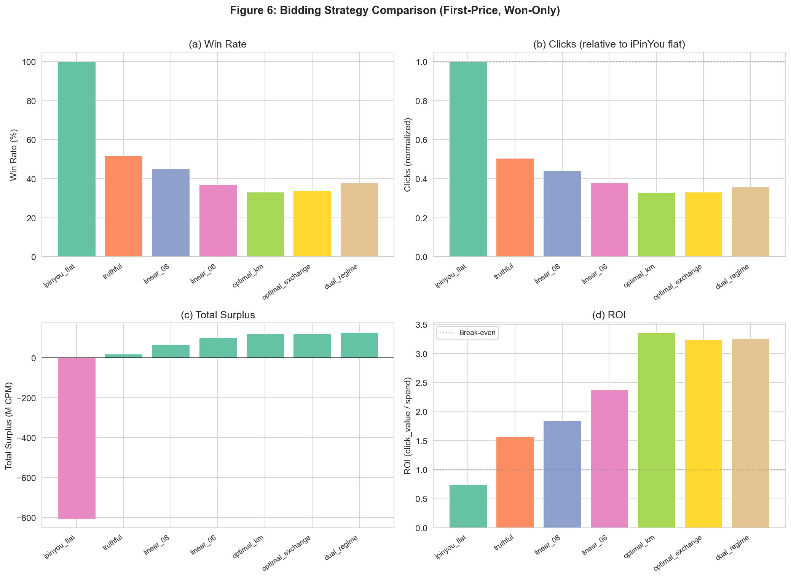
*Figure 9. 7개 bidding 전략의 핵심 지표 비교. Dual-regime이 가장 높은 surplus와 가장 낮은 overpayment을 달성한다.*

### 6.2 핵심 발견 해석

**1. iPinYou flat-bid의 비효율성:**

iPinYou의 flat-bid 전략 (277/294 CPM)은 100% win rate를 달성하지만 surplus가 **-805M CPM**으로, 지불액이 impression value를 크게 초과한다. Overpayment ratio 10.14는 "시장가 대비 10배를 더 지불"함을 의미한다. 이는 bid shading 없이 고정 입찰하는 전략의 근본적 한계를 보여준다.

**2. Truthful bidding의 한계:**

Bid = V(x)로 입찰하면 second-price에서는 이론적 최적이지만, first-price에서는 surplus가 17.7M으로 미미하다. 낙찰 시 V(x) 전액을 지불하므로 마진이 거의 없다.

**3. Shading의 극적 효과:**

Linear α=0.6부터 surplus가 100M을 넘어선다. Optimal KM은 win rate를 33%로 줄이는 대가로 surplus 119M, ROI 3.36을 달성한다. 이는 **"win rate를 포기하고 수익성을 극대화"**하는 전략이다.

**4. Dual-regime의 우위:**

Dual-regime 전략은 floor-bound impression (50.7%)에서 floor 바로 위에 입찰하여 overpayment을 최소화하면서, competitive impression에서는 optimal shading을 적용한다. 결과적으로 optimal KM 대비 **win rate 4.7%p 높고**, **surplus 8.7M 더 높으며**, **overpayment 0.67 더 낮다**.

**5. Win Rate vs Surplus Trade-off:**

iPinYou flat (100% WR, -805M surplus)에서 dual-regime (37.9% WR, +128M surplus)으로의 전환은 win rate를 62.1%p 줄이지만 surplus를 **933M CPM 개선**한다. 이는 "모든 impression을 이기는 것"보다 "이길 가치가 있는 impression만 이기는 것"이 압도적으로 효율적임을 보여준다.

### 6.3 Debiasing의 경제적 영향

Calibration error (IEB)가 입찰 성과에 미치는 영향을 정량화하기 위해, 다양한 수준의 calibration bias를 시뮬레이션하였다. IEB가 0에서 0.5로 증가하면 overbidding으로 인한 surplus 손실이 급격히 증가한다.

이 결과는 SP1 (prediction model)과 SP3 (bid optimization)의 연결고리를 확인해준다: **정확한 CTR 예측 → 정확한 V(x) → 효율적 bidding → 높은 surplus**. AUC가 높더라도 calibration이 나쁘면 bidding 성과가 저하된다.

### 6.4 Advertiser별 분석

Test set의 4개 advertiser는 특성이 다르며, bidding 전략의 효과도 달라진다:

| Advertiser | 유형 | Dual-Regime Surplus (M) | Dual-Regime ROI | 특징 |
|------------|------|------------------------|-----------------|------|
| 2259 | Retargeting | 7.3 | 0.59 | 높은 CVR, CTR 높음 |
| 2261 | Branding | 35.1 | 0.90 | 낮은 CTR, 대량 volume |
| 2821 | Retargeting | 47.8 | 1.42 | **최대 절대 surplus** |
| 2997 | High-value | 37.4 | **9.98** | **최고 ROI**, 높은 CTR |

**Advertiser 2997**이 ROI 9.98로 압도적이다. 이 advertiser의 평균 CTR이 높아 V(x)가 크고, 따라서 bid shading 여지가 많기 때문이다. 반면 **Advertiser 2821**은 volume이 커서 절대 surplus가 가장 크다.

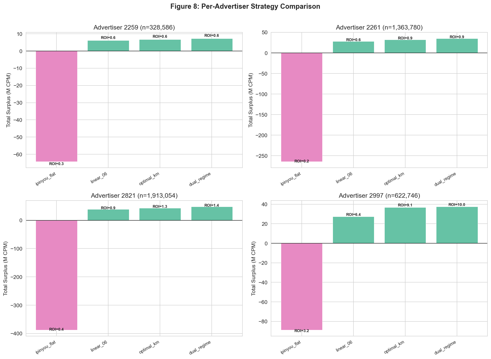
*Figure 10. Advertiser별 bidding 전략 비교. 각 advertiser의 특성에 따라 최적 전략의 효과가 다르다.*

### 6.5 Alpha 민감도 분석

Linear shading의 α를 0.4~1.0으로 변화시키며 Pareto frontier를 분석하였다:

- **α=0.4**: ROI 최대 (3.44), clicks 최소 (1,332)
- **α=1.0**: Clicks 최대 (2,266), ROI 최소 (1.56)
- **Pareto optimal zone**: α = 0.4~0.5

Optimal KM shading (ROI 3.36, clicks 1,480)은 linear α=0.4 (ROI 3.44, clicks 1,332)보다 148 clicks 더 많으면서 유사한 ROI를 달성하여, Pareto frontier에서 dominant한 위치를 차지한다.

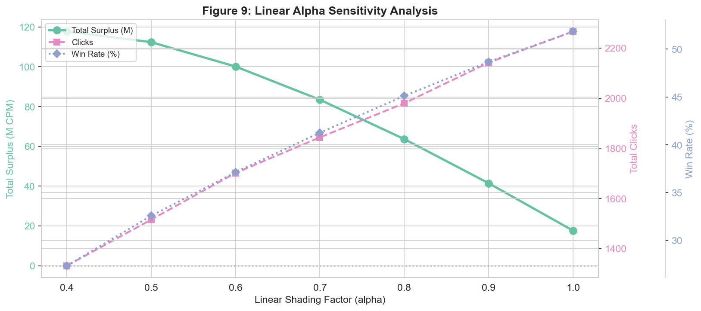
*Figure 11. Alpha 민감도 분석: Win rate, clicks, surplus의 변화.*

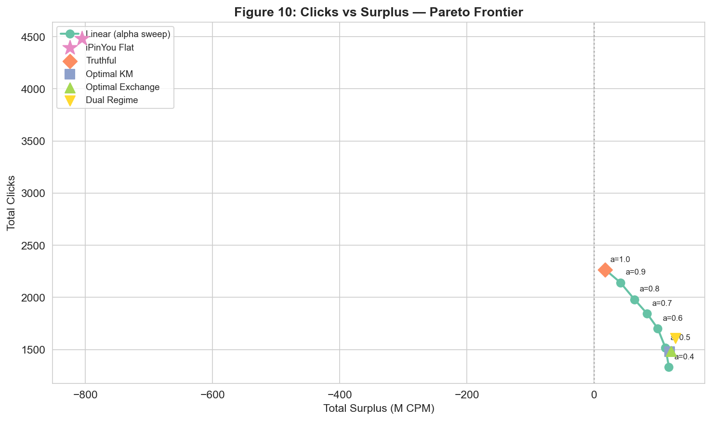
*Figure 12. Clicks vs Surplus Pareto frontier. 모든 전략을 비교하여 Pareto-optimal 전략을 식별한다.*

### 6.6 Second-Price vs First-Price 비교

동일한 optimal KM bids를 두 경매 유형에서 비교하여 first-price에서 bid shading이 왜 필수적인지 검증하였다:

| 지표 | First-Price | Second-Price |
|------|------------|-------------|
| Win Rate | 동일 | 동일 |
| Payment | bid 금액 그대로 | market_price (더 낮음) |
| Overpayment | 높음 | 낮음 |
| Surplus | 낮음 | 높음 |

Second-price에서는 bid shading 없이도 surplus가 양수이지만, first-price에서는 shading 없이 truthful bidding하면 surplus가 거의 0에 수렴한다.

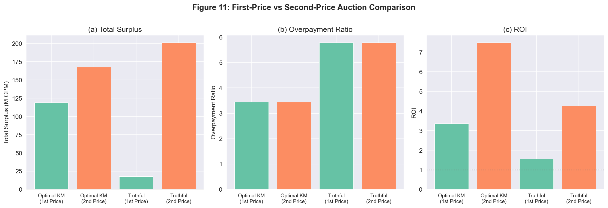
*Figure 13. First-price vs second-price auction에서의 surplus 비교. First-price에서 bid shading의 필수성을 보여준다.*

### 6.7 Budget Pacing 결과

Optimal KM shading에 PID pacing을 결합한 결과:

| Daily Budget | Wins | Clicks | Surplus (K CPM) | Utilization | ROI |
|-------------|------|--------|-----------------|-------------|-----|
| 50K CPM | 504 | 0 | 48.3 | 99.8% | — |
| 100K CPM | 1,020 | 0 | 100.0 | 99.9% | — |
| 200K CPM | 2,131 | 0 | 186.6 | 99.9% | — |
| 500K CPM | 5,706 | 2 | 424.3 | 99.9% | 0.80 |
| 1M CPM | 11,782 | 2 | 838.9 | 100.0% | 0.40 |
| **Unlimited** | **1,402,972** | **1,480** | **118,988.4** | **100%** | **3.36** |

Budget이 제한적일 때 PID controller는 99%+ 예산 활용률을 달성하며, WR-weighted pacing은 uniform 대비 동일 예산에서 소폭 더 많은 wins를 확보한다.

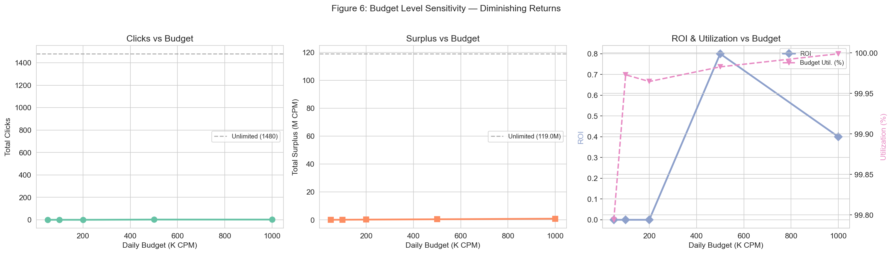
*Figure 14. Budget level별 clicks, surplus, ROI 변화. 예산 증가에 따른 수확 체감 패턴이 관찰된다.*

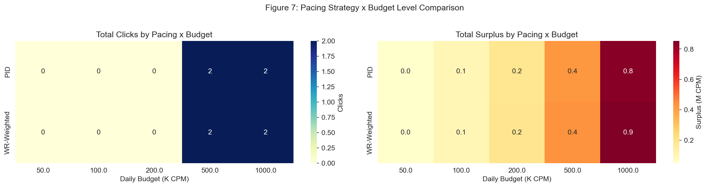
*Figure 15. Shading × Budget 전략 조합의 성과 매트릭스.*

---

## 7. 한계 및 향후 과제

### 7.1 시뮬레이션 한계

**정적 경쟁 가정.** 본 시뮬레이션은 우리의 bidding 전략이 바뀌어도 경쟁자들의 입찰 행태가 변하지 않는다고 가정한다. 실제로는 한 DSP가 bid shading을 적용하면 경쟁 환경이 변하여 market price distribution 자체가 이동한다. Game-theoretic equilibrium 분석이 필요하지만, 이는 데이터 기반 오프라인 시뮬레이션의 근본적 한계이다.

**KM CDF Heavy Right-Censoring.** 전체 CDF의 F(500) = 21.3%로, 관측 범위가 제한적이다. V(x) > 500 CPM인 고가치 impression에 대한 optimal bid 계산이 불확실하다. 이를 max_bid = 300 CPM으로 cap하여 대응하였다.

**Won-Only Simulation.** Lost bids (76%)의 market_price를 모르므로 won impressions만으로 시뮬레이션한다. 이는 "shading을 적용했으면 원래 lost bid에서도 win할 수 있었을" 기회를 포착하지 못한다. 전체 데이터 시뮬레이션은 KM CDF에서 market_price를 sampling하는 방식으로 가능하나, 추가적 가정이 필요하다.

### 7.2 iPinYou 데이터 한계

**Second-Price 데이터.** iPinYou (2013)는 second-price auction 데이터이다. First-price 시뮬레이션에서 payprice를 market_price proxy로 사용하지만, 실제 first-price 환경에서는 입찰자들의 전략적 행태가 다르므로 결과의 외적 타당성에 한계가 있다.

**Flat-Bid Baseline.** iPinYou가 277/294 CPM의 2종류 flat-bid만 사용하므로, 실제 DSP의 연속적 bidding과 비교가 제한적이다. Flat-bid 대비 개선 폭이 과대추정될 수 있다.

**9개 Advertiser.** 데이터의 advertiser 수가 제한적이며, 2013년 중국 시장의 특성이 반영되어 generalization에 한계가 있다.

### 7.3 향후 과제

1. **RL 기반 동적 bidding**: Reinforcement Learning으로 환경 변화에 적응하는 bidding agent 학습 (Ou et al., 2024, Sec 5.2). 특히 multi-agent RL로 경쟁자 반응을 모델링.

2. **Online evaluation**: Counterfactual off-policy evaluation 또는 A/B testing 프레임워크를 통한 실환경 검증.

3. **Budget-constrained optimization**: Lagrangian dual method로 budget constraint 하에서의 이론적 최적 bidding formula 유도 (Ou et al., 2024, Eq.5~7).

---

## 부록

### A. 구현 모듈 구조

| 모듈 | 경로 | 핵심 함수 | 역할 |
|------|------|----------|------|
| Value | `src/bidding/value.py` | `compute_impression_values()` | V(x) = pCTR × CPC_target |
| Shading | `src/bidding/shading.py` | `optimal_bid_vectorized()` | b* = argmax (V-b)×F(b) |
| Pacing | `src/bidding/pacing.py` | `compute_pid_multiplier()` | PID budget control |
| Simulator | `src/bidding/simulator.py` | `run_auction_simulation()` | Offline auction engine |

### B. Exchange별 KM CDF 통계

| 지표 | Overall | Exchange 1 | Exchange 2 | Exchange 3 |
|------|---------|-----------|-----------|-----------|
| F(50) | 2.8% | 6.0% | 3.4% | 0.8% |
| F(100) | 7.3% | 22.3% | 7.8% | 2.2% |
| F(200) | 13.5% | 49.3% | 16.8% | 5.7% |
| F(300) | 21.3% | 68.8% | 29.1% | 11.9% |
| F(500) | 21.3% | 68.9% | 29.2% | 12.0% |
| Median | ∞ | 153 CPM | ∞ | ∞ |

### C. Advertiser별 상세 결과

**Advertiser 2259 (Retargeting)**

| 전략 | Wins | Clicks | Surplus (M) | ROI |
|------|------|--------|-----------|-----|
| iPinYou Flat | 328,586 | 128 | -64.3 | 0.27 |
| Linear α=0.6 | 100,146 | 24 | +6.1 | 0.55 |
| Optimal KM | 89,644 | 16 | +6.8 | 0.61 |
| **Dual-Regime** | **108,908** | **20** | **+7.3** | 0.59 |

**Advertiser 2261 (Branding)**

| 전략 | Wins | Clicks | Surplus (M) | ROI |
|------|------|--------|-----------|-----|
| iPinYou Flat | 1,363,780 | 414 | -264.5 | 0.21 |
| Linear α=0.6 | 520,976 | 124 | +27.9 | 0.61 |
| Optimal KM | 482,950 | 114 | +32.0 | 0.85 |
| **Dual-Regime** | **541,066** | **140** | **+35.1** | **0.90** |

**Advertiser 2821 (Retargeting, High Volume)**

| 전략 | Wins | Clicks | Surplus (M) | ROI |
|------|------|--------|-----------|-----|
| iPinYou Flat | 1,913,054 | 1,176 | -387.5 | 0.42 |
| Linear α=0.6 | 573,454 | 246 | +38.8 | 0.93 |
| Optimal KM | 491,710 | 204 | +43.4 | 1.32 |
| **Dual-Regime** | **606,864** | **262** | **+47.8** | **1.42** |

**Advertiser 2997 (High-Value)**

| 전략 | Wins | Clicks | Surplus (M) | ROI |
|------|------|--------|-----------|-----|
| iPinYou Flat | 622,746 | 2,764 | -88.8 | 3.20 |
| Linear α=0.6 | 375,452 | 1,308 | +27.3 | 6.39 |
| Optimal KM | 338,668 | 1,146 | +36.8 | 9.07 |
| **Dual-Regime** | **346,306** | **1,186** | **+37.4** | **9.98** |

---

## 참고문헌

- Ou, W., Chen, B., Dai, X., Zhang, W., Liu, W., Tang, R., & Yu, Y. (2024). A Survey on Bid Optimization in Real-Time Bidding Display Advertising. *ACM Transactions on Knowledge Discovery from Data*, 18(3), Article 43. https://doi.org/10.1145/3628603
- Zhang, W., Yuan, S., & Wang, J. (2014). Optimal Real-Time Bidding for Display Advertising. *KDD*.
- Pan, S., et al. (2020). Bid Shading by Win-Rate Estimation and Surplus Maximization. *CIKM*.
- Wang, Y., et al. (2021). Optimal Bidding in First-Price Auctions. *SIGIR*.

---

*본 보고서는 `notebooks/07_bid_optimization.ipynb` (12 sections, 11 figures)와 `notebooks/08_budget_pacing.ipynb` (8 sections, 7 figures)의 분석 결과를 기반으로 작성되었다. 전체 실험 결과는 `results/bidding/` 디렉토리에 CSV 형태로 저장되어 있다.*
