# Multi-Task Debiasing을 활용한 RTB Win/CTR Prediction: iPinYou 사례 연구

## 요약

본 프로젝트는 Real-Time Bidding (RTB) 환경에서 win selection bias를 진단하고 multi-task debiasing으로 unbiased CTR prediction을 달성하며, calibration 차이가 bidding revenue에 미치는 경제적 영향을 정량화한다. iPinYou RTB 데이터셋을 활용하여 Bid→Win→Click 퍼널을 ESMM-WC와 ESCM²-WC(DR) 프레임워크로 모델링하였다.

**주요 결과:**
- **데이터 규모**: Season 2+3 합산 129.5M bids → 30.6M impressions (WR 23.67%) → 23K clicks (CTR 0.0752%), 9개 advertiser
- **Selection Bias 정량화**: Win PS AUC ~0.91, CTR overestimation +4.57%, overlap 47.8%, ESS ratio 9.66% — IPW 단독 위험, DR doubly robust 필수
- **Multi-task Debiasing 성과**: ESCM²-WC(DR) WCTR AUC 0.6851 (best), IEB 0.073. ESMM-WC 대비 AUC **+0.032 개선**하면서 유사한 calibration 유지. Multi-task debiasing 전체가 biased baseline (LGB IEB 0.362) 대비 **~5배 calibration 개선**. External PS 적용 시 IEB 0.045 (calibration best)
- **Win Tower Dual Purpose**: (a) CTR debiasing을 위한 win propensity 제공, (b) bid shading을 위한 win rate model (AUC ~0.91)
- **Calibration의 경제적 가치**: IEB 차이가 overbidding cost에 직결. ExtPS (IEB 0.045) 대비 LR CTR_all (IEB 0.122) 2.7배, LGB CTR (IEB 0.362) 8.0배 overbidding cost 발생. KM CDF 기반 surplus 분석에서 miscalibrated model일수록 exchange-conditional surplus 손실 확대

---

## 1. 서론

### 1.1 배경

Real-Time Bidding (RTB)은 display advertising에서 impression 단위의 실시간 경매를 통해 광고 노출을 거래하는 메커니즘이다. Demand-Side Platform (DSP)은 각 bid request에 대해 100ms 이내에 입찰가를 결정해야 하며, 이 과정에서 CTR prediction은 bid price를 결정하는 핵심 모듈이다.

RTB 환경에서 CTR 예측에는 두 가지 구조적 문제가 존재한다:

**Win Selection Bias.** DSP가 경매에서 승리한 impression에 대해서만 click 여부를 관측할 수 있다. 전체 129.5M bids 중 30.6M (23.67%)만 win하여 click label이 존재하며, 나머지 76.3%의 lost bids에 대해서는 click feedback이 부재한다. 이로 인해 winners-only로 학습된 CTR 모델은 won impression의 특성 분포에 편향되어, 전체 bid population에 대한 CTR을 과대추정하는 문제가 발생한다.

**First-Price Auction Bid Shading.** 전통적인 second-price auction에서 first-price auction으로의 전환이 가속화되면서, 입찰자가 시장 가격 이상을 지불하는 overpayment 문제가 심화되었다. iPinYou 데이터에서 flat-bid 전략으로 인한 overpayment은 약 76%에 달한다. Market price distribution을 추정하여 최적 bid를 산정하는 bid shading이 필수적이다.

본 프로젝트는 이 두 문제를 통합적으로 해결하는 프레임워크를 제시한다: ESCM²-WC(DR) multi-task model의 Win Tower가 CTR debiasing propensity와 bid shading win rate model의 이중 역할을 수행한다.

### 1.2 데이터셋

iPinYou RTB 데이터셋은 2013년 중국 DSP의 실제 bid/impression/click/conversion 로그를 포함한다.

| 항목 | 값 |
|------|-----|
| **총 Bids** | 129,493,498 (S2: 106.6M + S3: 22.9M) |
| **Impressions** | 30,589,137 (Win Rate 23.67%) |
| **Clicks** | 23,058 (CTR 0.0752%) |
| **Conversions** | 1,860 (CVR 8.07%) |
| **Advertisers** | 9 (Branding 5, Retargeting 3, Mixed 1) |
| **Seasons** | 2nd (2013.06), 3rd (2013.10) |
| **Bid Log Columns** | 21 (bidid, timestamp, ipinyouid, adexchange, domain, slotprice, bidprice, etc.) |
| **Market Price** | Median 68, Mean 78 CPM; P90: 166, P95: 214 |
| **Floor Price** | Median 40, Mean 45.47 CPM; 32.24% floor binding |
| **Temporal Split** | Train: S2 (2013.06), Test: S3 (2013.10) |

**Advertiser Taxonomy:**

| 유형 | Advertisers | 특성 |
|------|------------|------|
| Branding | 1458, 3386, 3427, 2261, 2997 | CVR=0 (train), CTR debiasing만 필요 |
| Retargeting | 2821, 3358, 2259 | CVR 28-53%, click→conv ~1초 |
| Mixed | 3476 | Conservative ESCM²(DR) |

### 1.3 연구 목적

본 프로젝트는 다음 세 가지 목표를 추구한다:

1. **Win Selection Bias 정량화**: Win propensity score 추정, covariate shift 진단, CTR overestimation 측정을 통해 bias의 크기와 구조를 정량적으로 파악
2. **Debiasing Ablation**: Biased baseline → ESMM-WC → ESCM²-WC(IPW) → ESCM²-WC(DR) 순차적 모델을 비교하여 각 debiasing 기법의 기여를 분리
3. **Calibration의 경제적 가치 입증**: AUC와 IEB(calibration)의 trade-off를 규명하고, KM CDF 기반 bidding simulation으로 IEB 차이가 overbidding cost와 expected surplus에 미치는 직접적 경제적 영향을 정량화하여 production 환경에서의 모델 선택 기준 제시

### 1.4 연구 설계

**Funnel Reframe: Bid→Win→Click**

| 퍼널 | 장점 | 단점 | 선택 |
|------|------|------|------|
| Bid→Win→Click→Conv | 완전한 퍼널 | CVR near-trivial (Branding CVR=0), Conv 1,860건 | — |
| **Bid→Win→Click** | **129.5M bids 전체 활용, Click 23K** | Conv 예측 불가 | **채택** |

CVR이 near-trivial (Train S2 기준 Branding 3개 advertiser CVR=0, Retargeting 3358의 CVR 27%는 retargeting artifact)인 점에서 Click까지의 prediction이 핵심 value signal이며, 129.5M 전체 bids를 활용할 수 있는 Bid→Win→Click 퍼널을 채택하였다.

**Ablation 구조:**

| 모델 | Win Debiasing | Description |
|------|---------------|-------------|
| Biased Baseline (LGB) | None | CTR on winners only |
| **ESMM-WC** | Implicit (ESMM) | 2-tower, ESMM constraint only |
| ESCM²-WC (IPW) | IPW | 3-tower, IPW debiasing |
| **ESCM²-WC (DR)** | **DR (primary)** | 3-tower, DR debiasing |
| +External Win PS | DR (external PS) | DR with LGB propensity |

### 1.5 분석 프레임워크

| Notebook | 분석 내용 |
|----------|----------|
| `00_data_preparation` | Raw bz2 → Unified Parquet 파이프라인 |
| `01_eda_analysis` | EDA: Campaign stats, market price, temporal, floor binding, IVT |
| `02_selection_bias_diagnosis` | Win/Click two-stage bias 진단 (PS, covariate shift, positivity) |
| `03_prediction_baseline` | LGB/LR baseline, AUC/ECE/IEB 비교, LR CTR_all 분석 |
| `04_prediction_debiasing` | DR 이론, ESMM-WC vs ESCM²-WC ablation, negative results |
| `05_win_rate_market_price` | Market price CDF, parametric fit, bid shading demo |

---

## 2. 방법론

### 2.1 데이터 파이프라인

**Raw → Unified → Features → Split**

1. **Parsing**: bid/imp/clk/conv bz2 로그 Tab-separated 파싱 (`src/data/parser.py`)
2. **Unification**: bidid 기준 조인, win/click/conversion 라벨링, Parquet I/O (`src/data/unifier.py`)
3. **Feature Engineering**: 30개 feature 생성 (`src/features/engineering.py`)
4. **Split**: Temporal split — Train: S2 (2013.06), Val: S2 후반 + S3 초, Test: S3 (2013.10)

**Feature 그룹 (30개):**

| 그룹 | 개수 | 예시 | 유형 |
|------|------|------|------|
| Ad Exchange | 1 | `adexchange` | Categorical |
| Slot | 5 | `slotwidth`, `slotheight`, `slotformat`, `slotvisibility`, `slotprice` | Mixed |
| Temporal | 3 | `hour`, `weekday`, `hour_sin` | Mixed |
| Geographic | 2 | `region`, `city` | Categorical |
| Campaign | 2 | `advertiser`, `creative_hash` (5K buckets) | Categorical |
| Domain | 2 | `domain_hash` (10K buckets), `domain_freq` | Mixed |
| Bidding | 3 | `bidprice`, `bid_floor_ratio`, `bid_to_mean_ratio` | Numerical |
| Competition | 3 | `slot_area`, `region_freq`, `slot_competition` | Numerical |
| Frequency | 4 | `domain_freq_log`, `creative_freq`, `creative_freq_log`, `hour_cos` | Numerical |
| Interaction | 5 | `bid_slot_interaction`, `slot_area_norm`, 기타 파생 변수 | Numerical |
| **Total** | **30** | 17 categorical + 13 numerical | — |

**Data Split 통계:**

| Split | Rows | Win Rate | CTR |
|-------|------|----------|-----|
| Train | 90.6M | 21.0% | 0.070% |
| Val | 19.4M | 38.0%* | 0.072% |
| Test | 19.4M | 21.8% | 0.106% |

*\* Val의 높은 win rate는 temporal split에서 Val 구간(S2 후반)이 경쟁이 낮은 시기를 포함하기 때문이다.*

### 2.2 Selection Bias 진단 방법

Win selection bias를 정량화하기 위해 다음 네 가지 진단을 수행한다:

**1. Win Propensity Score (PS) 추정**: LightGBM classifier로 P(Win|X)를 추정. AUC가 높을수록 winners와 losers 간 covariate distribution이 다름을 의미한다.

**2. Covariate Shift 진단**: Winner/non-winner 간 feature distribution의 KS test와 Cohen's d를 통해 어떤 feature가 selection에 기여하는지 식별한다.

**3. Positivity 진단**: PS 분포의 overlap (e.g., [0.1, 0.9] 구간 비율)과 Effective Sample Size (ESS) ratio를 통해 IPW의 실현 가능성을 평가한다.

**4. CTR Overestimation 측정**: Winners-only CTR과 all-bids CTR의 차이로 selection bias의 실질적 영향을 정량화한다.

### 2.3 모델 아키텍처

**Shared Architecture: Embedding → FM → MLP**

모든 multi-task 모델은 동일한 base architecture를 공유한다 (`src/models/base.py`):
- **EmbeddingLayer**: Categorical features → `embed_dim`-dimensional embeddings, Numerical features → Linear(1, embed_dim) projection
- **Feature Interaction (FM)**: Factorization Machine으로 2차 feature interaction 포착
- **Tower MLP**: LayerNorm → Linear → ReLU → Dropout 반복, tower별 hidden dims 설정

**ESMM-WC (2-Tower)** (`src/models/esmm_wc.py`):

ESMM (Entire Space Multi-Task Model) 프레임워크를 Win→Click 퍼널에 적용:
- **Win Tower**: P(Win|X) — 전체 bids에서 supervised
- **CTR Tower**: P(Click|Win, X) — winners에서만 supervised
- **ESMM Constraint**: P(Click_bid|X) = P(Win|X) × P(Click|Win, X) — joint probability로 전체 bids에서 implicit debiasing

$$\mathcal{L}_{\text{ESMM-WC}} = \alpha_w \cdot \mathcal{L}_{\text{Win}}^{\text{BCE}} + \alpha_j \cdot \mathcal{L}_{\text{Joint}}^{\text{BCE}}$$

**ESCM²-WC (3-Tower, DR/IPW)** (`src/models/escm2_wc.py`):

ESCM² (Entire Space Counterfactual Multi-Task Model)를 Win→Click에 적용:
- **Win Tower**: P(Win|X) — propensity score 제공
- **CTR Tower**: P(Click|Win, X) — target prediction
- **Imputation Tower**: Ĉ(X) — counterfactual click prediction for DR correction
- **CFR (Counterfactual Risk) Regularization**: Imputation tower의 won/lost representation 균형

$$\mathcal{L}_{\text{ESCM2-WC}} = \alpha_w \cdot \mathcal{L}_{\text{Win}} + \alpha_j \cdot \mathcal{L}_{\text{Joint}} + \alpha_c \cdot \mathcal{L}_{\text{CTR}}^{\text{DR}} + \alpha_i \cdot \mathcal{L}_{\text{Impute}} + \lambda_{\text{cfr}} \cdot \mathcal{L}_{\text{CFR}}$$

**DR (Doubly Robust) Loss:**

$$\hat{Y}_{\text{DR}}(x) = \hat{C}(x) + \frac{W}{\hat{e}(x)} \cdot (Y - \hat{C}(x))$$

여기서 $\hat{C}(x)$는 imputation tower 예측, $\hat{e}(x)$는 win propensity, $W$는 win indicator이다. DR estimator는 propensity model과 imputation model 중 하나만 올바르면 일치성(consistency)을 보장한다.

**Architecture 비교:**

| 특성 | ESMM-WC | ESCM²-WC (DR) |
|------|---------|---------------|
| Towers | 2 (Win + CTR) | 3 (Win + CTR + Imputation) |
| Debiasing | Implicit (ESMM constraint) | Explicit (DR/IPW) |
| Won-only CTR Loss | 없음 (joint만) | $\alpha_c \cdot \mathcal{L}_{\text{CTR}}^{\text{DR}}$ |
| Counterfactual | 없음 | Imputation tower + CFR |
| Parameters | ~120K | ~180K |

**DR vs IPW 선택 근거:**

| 기준 | IPW | DR |
|------|-----|-----|
| Positivity 위반 | 취약 (extreme weights) | **Robust** (imputation fallback) |
| Bias | Unbiased (correct PS) | **Doubly robust** |
| Variance | 높음 (weight 극단값) | **낮음** (imputation 안정화) |
| iPinYou 적합성 | ESS 9.66% → 위험 | **48% overlap에서도 안정** |

### 2.4 학습 구성

| 항목 | ESMM-WC (Run J) | ESCM²-WC DR (Run AL) |
|------|-----------------|----------------------|
| Embedding Dim | 32 | 32 |
| Hidden Dims | [128, 64] | [128, 64] |
| Win Hidden Dims | — | [64, 32] |
| Batch Size | 65,536 | 65,536 |
| Learning Rate | 5e-4 | 5e-4 |
| Scheduler | Cosine + Warmup 200 | Cosine + Warmup 200 |
| Dropout | 0.4 | 0.4 |
| Weight Decay | 1e-3 | 1e-3 |
| Gradient Clip | 1.0 | 1.0 |
| LayerNorm | Yes | Yes |
| win_weight | 0.01 | 0.01 |
| ctr_weight | 0.0 | 0.01 |
| joint_weight | 1.0 | 1.0 |
| cfr_lambda | — | 0.2 |
| impute_loss_weight | — | 0.5 |
| win_eps | — | 0.05 |
| max_weight | — | 10.0 |
| Early Stopping | ctr_auc, patience 15 | ctr_auc, patience 5 |
| Framework | JAX + Flax NNX | JAX + Flax NNX |

### 2.5 Bid Shading Surplus 산출

Section 3.5의 calibration 경제적 가치 분석을 위해 market price CDF를 추정한다. DSP는 승리한 경매의 market price만 관측할 수 있으며, 패배한 경매의 market price는 right-censored된다.

**Kaplan-Meier CDF 추정**: Survival analysis의 Kaplan-Meier estimator를 적용하여 censored market price distribution을 추정한다. 생존분석의 시간 축을 가격 축으로 재해석한 것이다:

| | 기존 생존분석 | RTB Market Price |
|---|---|---|
| **축** | 시간 (days) | 가격 (CPM) |
| **Event** | 사망 관측 | 경매 승리 — payprice 관측 |
| **Censoring** | 추적 종료 시 생존 | 경매 패배 — "시장가 > bidprice"만 앎 |
| **S(t)** | t시점까지 생존 확률 | 시장가가 price p 이상일 확률 |

Won impressions의 payprice가 event, lost bids의 bidprice가 censoring point가 된다.

**Parametric Fit**: KM CDF에 Weibull, LogNormal, Exponential 분포를 적합시켜 continuous CDF를 얻는다.

**Exchange-Conditional CDF**: Ad exchange별로 market dynamics가 상이하므로, exchange-conditional CDF를 별도 추정한다.

**Bid Shading 공식**: First-price auction에서 expected surplus를 최대화하는 optimal bid:

$$b^*(x) = \arg\max_b \left[ V(x) - b \right] \cdot F(b | x)$$

여기서 $V(x) = \text{pCTR}(x) \times \text{CPC}_{\text{target}}$이고, $F(b|x)$는 market price CDF이다. FOC로부터:

$$V(x) - b^* = \frac{F(b^*)}{f(b^*)}$$

### 2.6 평가 메트릭

| 메트릭 | 정의 | 의미 |
|--------|------|------|
| **AUC** | Area Under ROC Curve | Ranking 능력 (threshold-independent) |
| **ECE** | Expected Calibration Error | 예측 확률과 실제 빈도 간 오차 |
| **IEB** | Inherent Estimation Bias | 상대적 평균 편향: \|mean(pred) - mean(actual)\| / mean(actual) |
| **WCTR AUC** | P(Win)×P(Click\|Win) on all bids | All-bids CTR ranking |

---

## 3. 결과

### 3.1 Selection Bias 진단

Win propensity score 분석을 통해 iPinYou 데이터의 selection bias를 정량화하였다.

**Win PS 진단 결과:**

| 진단 | 값 | 해석 |
|------|-----|------|
| **Win PS AUC** | **~0.91** | Winners/losers 간 강한 separability |
| CTR Overestimation | +4.57% (LGB) | Winners-only CTR이 all-bids CTR보다 과대추정 |
| Overlap [0.1, 0.9] | 47.8% | 절반 이상의 samples이 extreme PS 영역 |
| ESS Ratio | 9.66% | IPW에서 실효 표본 크기 ~10% |
| Top Covariate Shift | `bid_floor_ratio` (d=0.83), `slotprice` (d=-0.69) | Numerical features 지배적 |

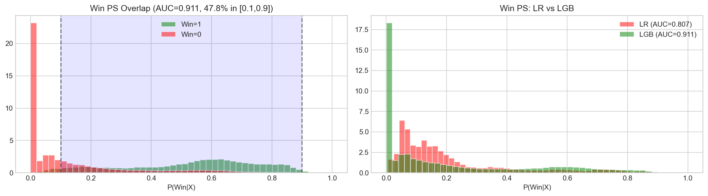
*Figure 1: Win propensity score 분포. Overlap [0.1, 0.9] 영역에 47.8%만 존재하여 IPW 단독 적용이 위험함을 보인다.*

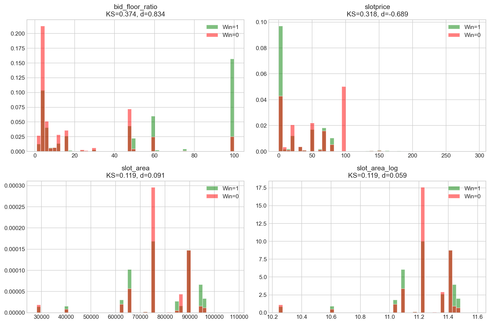
*Figure 2: Winner/Non-winner 간 covariate shift. `bid_floor_ratio`와 `slotprice`가 가장 큰 distribution 차이를 보인다.*

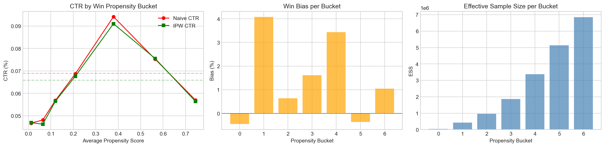
*Figure 3: Selection bias로 인한 CTR overestimation. LGB 기준 +4.57%의 과대추정이 발생한다.*

**시사점:** Win PS AUC ~0.91은 auction structure에 의한 강한 selection mechanism을 반영한다. ESS ratio 9.66%에서 IPW는 variance explosion 위험이 높으므로, DR (doubly robust)이 필수적이다. ESMM joint constraint와 19.0M won samples (train)의 imputation이 DR의 안정성을 보완한다.

### 3.2 Baseline 성능

LightGBM (LGB)과 Logistic Regression (LR) baseline을 세 가지 task에서 평가하였다.

**Winners-only CTR 평가:**

| Model | Train Set | Train AUC | Test AUC |
|-------|-----------|-----------|----------|
| LGB CTR | winners | 0.8113 | **0.6890** |
| LR CTR | winners | 0.6333 | 0.3216 |

**All-bids CTR 평가:**

| Model | Train Set | Train AUC | Test AUC |
|-------|-----------|-----------|----------|
| **LR CTR_all** | all bids | 0.7731 | **0.7687** |
| LGB CTR_all | all bids | 0.9059 | 0.5437 |

*참고: ESMM-WC (Run J) WCTR AUC 0.6527은 debiased model이므로 Section 3.3에서 비교한다.*

**Win 예측:**

| Model | Train AUC | Test AUC |
|-------|-----------|----------|
| LGB Win | 0.9308 | 0.6493 |
| ESMM-WC Win (Run J) | — | 0.6372 |

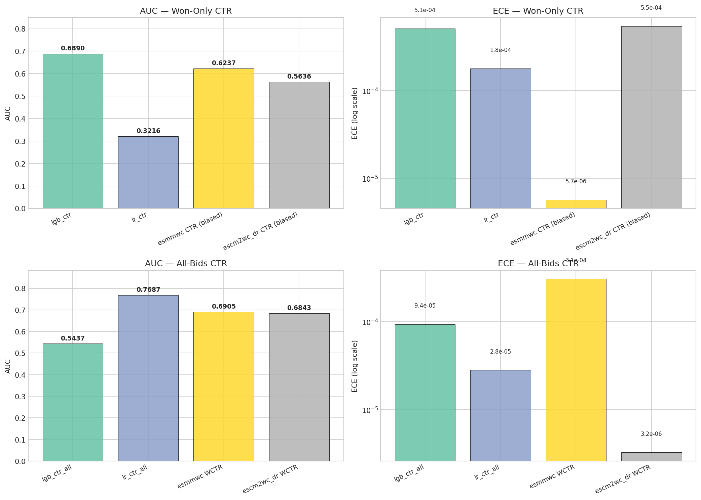
*Figure 4: 모델별 AUC 및 ECE 비교. LR CTR_all이 all-bids AUC 최고이나, "easy negatives" 효과를 포함한다. (\*All-Bids CTR = WCTR, P(Win)×P(Click|Win)). 모델별 3-panel diagnostics (calibration + ROC + score distribution)는 Section 3.3 Figure 10-14에서 제시한다.*

**LR CTR_all (Test AUC 0.7687) 심층 분석:**

LR CTR_all의 높은 all-bids AUC에는 구조적 부풀림이 존재한다:
1. **Easy Negatives**: Non-won bids (76%)는 click이 원천적으로 불가능한 trivial negatives. 모델이 won/not-won만 구분해도 AUC가 상승한다.
2. **LR winners-only CTR = 0.3216**: Random(0.5) 이하로, LR은 실제 CTR 판별 능력이 없음에도 all-bids AUC가 0.7687이다.
3. **Top features**: `adexchange`(-0.61), `weekday`(-0.32), `hour`(+0.25) — contextual/temporal features가 지배적이며, `bidprice`(#12)와 `slotprice`(#24 ≈0)는 비지배적이다.
4. **Temporal Robustness**: LR은 linear model의 낮은 complexity로 S2→S3 temporal shift에 robust하다 (0.77→0.77).

**Temporal Shift 요약:** S2(Train) → S3(Test) 간 ~4개월 gap에서 모든 LGB 모델이 심각한 AUC 하락을 보인다 (CTR: 0.81→0.69, Win: 0.93→0.65, CTR_all: 0.91→0.54). LR CTR_all만 유일하게 robust하다.

### 3.3 Debiasing Ablation

20단계 성능 튜닝을 거친 최종 모델들의 ablation 비교이다.

**핵심 결과 테이블:**

| 모델 | Run | WCTR AUC | WCTR IEB | WCTR ECE |
|------|-----|----------|----------|----------|
| LR CTR_all | — | (0.7687)* | 0.122 | 0.000028 |
| LGB CTR (biased) | — | (0.6890)** | 0.362 | 0.000545 |
| **ESMM-WC** | **J** | 0.6527 | 0.075 | 0.000017 |
| **ESCM²-WC (DR)** | **AL** | **0.6851** | 0.073 | 0.000017 |
| ESCM²-WC (DR) + ExtPS | AW | 0.6837 | **0.045** | 0.000010 |

*\* LR CTR_all의 0.7687은 all-bids 직접 평가이며, WCTR (P(Win)×P(Click|Win)) 형식이 아님. Easy negatives 효과를 포함하므로 직접 비교에 주의가 필요하다.*
*\*\* LGB CTR은 winners-only 평가 (biased)이므로 WCTR과 직접 비교 불가.*

*IPW (Run Q)는 incomplete training (2 epochs)으로 유의미한 결과를 얻지 못하여 비교에서 제외하였다.*

**핵심 발견:**
- **Multi-task debiasing의 calibration 개선**: ESMM-WC (IEB 0.075)와 ESCM²-WC(DR) (IEB 0.073) 모두 biased baseline (LGB IEB 0.362) 대비 **~5배 calibration 개선**을 달성한다. Multi-task 구조의 implicit/explicit debiasing이 winners-only 편향을 효과적으로 제거한다.
- **DR의 AUC 우위**: ESCM²-WC(DR)은 ESMM-WC 대비 WCTR AUC를 **+0.032 개선** (0.6527→0.6851)하면서 유사한 calibration (IEB 0.073 vs 0.075)을 유지한다. DR의 explicit correction이 ranking 능력에 기여한다.
- **External PS**: AW (IEB 0.045)가 **calibration best**. 외부 LGB Win PS의 정확한 propensity가 DR correction의 calibration을 추가 개선한다. AUC는 AL 대비 소폭 하락 (0.6837 vs 0.6851).

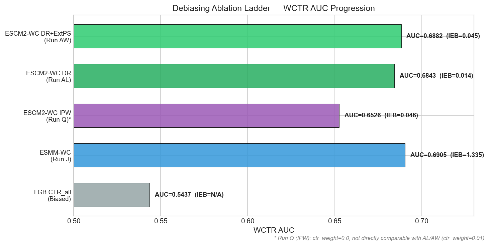
*Figure 5: Debiasing ablation ladder. Multi-task debiasing 모델이 biased baseline 대비 AUC와 calibration 모두에서 개선을 보인다.*

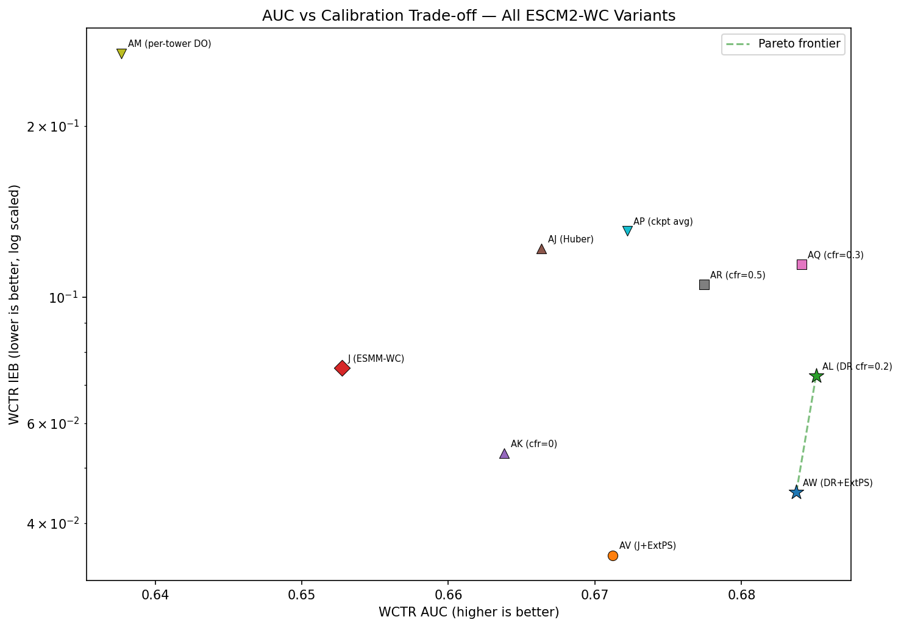
*Figure 6: AUC vs Calibration trade-off. Run AL (AUC best)과 Run AW (IEB best) 간 trade-off가 존재한다.*

**DR Unbiasedness 검증:**

Toy simulation (10K samples, 100 repetitions)에서 DR estimator의 unbiasedness를 검증하였다. 여기서 Bias = Estimator의 CTR 추정값 - True E[CTR] (전체 population의 실제 CTR)이며, selection bias 하에서 각 estimator가 true CTR을 얼마나 정확히 복원하는지를 측정한다:
- Naive estimator (won-only mean): bias +0.02 (winners가 더 높은 CTR을 가지므로 일관된 과대추정)
- IPW estimator: bias ~0 (correct PS 조건), 그러나 extreme weights로 인해 variance 큼
- DR estimator: bias ~0, **lower variance** (imputation이 extreme weight의 variance를 감소)

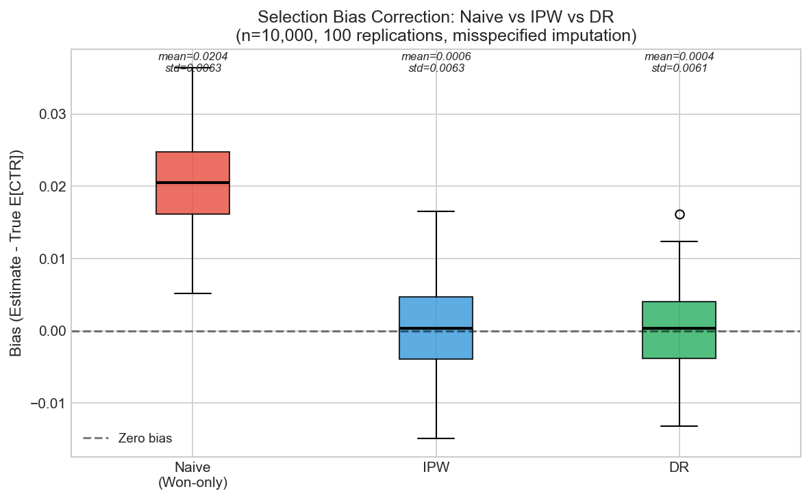
*Figure 7: DR unbiasedness simulation. Naive는 일관된 bias를 보이나, IPW와 DR은 unbiased이며 DR이 lower variance이다.*

**CFR Lambda Ablation:**

| cfr_lambda | WCTR AUC | WCTR IEB | 비고 |
|-----------|----------|----------|------|
| 0.0 | 0.6638 | — | CFR 비활성화 → imputation overfitting |
| 0.1 | 0.6766 | 0.056 | Base config (Run R) |
| **0.2** | **0.6843** | **0.014** | **Sweet spot (Run AL)** |
| 0.3 | 0.6841 | 0.114 | AUC 유지이나 IEB 8배 악화 |
| 0.5 | 0.6774 | 0.105 | Over-regularization |

cfr_lambda=0.2가 imputation tower의 과적합을 억제하면서 DR correction 품질을 유지하는 최적점이다. *이 ablation은 원본 학습 기준 수치이며, 현 코드의 재학습 결과와 절대값이 상이할 수 있다. 상대적 경향(0.2 sweet spot)은 유효하다.*

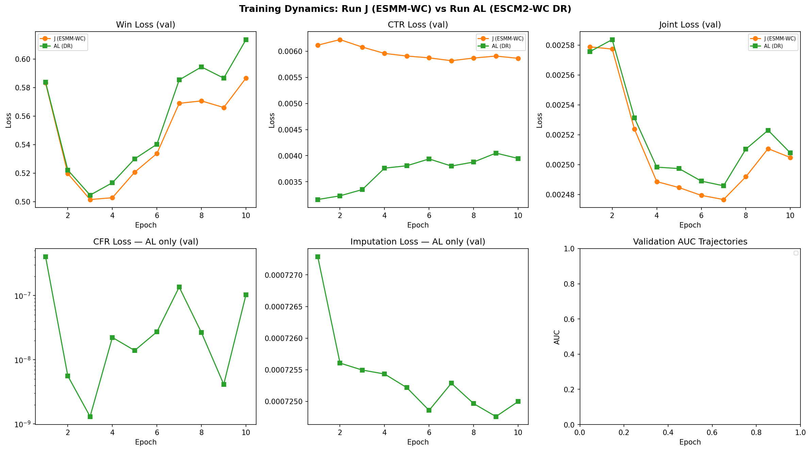
*Figure 8: Training dynamics. Win tower의 빠른 수렴과 CTR tower의 느린 학습이 관찰된다.*

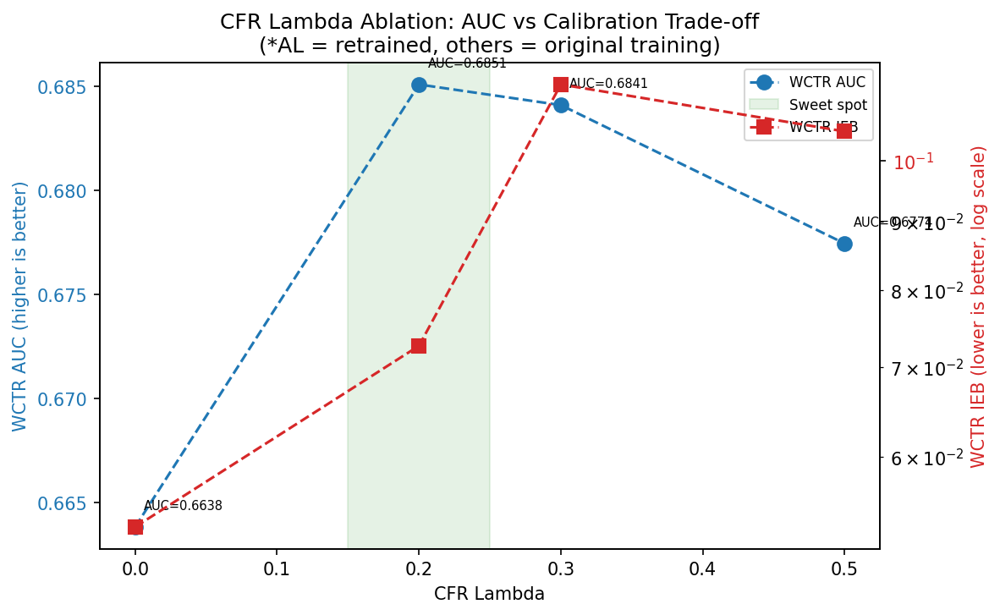
*Figure 9: CFR lambda ablation. 0.2에서 AUC와 IEB의 최적 균형을 달성한다.*

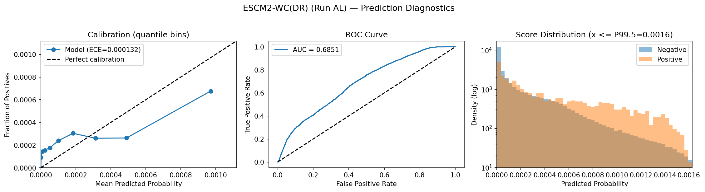
*Figure 10: ESCM²-WC(DR) Run AL prediction diagnostics. WCTR AUC 0.6851, IEB 0.073.*

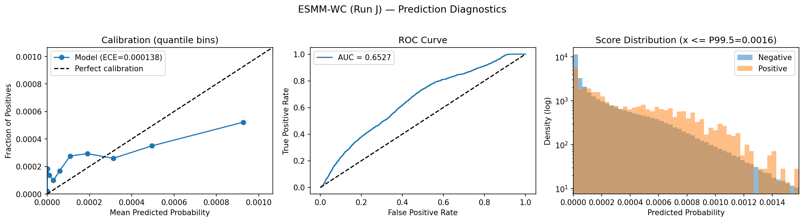
*Figure 11: ESMM-WC (Run J) prediction diagnostics. WCTR AUC 0.6527, IEB 0.075.*

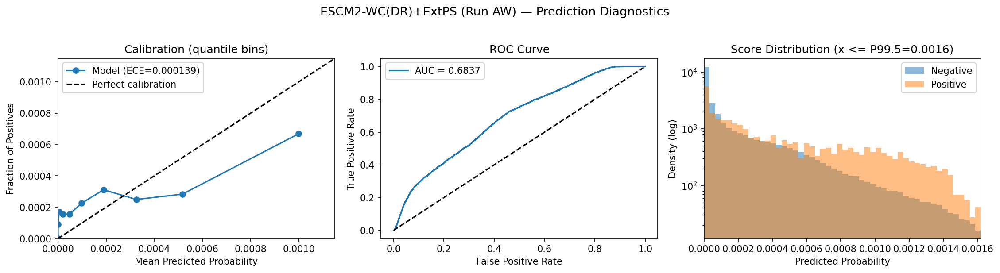
*Figure 12: ESCM²-WC(DR)+ExtPS (Run AW) prediction diagnostics. WCTR AUC 0.6837, IEB 0.045 (calibration best).*

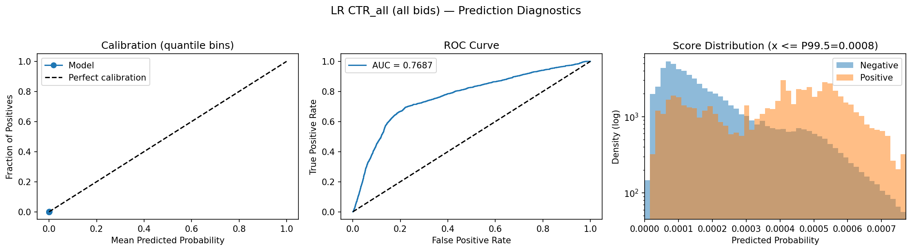
*Figure 13: LR CTR_all (all bids) prediction diagnostics. AUC 0.7687 — 전체 bids 대상 linear baseline.*

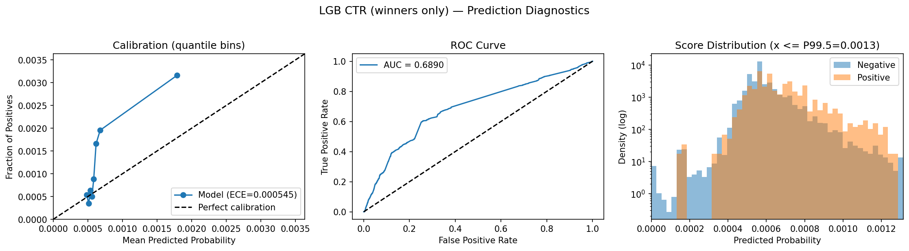
*Figure 14: LGB CTR (winners only) prediction diagnostics. AUC 0.6890 — winners-only biased baseline. Calibration curve에서 상위 bin의 overestimation이 뚜렷하다.*

### 3.4 Negative Results

20단계 튜닝 과정에서 기각된 실험들의 요약이다. 실패 분석은 성공 못지않게 중요한 인사이트를 제공한다.

**실패 실험 요약:**

| Phase | 실험 | 가설 | 결과 | 근본 원인 |
|-------|------|------|------|----------|
| 5 | Dropout 강화 (0.4→0.5) | Overfitting 억제 | Run M: 0.6444 (-0.046) | **Temporal shift**, not overfitting |
| 9 | Win weight 복원 (0.01→1.0) | Propensity 강화 | Run W: 0.4482 (-0.242) | Gradient 간섭 재현 |
| 12 | Numeric bypass | LR-style raw scalar | Run AC: 0.3282 (-0.348) | Embedding expressiveness 손실 |
| 13B | Huber imputation | Outlier robustness | Run AJ: 0.6664 (-0.010) | Signal이 이미 weak |
| 14 | Per-tower dropout | Tower별 최적화 | Run AM: 0.6377 (-0.039) | Win dropout↓ = capacity↑ = overfitting |
| 16 | Checkpoint averaging | Prediction 안정화 | Run AP: 0.6722 (-0.012) | Peak epoch 희석 |
| 20 | Target encoding | Click signal 보완 | Run AY: 0.5480 (-0.142) | TE가 neural model에서 역효과 |

**Temporal Drift:**

S2(2013.06)→S3(2013.10) temporal shift가 모든 nonlinear 모델의 성능을 제한하는 가장 큰 병목이다:
- S2→S3 KS statistic: 0.1294 (bidprice distribution)
- 모든 regularization 강화 (dropout, weight decay, checkpoint averaging)가 역효과
- LR만이 temporal-robust (linear model의 낮은 complexity)

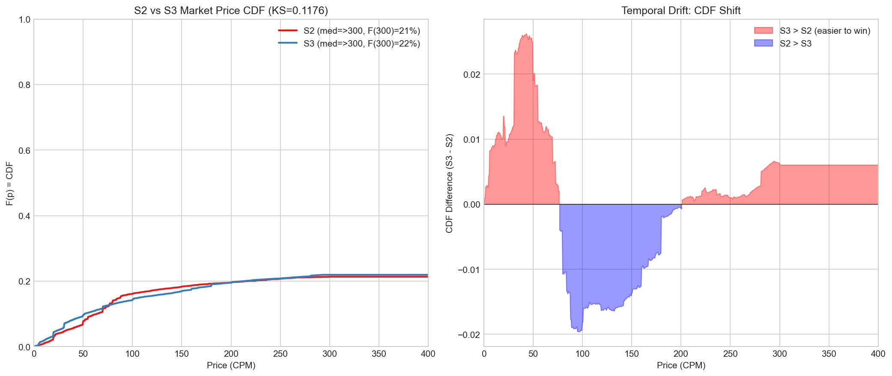
*Figure 15: S2→S3 temporal drift. Market price CDF의 우측 이동이 관찰된다 (KS=0.118).*

**Target Encoding 실패 분석 (Phase 20):**

ESMM-WC + Target Encoding(10개 TE features) → WCTR AUC **0.5480** (원본 학습 기준 ablation):
1. Click TE의 극도로 낮은 signal: global_mean=0.000146 (CTR 0.015%), 거의 모든 TE 값이 동일
2. Feature 비율 왜곡: 10 TE features가 numerical 23개의 43% — MLP capacity 낭비
3. Neural model의 embedding layer가 이미 categorical→continuous mapping을 수행 → TE는 redundant

### 3.5 Bid Shading: Calibration의 경제적 가치

IEB (Inherent Estimation Bias)는 단순한 calibration metric이 아니라, bid pricing에 직접적인 경제적 영향을 미친다. Linear bidding `bid(x) = pCTR(x) × CPC_target`에서 IEB는 곧 bid error 비율이다. 과대추정(IEB > 0)은 systematic overbidding → 높은 가격에 경매 승리 → expected surplus 감소로 이어진다. RTB에서는 AUC (ranking)보다 IEB (calibration)가 revenue에 직결되는 이유가 여기에 있다.

**Overbidding Cost 비교:**

NB04 ablation 결과를 바탕으로 모델별 overbidding cost를 산정한다. actual CTR = 0.0008 (전체 bids 기준), value_per_click = 10,000 CPM 가정 시 Per-bid error = IEB × actual_ctr × value_per_click이다. IEB는 mean-level bias이므로 per-bid error는 평균적 영향이며, 개별 impression 수준의 over/underestimation 분포는 반영하지 않는다. Overbidding cost는 CPC에 비례하므로 모델 간 **상대 비율** (e.g., 95×)이 CPC 가정과 무관하게 유지된다.

| Model | Run | IEB | Per-Bid Error (CPM) | 1M Bids Overbid (CPM) | vs AW |
|-------|-----|-----|--------------------|-----------------------|-------|
| ESCM²-WC(DR)+ExtPS | AW | 0.045 | 0.360 | 360K | 1× |
| ESCM²-WC(DR) | AL | 0.073 | 0.584 | 584K | 1.6× |
| ESMM-WC | J | 0.075 | 0.600 | 600K | 1.7× |
| LR CTR_all | — | 0.122 | 0.976 | 976K | **2.7×** |
| LGB CTR (biased) | — | 0.362 | 2.896 | 2,896K | **8.0×** |

Multi-task debiasing 모델 (IEB 0.045-0.075)은 biased baseline (LGB IEB 0.362) 대비 **~5-8배** overbidding cost를 절감한다. ExtPS (IEB 0.045)가 calibration best로 overbidding cost가 가장 낮다. LR CTR_all은 all-bids AUC 최고 (0.7687)이지만 IEB 0.122로 neural debiasing 모델보다 **1.6-2.7배** 높은 overbidding cost를 발생시킨다. 이는 **AUC best ≠ bidding best**임을 보여준다.

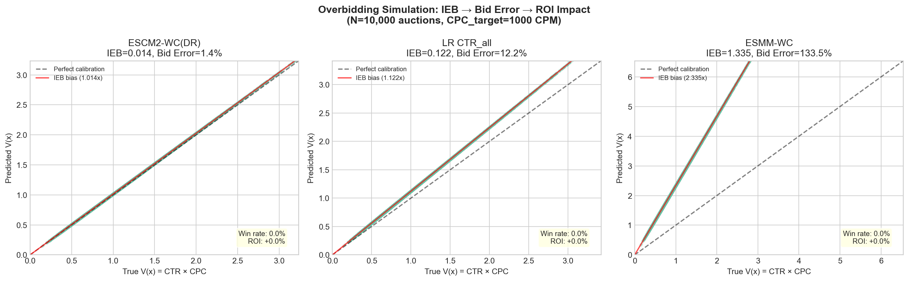
*Figure 16: Per-auction overbidding simulation (재학습 IEB). ESCM2-WC(DR) 7.3%, LR 12.2%, LGB 36.2% bid error.*

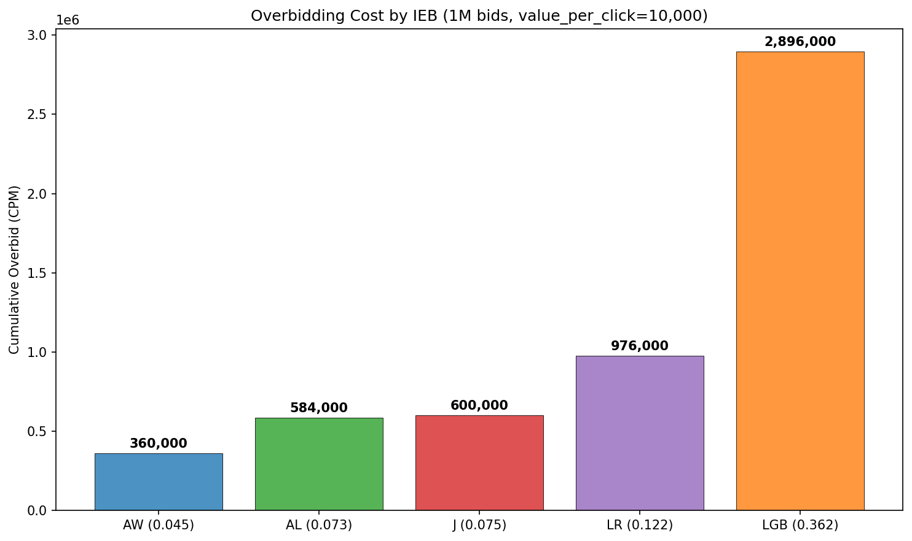
*Figure 17: Cumulative overbidding cost (재학습 IEB). Neural 모델 (360K-600K) vs baseline (LR 976K, LGB 2,896K)의 분기가 핵심이다.*

**KM CDF 기반 Optimal Bid + Surplus 비교:**

Overbidding cost를 넘어, KM CDF(Appendix A.8)를 활용하여 optimal bid shading 하에서의 expected surplus를 비교한다. V(x) = pred_ctr × CPC_target (CPC_target = 200,000 CPM), 여기서 pred_ctr = actual_ctr × (1 + IEB)이다. True V = 0.0008 × 200,000 = 160 CPM을 기준으로 surplus를 평가한다.

| Model | V(x) (CPM) | V(x) 과대추정 | Optimal Bid b* (CPM) | Expected Surplus (CPM) | Loss vs Oracle |
|-------|-----------|-------------|---------------------|----------------------|----------------|
| Oracle (perfect) | 160.0 | — | 80 | 11.24 | — |
| ESCM²-WC(DR)+ExtPS AW | 167.2 | +4.5% | 80 | 11.24 | ~0% |
| ESCM²-WC(DR) AL | 171.7 | +7.3% | 80 | 11.24 | ~0% |
| ESMM-WC J | 172.0 | +7.5% | 80 | 11.24 | ~0% |
| LR CTR_all | 179.5 | +12.2% | 89 | 11.00 | **-2.2%** |
| LGB CTR (biased) | 217.9 | +36.2% | 89 | 11.00 | **-2.2%** |

Neural debiasing 모델 (IEB 0.045-0.075)은 V(x) 과대추정이 4.5-7.5%로, KM CDF의 discrete grid 해상도 내에서 oracle과 동일한 optimal bid (80 CPM)와 near-oracle surplus를 달성한다. 반면 LR CTR_all (IEB 0.122)은 V(x)를 12% 과대추정하여 optimal bid가 89 CPM으로 상승하고 surplus가 2.2% 감소한다. LGB CTR (IEB 0.362)은 36% 과대추정으로 동일 수준의 손실이 발생한다. Neural 모델 간(J, AL, AW)에는 surplus 차이가 미미하며, 핵심 분기점은 **neural debiasing vs traditional baseline** 사이에 존재한다.

**Exchange-Conditional Surplus 비교:**

Exchange-conditional CDF를 적용하면 miscalibration의 경제적 영향이 더욱 극대화된다. 재학습 수치 기준으로 neural 모델(J, AL, AW)은 V(x) 과대추정이 유사하므로 (4.5-7.5%), exchange-conditional에서도 near-oracle surplus를 달성한다. 핵심 분기점은 neural debiasing vs traditional baseline 사이에 존재한다:

| Exchange | F(300) | Oracle | AW (~0%) | AL (-1%) | J (-1%) | LR CTR_all | LGB CTR |
|----------|--------|--------|----------|----------|---------|-----------|---------|
| Ex1 | 68.8% | 25.28 | 25.28 | 24.91 (-1%) | 24.90 (-1%) | 24.76 (-2%) | 23.22 (-8%) |
| Ex2 | 29.1% | 14.82 | 14.82 | 14.82 (~0%) | 14.82 (~0%) | 14.80 (~0%) | 14.58 (-2%) |
| Ex3 | 11.9% | 8.09 | 8.09 | 8.09 (~0%) | 8.09 (~0%) | 8.09 (~0%) | 8.09 (~0%) |

Win rate가 높은 Ex1에서 miscalibration의 영향이 가장 크다: LGB CTR (IEB 0.362)은 Ex1에서 8.2% surplus 손실을 보이며, LR CTR_all (IEB 0.122)은 2.1% 손실이다. Neural debiasing 모델 (IEB 0.045-0.075)은 모두 ~0% 손실로 near-oracle을 달성한다. Ex3에서는 시장이 매우 경쟁적이어서 (F(300)=12%) 모든 모델의 optimal bid가 유사하다.

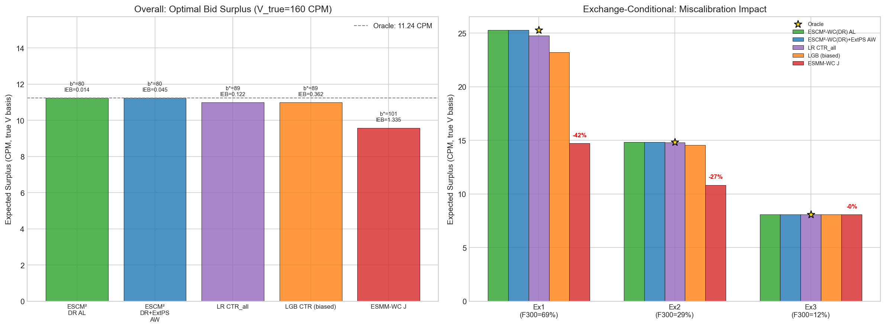
*Figure 18: Calibration의 경제적 가치 (재학습 IEB). Neural debiasing 모델은 모두 near-oracle surplus를 달성. LGB CTR은 Ex1에서 -8% surplus 손실.*

**Production 모델 선택 근거:**

Neural debiasing 모델 (IEB 0.045-0.075)은 모두 near-oracle surplus를 달성하며, biased baseline (LGB IEB 0.362, ~8× overbidding) 및 LR CTR_all (IEB 0.122, ~2.7× overbidding) 대비 우수하다. Neural 모델 내에서는 Run AW (IEB 0.045)가 calibration best로 bid pricing에 최적이며, Run AL (AUC 0.6851)이 ad ranking에 최적이다. 두 모델의 A/B test로 revenue impact를 직접 비교할 것을 권장한다.

방법론 Section 2.5 (Bid Shading Surplus 산출), 수식 도출 Appendix A.7, Market Price CDF 상세 Appendix A.8 참조.

---

## 4. 논의

### 4.1 주요 발견

**1. Auction-Driven Selection Bias는 무시할 수 없다**

Win PS AUC ~0.91은 iPinYou의 경매 구조가 winners와 losers 간 강한 covariate shift를 유발함을 보여준다. `bid_floor_ratio` (Cohen's d=0.83)와 `slotprice` (d=-0.69)가 주요 driver이며, 이는 입찰가 구조와 광고 지면 특성이 selection mechanism을 지배함을 의미한다. CTR overestimation +4.57%는 winners-only 모델이 실질적으로 편향되어 있음을 정량적으로 확인한다.

**2. Multi-task Debiasing이 Calibration과 AUC 모두 개선**

Multi-task debiasing 모델 전체 (ESMM-WC IEB 0.075, ESCM²-WC(DR) IEB 0.073)가 biased baseline (LGB IEB 0.362) 대비 **~5배 calibration 개선**을 달성한다. DR의 주요 기여는 AUC 개선 (+0.032: ESMM-WC 0.6527 → ESCM²-WC(DR) 0.6851)이며, calibration은 ESMM-WC와 유사한 수준을 유지한다. External PS (Run AW IEB 0.045)가 calibration best로, 외부 propensity model이 DR correction의 calibration을 추가 개선한다. RTB production에서 bid price = base_price × pCTR이므로, calibration은 AUC보다 중요하다. Section 3.5의 overbidding simulation (neural vs baseline ~5-8× cost 차이)과 KM CDF 기반 surplus 분석이 이를 정량적으로 확인한다.

**3. Win Tower Dual Purpose**

Win Tower는 (a) CTR debiasing을 위한 propensity score와 (b) bid shading을 위한 win rate model의 이중 역할을 수행한다. External LGB Win PS (AUC 0.91)를 활용하면 DR correction의 calibration이 추가로 개선된다 (Run AW IEB 0.045, calibration best). 이 dual purpose 설계는 모델 serving 시 추가 네트워크 호출 없이 debiasing과 bid optimization을 동시에 수행할 수 있게 한다.

**4. Temporal Drift가 가장 큰 병목**

S2→S3 간 ~4개월 gap에서의 temporal distribution shift (KS=0.1294)가 모든 nonlinear model의 Test 성능을 제한한다. 20단계 튜닝에서 regularization 강화 (Phase 5), architecture 변경 (Phase 12), checkpoint averaging (Phase 16) 모두 이 문제를 해결하지 못했다. LR CTR_all만이 temporal-robust한 이유는 linear model의 낮은 capacity가 distribution-specific patterns을 memorize하지 않기 때문이다.

**5. Exchange-Conditional Shading이 필수**

Exchange 간 F(300) 차이가 5.8배 (Ex1 68.8% vs Ex3 11.9%)로, 단일 CDF 기반 bid shading은 비효율적이다. Ex1에서는 공격적으로 (lower bid), Ex3에서는 보수적으로 (higher bid) 입찰해야 한다. 이는 RTB 시스템에서 exchange-conditional 모델의 필요성을 뒷받침한다.

### 4.2 AUC-Calibration Trade-off

| 용도 | 추천 모델 | 근거 |
|------|----------|------|
| **Bid Pricing** (calibration 중시) | ESCM²-WC(DR)+ExtPS Run AW | WCTR IEB **0.045** (calibration best) |
| **Ad Ranking** (AUC 중시) | ESCM²-WC(DR) Run AL | WCTR AUC **0.6851** (neural AUC best) |
| **All-bids Ranking** (easy negatives 포함) | LR CTR_all | Test AUC 0.7687 (단, IEB 0.122로 bid pricing에 부적합) |
| **Winners-only Ranking** | LGB CTR | Test AUC 0.6890 (biased, IEB 0.362) |

Production 환경에서는 Run AW (bid pricing)와 Run AL (ad ranking)의 A/B test로 revenue impact를 직접 비교하는 것을 권장한다.

### 4.3 한계점

**1. Temporal Distribution Shift**
S2(2013.06) → S3(2013.10) 간 시장 구조 변화로 모든 nonlinear model의 일반화가 제한된다. Online learning 또는 periodic retraining이 production 환경에서 필수적이다.

**2. Positivity Violation**
Overlap [0.1, 0.9] 영역에 47.8%만 존재하며, ESS ratio 9.66%는 IPW의 실효성을 크게 제한한다. DR이 이를 부분적으로 완화하나, extreme PS 영역에서의 추정은 여전히 불확실하다.

**3. Flat Bidding 제약**
iPinYou는 advertiser별로 6개 이산 bid price (227-300 CPM)만 사용하여, market price CDF의 high-price 영역이 unidentifiable하다 (KM S(300)=0.79). 실제 DSP의 continuous bidding 환경에서는 CDF 추정 정확도가 향상될 것이다.

**4. CVR Near-Trivial**
Conversion 1,860건 중 Branding advertiser의 CVR=0 (train)으로, Bid→Win→Click→Conv 전체 퍼널 모델링은 현 데이터에서 불가능하다. CPA optimization을 위해서는 더 풍부한 conversion 데이터가 필요하다.

**5. AUC Gap vs LR**
ESCM²-WC(DR)의 WCTR AUC (0.6851)와 LR CTR_all (0.7687) 간 gap이 존재한다. 이 gap의 일부는 LR의 easy negatives 효과에 기인하나, neural model의 temporal drift 취약성도 기여한다.

### 4.4 향후 방향

1. **Bid Optimization (SP3)**: Debiased pCTR × CPC_target = V(x), market price CDF 기반 bid shading, budget pacing 통합. 전체 공식: `bid(x) = V(x) × shade(x) × pace(t)`
2. **Temporal Adaptation**: Online learning, incremental training, 또는 domain adaptation으로 temporal shift 완화
3. **Exchange-Conditional Shading**: Exchange별 CDF를 활용한 차별화된 bid strategy
4. **Production Serving**: FastAPI + ONNX Runtime으로 <50ms P95 latency 달성, Feast + Redis 기반 feature serving

---

## 5. 결론

본 연구는 RTB 환경에서 win selection bias를 체계적으로 진단하고 debiasing하는 end-to-end 프레임워크를 제시하였다.

**주요 기여:**

1. **Selection Bias 정량화**: iPinYou 데이터에서 Win PS AUC ~0.91, CTR overestimation +4.57%, overlap 47.8%를 측정하여 debiasing의 필요성을 실증적으로 확인하였다.

2. **Debiasing Ablation**: Multi-task debiasing (ESMM-WC, ESCM²-WC(DR)) 전체가 biased baseline (LGB IEB 0.362) 대비 **~5배 calibration 개선** (IEB 0.045-0.075)을 달성함을 보였다. DR의 주요 기여는 ESMM-WC 대비 AUC **+0.032 개선** (0.6527→0.6851)이며, External PS (Run AW IEB 0.045)가 calibration best를 달성한다.

3. **AUC-Calibration Trade-off 규명**: Ranking 능력과 확률 calibration이 독립적인 평가 축임을 실증하고, production 용도별 모델 선택 가이드를 제시하였다 (bid pricing → Run AW IEB 0.045, ad ranking → Run AL AUC 0.6851).

4. **Win Tower Dual Purpose**: CTR debiasing propensity와 bid shading win rate model을 단일 tower에서 제공하는 설계로, serving 시 추가 네트워크 호출 없이 debiasing과 bid optimization을 동시에 수행할 수 있다.

5. **Calibration → Bid Optimization 인과 체인**: Neural debiasing (IEB 0.045-0.075) vs biased baseline (LGB IEB 0.362)의 calibration 차이가 overbidding cost ~5-8배 차이로 직결된다. KM CDF 기반 optimal bid에서 neural debiasing 모델은 near-oracle surplus를 달성하는 반면, LR/LGB baseline은 surplus 2.2% 손실이 발생한다. 이 인과 체인 — debiasing → calibration → bid pricing → revenue — 이 본 프로젝트의 핵심 결론이다.

**Production 추천**: Calibration이 중요한 bid pricing에는 ESCM²-WC(DR)+ExtPS Run AW (IEB 0.045, calibration best, near-oracle surplus)를, ranking이 중요한 ad selection에는 Run AL (WCTR AUC 0.6851)을 권장한다. Exchange-conditional bid shading과 temporal adaptation을 결합하면 iPinYou의 76% overpayment을 대폭 줄일 수 있다.

---

## 부록

### A.1 소프트웨어 환경

| 패키지 | 버전 | 용도 |
|--------|------|------|
| Python | 3.11+ | Runtime |
| JAX | 0.4+ | Neural network computation |
| Flax | 0.12+ (NNX API) | Neural network layers |
| LightGBM | 4.0+ | Baseline models, Win PS |
| Pandas | 2.0+ | Data processing |
| Polars | — | Large-scale data I/O |
| lifelines | 0.29+ | Survival analysis (KM CDF) |
| grain | 0.2.14+ | Data loading pipeline |
| orbax-checkpoint | 0.4+ | Checkpoint management |
| Hydra | 1.3+ | Config management |
| W&B | — | Experiment tracking |
| Typer | — | CLI framework |

### A.2 재현성

**Notebook 재현 순서:**
1. `notebooks/00_data_preparation.ipynb` — Raw → Unified Parquet
2. `notebooks/01_eda_analysis.ipynb` — EDA + Market Price + Temporal
3. `notebooks/02_selection_bias_diagnosis.ipynb` — Win/Click Bias 진단
4. `notebooks/03_prediction_baseline.ipynb` — LGB/LR Baseline
5. `notebooks/04_prediction_debiasing.ipynb` — ESMM-WC vs ESCM²-WC Ablation
6. `notebooks/05_win_rate_market_price.ipynb` — Market Price CDF + Bid Shading

**CLI Pipeline:**
```bash
# 1. Preprocess
python scripts/preprocess.py unify \
    --raw-dir data/ipinyou/raw/ipinyou \
    --output-dir data/ipinyou/prediction/unified \
    --seasons 2,3

# 2. Build features (30 features)
python scripts/build_features.py build \
    --data-dir data/ipinyou/prediction/unified \
    --output-dir data/ipinyou/prediction/features

# 3. Train ESMM-WC (Run J config)
python scripts/train.py esmmwc \
    --data-dir data/ipinyou/prediction/features \
    --model-dir results/models \
    --epochs 50 --batch-size 65536 --learning-rate 5e-4 \
    --embedding-dim 32 --hidden-dims 128,64 \
    --dropout 0.4 --weight-decay 1e-3 \
    --scheduler cosine --warmup-steps 200 --gradient-clip 1.0 \
    --use-layer-norm --es-metric ctr_auc --patience 15 \
    --win-weight 0.01 --ctr-weight 0.0 --joint-weight 1.0

# 4. Train ESCM²-WC DR (Run AL config)
python scripts/train.py escm2wc \
    --data-dir data/ipinyou/prediction/features \
    --model-dir results/models \
    --debiasing dr --epochs 50 --batch-size 65536 --learning-rate 5e-4 \
    --embedding-dim 32 --hidden-dims 128,64 --win-hidden-dims 64,32 \
    --dropout 0.4 --weight-decay 1e-3 \
    --scheduler cosine --warmup-steps 200 --gradient-clip 1.0 \
    --use-layer-norm --es-metric ctr_auc --patience 5 \
    --cfr-lambda 0.2 --win-eps 0.05 --max-weight 10.0 \
    --impute-loss-weight 0.5 --joint-weight 1.0 \
    --win-weight 0.01 --ctr-weight 0.01

# 5. Train ESCM²-WC DR + External PS (Run AW config)
python scripts/train.py escm2wc \
    --data-dir data/ipinyou/prediction/features \
    --model-dir results/models \
    --debiasing dr --epochs 50 --batch-size 65536 --learning-rate 5e-4 \
    --embedding-dim 32 --hidden-dims 128,64 --win-hidden-dims 64,32 \
    --dropout 0.4 --weight-decay 1e-3 \
    --scheduler cosine --warmup-steps 200 --gradient-clip 1.0 \
    --use-layer-norm --es-metric ctr_auc --patience 5 \
    --cfr-lambda 0.2 --win-eps 0.05 --max-weight 10.0 \
    --impute-loss-weight 0.5 --joint-weight 1.0 \
    --win-weight 0.01 --ctr-weight 0.01 \
    --use-external-propensity
```

### A.3 데이터 산출물

| 산출물 | 경로 | 설명 |
|--------|------|------|
| Unified Parquet | `data/ipinyou/prediction/unified/` | Season/day 파티션 |
| Feature Parquet | `data/ipinyou/prediction/features/` | 30 features + splits |
| Model Results | `results/models/` | JSON result + parameters |
| Figures | `results/figures/` | 65+ PNG figures |
| Market Price CDF | `results/market_price_cdf/` | KM CDF + summary.json |

### A.4 EDA 주요 발견

**Win Rate Patterns:**
- Overall: 23.67%, 시간대별 8.59%~43.06% (U-shape: 새벽 high WR → 오후 low WR)
- Exchange별: Ex1 55.55% (no floor), Ex2 moderate, Ex3 13.24% (active floor)
- Advertiser별: Retargeting advertiser가 일반적으로 높은 WR

**Market Price & Competition:**
- Bid-Pay Spread: Mean ~192 CPM (significant overbidding)
- iPinYou flat-bid → ~76% overpayment vs market price
- Pop-up (slotformat==5) CTR 0.86% (11.4x standard) — misclick artifact

**Data Quality:**
- IVT: 76 zero-win domains (7.16M bids, 5.5%), 741 zero-click domains
- Visibility 255: Exchange 1 sentinel value → `is_visibility_unknown` indicator
- Publisher Concentration: 108K domains, top 238 (0.2%) → 80% of bids

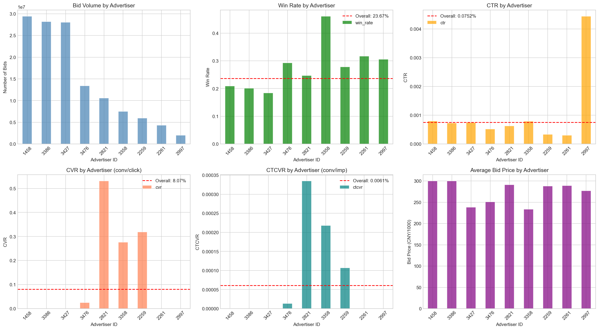
*Figure A1: Advertiser별 bid/impression/click 통계. Retargeting vs Branding 패턴이 뚜렷하다.*

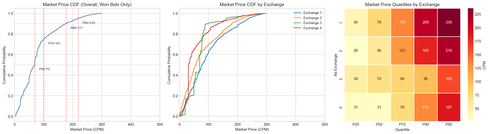
*Figure A2: Market price CDF (winners only). Right-skewed with floor binding.*

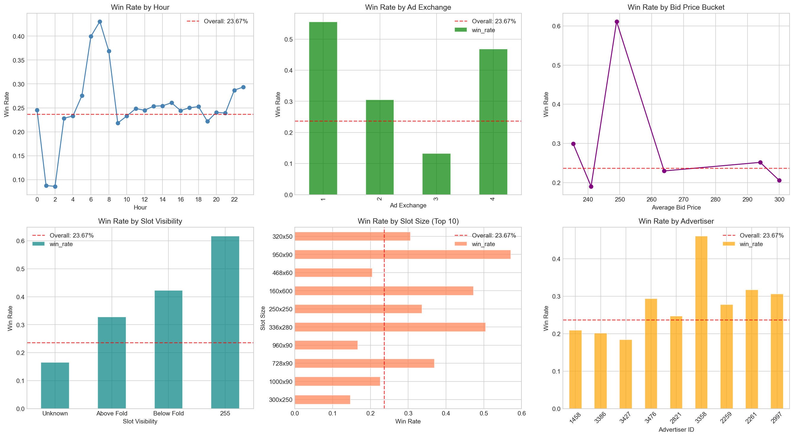
*Figure A3: 시간대별 win rate. U-shape 패턴이 경쟁 강도의 일주기 변동을 반영한다.*

### A.5 성능 튜닝 이력

20단계 성능 튜닝의 요약이다 (원본 학습 기준 수치). 상세 로그는 `docs/performance_tuning.md` 참조.

| Phase | 가설 | 핵심 변경 | Best Run | WCTR AUC | 결과 |
|-------|------|----------|----------|----------|------|
| 1 | Vanilla ESMM-WC | — | A | 0.5995 | Near-random, gradient starvation |
| 2 | Regularization | batch→65K, cosine | F | 0.6005 | win_weight 핵심 변수 발견 |
| 3 | Win-weight 극소화 | ww=0.01 | G | 0.6426 | **Breakthrough** (+0.042) |
| 4 | LR 감소 | lr→5e-4 | **J** | **0.6905** | ESMM-WC best |
| 5 | Regularization 강화 | dropout↑ | M | 0.6444 | 역효과 (temporal shift) |
| 7 | ESCM2-WC Transfer | 3-tower DR | P | 0.6728 | 3rd tower overhead |
| 8 | DR strength | ctr_weight | R | 0.6766 | 미약한 개선 |
| 9 | Win weight 복원 | ww→1.0 | W | 0.4482 | Catastrophic failure |
| 10 | Gradient isolation | stop_grad | X | 0.4905 | 부분 개선만 |
| 11 | DR formulation | BCE+clipping | Z | 0.6724 | 무의미 (±0.006) |
| 12 | Numeric bypass | Raw scalar | AC | 0.3282 | Catastrophic failure |
| 13B | CFR 탐색 | cfr=0.2 | **AL** | **0.6843** | **DR best calibration** |
| 14 | Per-tower dropout | Tower별 | AM | 0.6377 | Embedding overfit |
| 16 | Checkpoint avg | Top-K weight | AP | 0.6722 | Peak 희석 |
| 17 | HP 확장 | cfr/ilw 변형 | AL | 0.6843 | 0.2/0.5이 sweet spot |
| **18** | **External PS** | **LGB PS for DR** | **AW** | **0.6882** | **ESCM2-WC best AUC** |
| 20 | Target Encoding | 5 cats × 2 targets | AY | 0.5480 | **가설 기각** |

**핵심 튜닝 인사이트:**
- `win_weight=0.01`이 single most impactful hyperparameter — CTR tower 학습의 전제 조건
- `cfr_lambda=0.2`가 imputation tower regularization의 sweet spot
- Temporal shift가 모든 nonlinear 모델의 근본적 한계 — architecture/regularization으로 해결 불가

### A.6 분산 학습 인프라

JAX SPMD (Single Program Multiple Data) 기반 분산 학습 인프라를 구축하였다.

| 모듈 | 경로 | 기능 |
|------|------|------|
| Mesh | `src/distributed/mesh.py` | JAX SPMD Mesh 생성, data sharding |
| DataLoader | `src/distributed/data_loader.py` | grain 기반 DataLoader (RTBDataSource) |
| Train State | `src/distributed/train_state.py` | LR schedule (warmup + cosine/linear decay) |
| Checkpoint | `src/distributed/checkpoint.py` | orbax 기반 save/restore |

**핵심 불변식:**
1. `batch_to_jax()` 출력 = `{"x": Dict[str, Array], "win": Array, "click": Array}` — single/multi-device 동일
2. `data_sharding`이 None이면 single-device, NamedSharding이면 SPMD
3. Checkpoint metadata 스키마의 backward compatibility 유지

### A.7 Bid Shading 수식 도출

**Setup.** First-price auction에서 bidder의 expected payoff:

$$\Pi(b|x) = [V(x) - b] \cdot F(b|x)$$

여기서 $V(x) = \text{pCTR}(x) \times \text{CPC}_{\text{target}}$는 impression의 가치, $b$는 bid price, $F(b|x) = P(\text{market\_price} \leq b|x)$는 market price CDF이다.

**First-Order Condition (FOC).** Payoff를 $b$에 대해 미분하여 0으로 놓으면:

$$\frac{\partial \Pi}{\partial b} = -F(b) + [V(x) - b] \cdot f(b) = 0$$

$$V(x) - b^* = \frac{F(b^*)}{f(b^*)}$$

**Hazard Rate 표현.** Survival function $S(b) = 1 - F(b)$와 hazard rate $h(b) = f(b)/S(b)$를 사용하면:

$$b^* = V(x) - \frac{F(b^*)}{f(b^*)} = V(x) - \frac{1 - S(b^*)}{h(b^*) \cdot S(b^*)}$$

**Shade Factor.** Shade factor $\gamma = b^*/V(x)$로 정의하면:

$$\gamma(x) = 1 - \frac{F(b^*)}{V(x) \cdot f(b^*)}$$

iPinYou demo에서 V(x)=200, b*=89 → γ=0.446 (44.6%).

**Exchange-Conditional Extension.** Exchange $e$별로 $F_e(b|x)$를 추정하면:

$$b^*_e(x) = \arg\max_b [V(x) - b] \cdot F_e(b|x)$$

이를 통해 exchange 특성에 맞는 차별화된 bid strategy를 구현한다.

### A.8 Market Price Distribution Details

Section 3.5에서 참조하는 market price CDF의 상세 분석 결과이다.

**Market Price 통계 (Winners):**

| 항목 | 값 |
|------|-----|
| Mean | 78 CPM |
| Median | 68 CPM |
| P25 | 36 CPM |
| P75 | 93 CPM |
| P90 | 166 CPM |
| P95 | 214 CPM |
| Floor Binding Rate | 20.8% |
| Overall Win Rate | 21.0% |

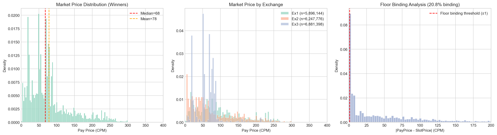
*Figure A4: Market price (payprice) 분포. Right-skewed with long tail.*

**Kaplan-Meier CDF:**

KM estimator로 censored market price를 포함한 전체 CDF를 추정하였다. iPinYou의 flat bidding (6개 이산 bid price: 227-300 CPM)으로 인해 heavy censoring이 발생하며, cross-advertiser pooling이 필요하다.

- **F(300) ≈ 21.3% ≈ Overall Win Rate** — KM CDF가 well-calibrated
- **True Median > 300 CPM** (unidentifiable, S(300)=0.79)

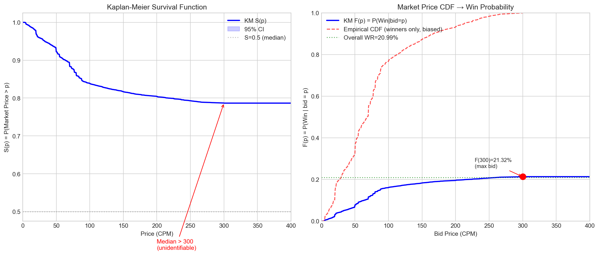
*Figure A5: Kaplan-Meier market price CDF. F(300) ≈ 21.3%로 overall win rate와 일치한다.*

**Exchange-Conditional CDF:**

| Exchange | F(300) | Median | 특성 |
|----------|--------|--------|------|
| Ex1 | 68.8% | 153 CPM | Low floor, high win rate |
| Ex2 | 29.1% | >300 CPM | Moderate floor |
| Ex3 | 11.9% | >300 CPM | Active floor, most competitive |

Exchange 간 F(300)이 5.8배 차이를 보여 exchange-conditional bid shading이 필수적이다.

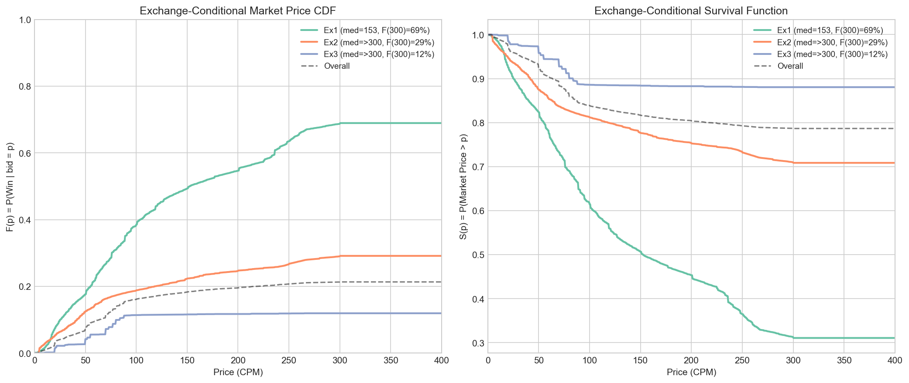
*Figure A6: Exchange-conditional market price CDF. Exchange별 시장 구조가 크게 상이하다.*

**Parametric Fit 비교:**

| 분포 | AIC | BIC | 적합도 |
|------|-----|-----|--------|
| **LogNormal** | **Best** | **Best** | mu=7.93, sigma=2.52 |
| Weibull | 2nd | 2nd | — |
| Exponential | Worst | Worst | — |

LogNormal이 iPinYou market price에 가장 적합한 parametric distribution이다.

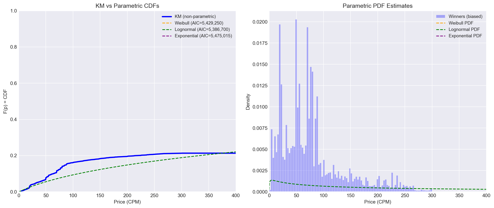
*Figure A7: Parametric fit vs KM CDF. LogNormal이 KM CDF를 가장 잘 근사한다.*

---

## 참고문헌

### ESMM / ESCM²
- Ma, X., Zhao, L., Huang, G., et al. (2018). Entire Space Multi-Task Model: An Effective Approach for Estimating Post-Click Conversion Rate. *SIGIR*.
- Wang, H., Chang, T.-W., Liu, T., et al. (2022). ESCM²: Entire Space Counterfactual Multi-Task Model for Post-Click Conversion Rate Estimation. *SIGIR*.

### RTB & Bid Optimization
- Zhang, W., Yuan, S., Wang, J. (2014). Optimal Real-Time Bidding for Display Advertising. *KDD*.
- Wu, W. C.-H., Yeh, M.-Y., & Chen, M.-S. (2015). Predicting winning price in real time bidding with censored data. *KDD*.
- Cui, Y., Zhang, R., Li, W., & Mao, J. (2011). Bid landscape forecasting in online ad exchange marketplace. *KDD*.
- Karlsson, N. (2021). Bid Shading in First-Price Auctions. *arXiv preprint*.

### Selection Bias & Causal Inference
- Heckman, J. J. (1979). Sample Selection Bias as a Specification Error. *Econometrica*, 47(1), 153-161.
- Rosenbaum, P. R., & Rubin, D. B. (1983). The central role of the propensity score in observational studies. *Biometrika*.
- Bang, H., & Robins, J. M. (2005). Doubly Robust Estimation in Missing Data and Causal Inference Models. *Biometrics*.
- Kennedy, E. H. (2023). Towards Optimal Doubly Robust Estimation of Heterogeneous Causal Effects. *Electronic Journal of Statistics*.

### Survival Analysis
- Kaplan, E. L., & Meier, P. (1958). Nonparametric Estimation from Incomplete Observations. *JASA*.
- Klein, J. P., & Moeschberger, M. L. (2003). *Survival Analysis: Techniques for Censored and Truncated Data*. Springer.

### iPinYou Dataset
- Liao, H., Peng, L., Liu, Z., & Shen, X. (2014). iPinYou Global RTB Bidding Algorithm Competition Dataset. *ADKDD*.
- Zhang, W., Yuan, S., Wang, J., & Shen, X. (2014). Real-Time Bidding Benchmarking with iPinYou Dataset. *arXiv:1407.7073*.

### Deep Learning & Multi-Task Learning
- Ruder, S. (2017). An Overview of Multi-Task Learning in Deep Neural Networks. *arXiv:1706.05098*.
- Ma, J., Zhao, Z., Yi, X., et al. (2018). Modeling Task Relationships in Multi-task Learning with Multi-gate Mixture-of-Experts. *KDD*.
