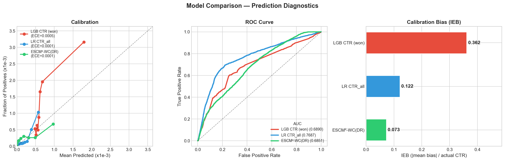

# Multi-Task Debiasing for RTB Win/CTR Prediction — iPinYou

## Executive Summary

본 프로젝트는 **129.5M bids × 30.6M impressions** RTB 데이터에서 **Win Selection Bias를 진단·정량화**하고, Multi-task Debiasing (ESMM-WC / ESCM²-WC(DR))으로 **unbiased CTR prediction**을 달성하며, Calibration 차이가 bidding revenue에 미치는 **경제적 영향을 정량화**한 연구이다. Bid→Win→Click 퍼널의 **Win Tower Dual Purpose** 설계로 CTR debiasing과 bid shading을 동시에 해결한다.

### Key Results

| 핵심 성과 | 수치 |
|----------|------|
| Selection Bias 규모 | Win PS AUC ~0.91, CTR overestimation +4.57% |
| **Calibration 개선** | **Biased baseline IEB 0.362 → Neural debiasing IEB 0.045-0.075 (~5배)** |
| **AUC 개선** | **ESMM-WC 0.6527 → ESCM²-WC(DR) 0.6851 (+0.032)** |
| Overbidding Cost 절감 | Neural (360K-600K CPM/1M bids) vs LGB Baseline (2,896K) — **~5-8배** |
| KM CDF Surplus | Neural debiasing: **near-oracle surplus**, LR/LGB: **-2.2% 손실** |

| 분석 단계 | 핵심 발견 | 비즈니스 임팩트 |
|----------|----------|----------------|
| Bias 진단 | Win PS AUC ~0.91, ESS 9.66% → IPW 위험 | DR doubly robust 필수 |
| Debiasing | Multi-task 전체가 **~5배** calibration 개선 | Bid pricing error 대폭 감소 |
| Bid Shading | IEB → overbidding cost 직결 | **AUC best ≠ Bidding best** 입증 |

### Approach & Technical Highlights

| 단계 | 방법론 | 핵심 기술 | Output |
|------|--------|----------|--------|
| Bias 진단 | Win PS + Covariate Shift | LGB classifier, KS test, Cohen's d | Positivity 진단 보고서 |
| Baseline | LGB / LR | Winners-only vs All-bids 비교 | AUC/IEB/ECE 기준선 |
| Debiasing | ESMM-WC → ESCM²-WC(DR) | 2/3-tower multi-task, DR estimator, CFR | Unbiased pCTR + Win Rate |
| Bid Shading | KM CDF + FOC | Survival analysis, exchange-conditional | Optimal bid + surplus 분석 |

**프로젝트 차별점:**
- **End-to-End Framework**: Bias 진단 → Debiasing Ablation → Calibration → Bid Optimization 전체 인과 체인
- **Calibration의 경제적 가치 정량화**: IEB 차이 → overbidding cost → surplus 손실까지 연결
- **Win Tower Dual Purpose**: CTR debiasing propensity + bid shading win rate model을 단일 tower에서 제공

---

## Motivation & Framework

RTB 환경에서 DSP는 경매 승리(win)한 impression에 대해서만 click 관측이 가능하다. 이 **Win Selection Bias**로 인해 winners-only CTR 모델은 전체 bid population의 CTR을 과대추정하며, 이는 systematic overbidding으로 이어진다.

```
┌─────────────────────────────────────────────────────────────────────────────┐
│                      DEBIASING FRAMEWORK                                    │
├─────────────────────────────────────────────────────────────────────────────┤
│                                                                             │
│  PROBLEM: Win Selection Bias                                                │
│  ═══════════════════════════                                                │
│                                                                             │
│  129.5M Bids ──→ 30.6M Wins (23.67%) ──→ 23K Clicks (0.075%)              │
│       │               │                                                     │
│       │        Click label 관측 가능                                          │
│       │                                                                     │
│  76.3% Lost ──→ Click label 부재 (unobserved)                               │
│                                                                             │
│  → Winners-only CTR 학습 = Biased (CTR +4.57% overestimation)               │
│                                                                             │
├─────────────────────────────────────────────────────────────────────────────┤
│                                                                             │
│  SOLUTION: Multi-Task Debiasing Ablation                                    │
│  ═══════════════════════════════════════                                     │
│                                                                             │
│  Step 1: Biased Baseline (LGB)     → CTR on winners only                   │
│  Step 2: ESMM-WC (2-tower)         → ESMM implicit debiasing               │
│  Step 3: ESCM²-WC (IPW)            → Explicit IPW correction               │
│  Step 4: ESCM²-WC (DR)             → Doubly Robust (primary)               │
│  Step 5: + External Win PS         → LGB propensity for DR                  │
│                                                                             │
│  Output: Unbiased pCTR + Win Rate Model (dual purpose)                     │
│                                                                             │
├─────────────────────────────────────────────────────────────────────────────┤
│                                                                             │
│  VALUE CHAIN: Calibration → Revenue                                         │
│  ══════════════════════════════════                                          │
│                                                                             │
│  Debiasing → Better IEB → Lower bid error → Less overbidding               │
│                                → Near-oracle surplus in bid shading          │
│                                                                             │
└─────────────────────────────────────────────────────────────────────────────┘
```

**왜 Multi-task Debiasing인가?**

| 측면 | Biased Baseline | Multi-task Debiasing |
|------|-----------------|---------------------|
| 학습 데이터 | Winners only (30.6M) | **전체 Bids (129.5M)** |
| CTR 추정 | 과대추정 (+4.57%) | **Unbiased** (DR correction) |
| Calibration (IEB) | 0.362 (biased) | **0.045-0.075** (~5배 개선) |
| Overbidding Cost | 2,896K CPM / 1M bids | **360-600K** (~5-8배 절감) |
| Win Rate Model | 별도 필요 | **Win Tower 내장** (AUC ~0.91) |

---

## Key Insights: 핵심 발견

### 1. Calibration → Revenue 인과 체인 (AUC best ≠ Bidding best)

| Model | IEB | All-bids AUC | Overbid/1M Bids | vs Best |
|-------|-----|-------------|-----------------|---------|
| ESCM²-WC(DR)+ExtPS | **0.045** | 0.6837 | **360K** | 1× |
| ESCM²-WC(DR) | 0.073 | **0.6851** | 584K | 1.6× |
| LR CTR_all | 0.122 | (0.7687)* | 976K | **2.7×** |
| LGB CTR (biased) | 0.362 | (0.6890)** | 2,896K | **8.0×** |

*\* All-bids 직접 평가 (easy negatives 포함). \*\* Winners-only 평가.*

LR CTR_all은 all-bids AUC 최고(0.7687)이지만, IEB 0.122로 neural debiasing 대비 **2.7배** overbidding cost. **Ranking 최고 모델 ≠ Bidding 최적 모델**.

### 2. Win Tower Dual Purpose

Win Tower는 (a) CTR debiasing을 위한 propensity score와 (b) bid shading을 위한 win rate model의 **이중 역할** 수행. Serving 시 추가 네트워크 호출 없이 debiasing + bid optimization 동시 처리 가능.

### 3. Temporal Drift — 가장 큰 병목

S2(2013.06) → S3(2013.10) ~4개월 gap의 temporal shift (KS=0.1294)가 모든 nonlinear model 성능을 제한:
- 모든 LGB 모델: AUC 대폭 하락 (CTR: 0.81→0.69, Win: 0.93→0.65)
- 20단계 튜닝에서 regularization/architecture 변경 모두 **해결 불가**
- **LR만 temporal-robust** (linear model의 낮은 complexity)

---

## Methodology

### Analysis Pipeline

```
┌────────────────────────────────────────────────────────────────┐
│                    ANALYSIS PIPELINE                           │
├────────────────────────────────────────────────────────────────┤
│                                                                │
│  [Raw bz2 logs: bid/imp/clk/conv]                              │
│        │                                                       │
│        ▼                                                       │
│  ┌─────────────────┐                                           │
│  │ Data Pipeline   │ → 30 Features                             │
│  │ (Parse+Unify+FE)│   (Slot, Temporal, Bid, Competition...)   │
│  └────────┬────────┘                                           │
│           │                                                    │
│    ┌──────┴──────┐                                             │
│    ▼             ▼                                             │
│ [NB02]        [NB03-04]                                        │
│    │             │                                             │
│    ▼             ▼                                             │
│ ┌──────────┐ ┌───────────┐                                     │
│ │Bias Diag │ │ Baselines │ → LGB/LR AUC, IEB, ECE             │
│ │(Win PS)  │ │(CTR/Win)  │                                     │
│ └──┬───────┘ └────┬──────┘                                     │
│    │              │                                            │
│    ▼              ▼                                            │
│ [Positivity]  ┌───────────┐                                    │
│  AUC ~0.91    │ Debiasing │ → ESMM-WC, ESCM²-WC(DR)           │
│  ESS 9.66%    │ Ablation  │   20-phase tuning                  │
│               └────┬──────┘                                    │
│                    │                                           │
│                    ▼                                            │
│            ┌──────────────┐                                    │
│            │ Bid Shading  │ → KM CDF, Optimal Bid              │
│            │ + Surplus    │   Exchange-conditional               │
│            └──────────────┘                                    │
│                    │                                           │
│                    ▼                                            │
│            [Calibration Economic Value]                        │
│            → Neural debiasing: near-oracle surplus             │
│            → LGB baseline: -8% surplus loss (Ex1)             │
└────────────────────────────────────────────────────────────────┘
```

### Model Architecture

**ESMM-WC (2-Tower):** P(Click_bid|X) = P(Win|X) × P(Click|Win, X) — ESMM constraint로 implicit debiasing

**ESCM²-WC (3-Tower, DR):** Win + CTR + Imputation Tower. DR estimator로 explicit debiasing:

$$\hat{Y}_{DR}(x) = \hat{C}(x) + \frac{W}{\hat{e}(x)} \cdot (Y - \hat{C}(x))$$

Propensity 또는 imputation 중 하나만 올바르면 일치성 보장 (doubly robust).

| 특성 | ESMM-WC | ESCM²-WC (DR) |
|------|---------|---------------|
| Towers | 2 (Win + CTR) | 3 (Win + CTR + Imputation) |
| Debiasing | Implicit (ESMM constraint) | Explicit (DR/IPW) |
| Counterfactual | 없음 | Imputation tower + CFR |
| Parameters | ~120K | ~180K |

> 상세 수식 및 학습 설정: [prediction_report.md §2](prediction_report.md#2-방법론) 참조

### Calibration의 경제적 평가: Overbidding vs Surplus

RTB에서 calibration error(IEB)의 경제적 영향을 두 가지 관점에서 측정한다:

| | Overbidding Cost | Surplus Loss |
|---|---|---|
| **측정** | 입찰가 초과분 (bid error) | 기대 수익 감소 (profit loss) |
| **산식** | `IEB × actual_CTR × CPC` | `(V - b*) × F(b*)` vs Oracle |
| **IEB 관계** | 선형 비례 | 시장 CDF shape 의존 |
| **해석** | "calibration이 얼마나 나쁜가" (모델 품질) | "실제로 돈을 얼마나 잃는가" (비즈니스 임팩트) |

Overbidding은 모든 exchange에서 동일하지만, surplus loss는 시장 경쟁도에 따라 다르다 — 경쟁이 낮은 exchange(Ex1)에서는 win rate가 높아 과다 입찰의 영향이 크고, 경쟁이 높은 exchange(Ex3)에서는 어차피 승리가 어려워 영향이 없다.

---

## Results Summary

### Selection Bias 진단

| 진단 | 값 | 해석 |
|------|-----|------|
| **Win PS AUC** | **~0.91** | Winners/losers 간 강한 separability |
| CTR Overestimation | +4.57% | Winners-only CTR 과대추정 |
| Overlap [0.1, 0.9] | 47.8% | 절반 이상 extreme PS 영역 |
| ESS Ratio | 9.66% | IPW 실효 표본 ~10% → DR 필수 |
| Top Covariate Shift | `bid_floor_ratio` (d=0.83) | 입찰가 구조가 selection 지배 |


*Win PS 분포. Overlap [0.1, 0.9] 영역에 47.8%만 존재하여 IPW 단독 위험.*

### Debiasing Ablation

| 모델 | WCTR AUC | WCTR IEB | WCTR ECE |
|------|----------|----------|----------|
| LGB CTR (biased) | (0.6890)* | 0.362 | 0.000545 |
| LR CTR_all | (0.7687)** | 0.122 | 0.000028 |
| **ESMM-WC** | 0.6527 | 0.075 | 0.000017 |
| **ESCM²-WC (DR)** | **0.6851** | 0.073 | 0.000017 |
| ESCM²-WC (DR) + ExtPS | 0.6837 | **0.045** | 0.000010 |

*\* Winners-only. \*\* All-bids (easy negatives 포함).*

**핵심:**
- Multi-task debiasing 전체가 biased baseline 대비 **~5배 calibration 개선**
- DR의 주요 기여는 AUC **+0.032 개선** (ESMM-WC → ESCM²-WC(DR))
- External PS (Run AW) = **calibration best** (IEB 0.045)


*LGB CTR (won-only) vs LR CTR_all vs ESCM²-WC(DR) 비교. Calibration: ESCM²-WC(DR)이 perfect line에 가장 근접. LGB는 상위 bin에서 overestimation이 뚜렷하다.*


*모델별 Overbidding Cost (1M bids). Neural debiasing (AW 360K) vs LGB baseline (2,896K) — ~8배 차이.*

### Calibration의 경제적 가치

**Overbidding Cost:**

| Model | IEB | Per-Bid Error (CPM) | 1M Bids Overbid | vs Best |
|-------|-----|--------------------|-----------------------|---------|
| ESCM²-WC(DR)+ExtPS | 0.045 | 0.360 | 360K | 1× |
| ESCM²-WC(DR) | 0.073 | 0.584 | 584K | 1.6× |
| ESMM-WC | 0.075 | 0.600 | 600K | 1.7× |
| LR CTR_all | 0.122 | 0.976 | 976K | **2.7×** |
| LGB CTR (biased) | 0.362 | 2.896 | 2,896K | **8.0×** |

**KM CDF 기반 Surplus:**

| Exchange | Oracle | ExtPS AW | ESCM²(DR) AL | LR CTR_all | LGB CTR |
|----------|--------|----------|-------------|-----------|---------|
| Ex1 (F(300)=69%) | 25.28 | 25.28 (~0%) | 24.91 (-1%) | 24.76 (-2%) | 23.22 (**-8%**) |
| Ex2 (F(300)=29%) | 14.82 | 14.82 (~0%) | 14.82 (~0%) | 14.80 (~0%) | 14.58 (-2%) |
| Ex3 (F(300)=12%) | 8.09 | 8.09 (~0%) | 8.09 (~0%) | 8.09 (~0%) | 8.09 (~0%) |

Neural debiasing = **near-oracle surplus**. LGB baseline은 경쟁이 낮은 Ex1에서 **-8% surplus 손실**.


*Surplus Loss vs Oracle (%). LGB CTR은 Ex1(win rate 높은 exchange)에서 8.2% 손실. Neural debiasing 모델은 전 exchange에서 ~0% loss.*

### Production 모델 선택

| 용도 | 추천 모델 | 근거 |
|------|----------|------|
| **Bid Pricing** | ESCM²-WC(DR)+ExtPS Run AW | IEB **0.045** (calibration best, near-oracle surplus) |
| **Ad Ranking** | ESCM²-WC(DR) Run AL | WCTR AUC **0.6851** (neural AUC best) |

→ 두 모델의 **A/B test**로 revenue impact 직접 비교 권장.

---

## Limitations & Lessons Learned

| 한계 | 증거 | 완화책 |
|------|------|--------|
| **Temporal Distribution Shift** | S2→S3 KS=0.1294, 모든 nonlinear AUC 하락 | Online learning, periodic retraining |
| **Positivity Violation** | Overlap 47.8%, ESS 9.66% | DR doubly robust + ESMM joint constraint |
| **Flat Bidding 제약** | 6개 이산 bid price (227-300 CPM) | KM S(300)=0.79 — high-price CDF unidentifiable |
| **CVR Near-Trivial** | Branding CVR=0 (train), Conv 1,860건 | Bid→Win→Click 퍼널만 채택 |
| **AUC Gap vs LR** | WCTR 0.6851 vs LR 0.7687 | Easy negatives + temporal drift 기여 |

### 교훈

> "Win PS AUC 0.91과 IPW ESS 9.66%는 auction-driven selection의 구조적 심각성을 보여준다.
> Biased baseline과 debiased model 간 **~5배 IEB 차이**가 overbidding cost **~5-8배 차이**로 직결되며,
> 이 **debiasing → calibration → bid pricing → revenue 인과 체인**이 본 프로젝트의 핵심 결론이다."

### 향후 방향

1. **Bid Optimization (SP3)**: `bid(x) = V(x) × shade(x) × pace(t)` — KM CDF 기반 bid shading + budget pacing
2. **Temporal Adaptation**: Online learning / domain adaptation으로 temporal shift 완화
3. **Exchange-Conditional Shading**: Exchange별 CDF 활용 차별화된 bid strategy
4. **Production Serving**: FastAPI + ONNX Runtime (<50ms P95), Feast + Redis feature serving

---

## Technical Reports

상세 방법론, 수식, 부록은 다음을 참조한다:

- **[Prediction Report (Full)](prediction_report.md)**: 전체 리포트
  - Selection Bias 진단, 모델 아키텍처 수식, 20단계 튜닝, Negative Results, KM CDF 수식 도출

- **[Performance Tuning Log](performance_tuning.md)**: 20단계 성능 튜닝 상세 로그

---

## Project Structure

```
rtb_ipinyou/
├── src/                    # Core library
│   ├── data/               # parser.py, unifier.py
│   ├── features/           # engineering.py, usertag.py
│   ├── models/             # base.py, esmm_wc.py, escm2_wc.py
│   ├── debiasing/          # win_propensity.py, diagnostics.py
│   ├── distributed/        # mesh.py, data_loader.py, train_state.py, checkpoint.py
│   ├── bidding/            # shading.py (planned)
│   └── config.py
├── scripts/                # CLI entry points (preprocess, build_features, train)
├── notebooks/              # Analysis notebooks (00-05)
├── configs/                # Hydra YAML config groups
├── docs/                   # Research docs + reports
├── results/                # Models, figures, tables
└── PLAN.md                 # Progress tracking
```

---

## Notebooks

| Notebook | 분석 내용 |
|----------|----------|
| `00_data_preparation` | Raw bz2 → Unified Parquet 파이프라인 |
| `01_eda_analysis` | EDA: Campaign stats, market price, temporal, floor binding |
| `02_selection_bias_diagnosis` | Win/Click selection bias 진단 (PS, covariate shift, positivity) |
| `03_prediction_baseline` | LGB/LR baseline, AUC/ECE/IEB 비교 |
| `04_prediction_debiasing` | ESMM-WC vs ESCM²-WC ablation, negative results |
| `05_win_rate_market_price` | Market price CDF, parametric fit, bid shading |

---

## Technical Stack

- **Neural Network**: JAX, Flax (NNX API)
- **ML Baseline**: LightGBM, scikit-learn
- **Data Processing**: Pandas, Polars, NumPy
- **Survival Analysis**: lifelines (Kaplan-Meier CDF)
- **Data Loading**: grain
- **Config**: Hydra + OmegaConf + Typer
- **Experiment Tracking**: W&B
- **Checkpoint**: orbax-checkpoint

---

## Data Source

**iPinYou RTB Dataset** — 2013년 중국 DSP의 실제 RTB 로그

| 항목 | 값 |
|------|-----|
| 총 Bids | 129.5M (S2: 106.6M + S3: 22.9M) |
| Impressions | 30.6M (Win Rate 23.67%) |
| Clicks | 23,058 (CTR 0.0752%) |
| Conversions | 1,860 (CVR 8.07%) |
| Advertisers | 9 (Branding 5, Retargeting 3, Mixed 1) |
| Market Price | Median 68, Mean 78 CPM |
| Temporal Split | Train: S2 (2013.06), Test: S3 (2013.10) |
