# Debiasing Win Selection Bias in RTB — Technical Report

**English** · [한국어 요약 in README.ko.md](../README.ko.md) · Status: post-redesign, current ·
Numbers pinned to [`NUMBERS_LEDGER.md`](NUMBERS_LEDGER.md) · Evaluation contract frozen in
[`evaluation_protocol.md`](evaluation_protocol.md)

This is the 30-minute layer behind the [README](../README.md). It documents the method, the
falsification-first evaluation, the results, and — deliberately — the corrections we made to our own
earlier claims.

---

## Abstract

In Real-Time Bidding, click labels exist only for bids that won the auction, so a click model fit on
winners is selection-biased: `P(click | win) ≠ P(click)`. We adapt the ESMM / ESCM² entire-space
framework from impression→click→conversion to a **bid→win→click** funnel and train a doubly-robust
3-tower model (`ESCM²-WC`) whose Win Tower serves double duty as the debiasing propensity and the
bid-shading win-rate model. We then test the only thing a bidder cares about: **does debiasing produce
better bidding decisions than strong baselines?** On a fair per-advertiser temporal split, debiasing
wins the ranking object (winners-only AUC 0.658 vs 0.632 / 0.554), and post-hoc cross-fit isotonic plus
per-advertiser calibration fully solve calibration (IEB 0.597→0, residual 0.226→0.0006). On realized
second-price surplus the verdict is **split**: robust over a linear LR baseline (5/5 advertisers, CI
excludes 0) but **not robust over a strong GBM** — that gap is advertiser-heterogeneous (Cochran's Q
I²=0.82) and driven by a single advertiser. We report this honestly, including the retraction of an
earlier AUC headline that turned out to be a split artifact.

## 1. Problem & data

<p align="center">
  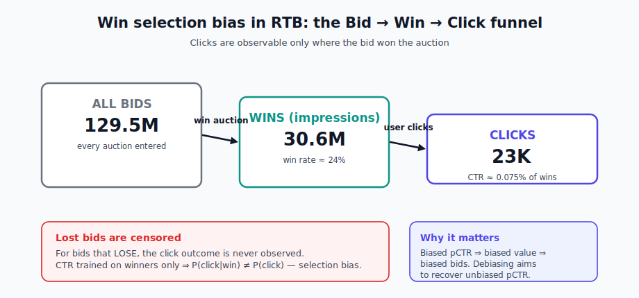
</p>

**iPinYou** RTB dataset (2013, seasons 2–3): 129.5M bids, 30.6M impressions (win rate ≈ 24%), ~23K
clicks (CTR ≈ 0.075% of winners), market price median 70 / mean 80 CPM, floor binding 32.24%.
Conversion is not modeled (CVR near-trivial: ~1.86K conversions), so the funnel is **bid→win→click**.

The **fair split** (`features_fair`) is a per-advertiser temporal split (0.70/0.15/0.15) with shared
advertiser and creative vocabulary: train 90.6M / val 19.4M / test 19.4M bids; the test winner set is
5,616,945 winners with 4,534 clicks over 5 advertisers {1458, 3358, 3386, 3427, 3476}. Surplus analyses
use the `payprice>0` subset (5,616,873 winners, 4,512 clicks).

## 2. Method — `ESCM²-WC`

<p align="center">
  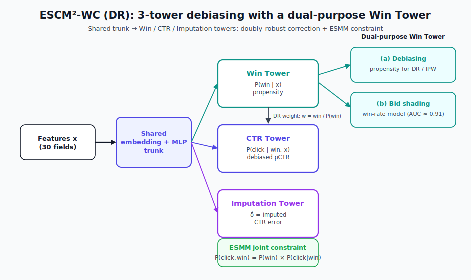
</p>

A shared embedding+MLP trunk (30 features) feeds three towers:

- **Win Tower** `P(win | x)` — trained on all bids; supplies the DR propensity and (post-training) the
  win-rate model for bid shading (AUC ≈ 0.91).
- **CTR Tower** `P(click | win, x)` — the debiased pCTR, trained on won samples with DR weights
  `w = win / clip(P̂(win))`.
- **Imputation Tower** `δ̂` — models the CTR error `(click − p_ctr)`, making the estimator doubly robust.

The total loss combines a Win BCE (all bids), a DR-weighted CTR loss (won samples), an imputation loss,
an **ESMM joint constraint** `BCE(P(win)·P(click|win), click)` over all bids, and a counterfactual-risk
regularizer on unselected samples. Ablation ladder: **Biased LGB → ESMM-WC → ESCM²-WC (IPW) →
ESCM²-WC (DR)**. DR is primary because positivity diagnostics (overlap ≈ 48%, ESS ratio ≈ 10%) make
pure IPW high-variance.

## 3. The retraction — why the headline changed

<p align="center">
  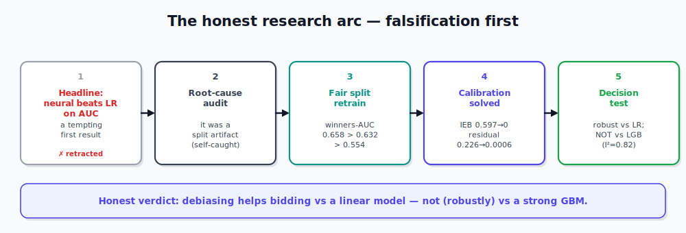
</p>

<p align="center">
  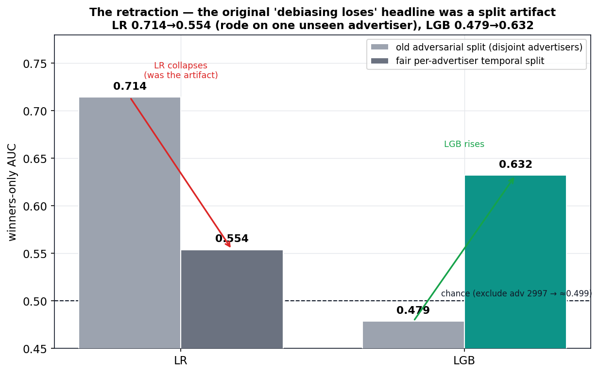
</p>

The pre-redesign program chased prediction AUC and reported debiasing *losing* to logistic regression
(LR all-bids AUC 0.769). A root-cause audit found **two independent bugs** manufacturing that result:

1. **Adversarial disjoint-advertiser split** — train (S2) and test (S3) advertisers were disjoint
   (creative-vocabulary overlap 0/55). "LR 0.714" rode on a single unseen high-CTR advertiser (2997)
   plus an accidental monotone raw-ID encoding. **Exclude 2997 and every model → AUC ≈ 0.499 (chance).**
2. **Unsupervised CTR tower** — saved runs trained with `ctr_weight ≈ 0`, so the CTR head learned only
   indirectly through the win×ctr product → systematic 10/10-decile under-prediction.

On the fair split the ranking artifact disappears (LR 0.714→0.554; LGB 0.479→0.632) and the defensible
thesis becomes **calibration → bidding surplus**. The takeaway is methodological: the headline was a
*measurement artifact*, and we caught it ourselves.

## 4. Evaluation protocol (frozen)

The [evaluation contract](evaluation_protocol.md) fixes the primary objects to prevent regression:
**winners-only AUC** (ranking), realized **second-price** surplus on actual payprice (decision value),
**cross-fit isotonic** recalibration (leak-free), and **advertiser-cluster** CIs with mandatory
heterogeneity reporting. Forbidden: global-IEB headlines, first-price/"phantom" surplus, and clustering
finer than advertiser (ICC > 0).

## 5. Results

### 5.1 Ranking

<p align="center">
  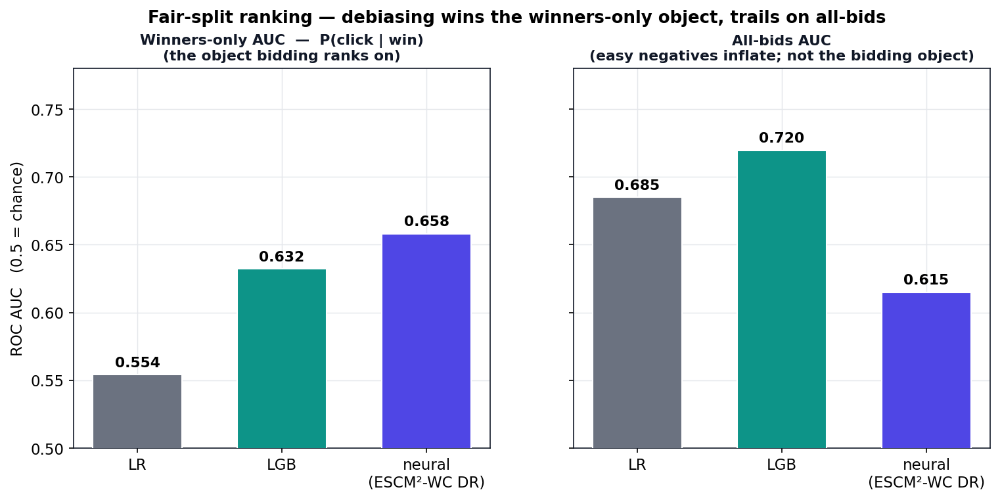
</p>

| model (fair split) | winners-only AUC | all-bids AUC |
|---|---|---|
| **escm2wc_dr (neural)** | **0.658** | 0.615 |
| LGB (ctr_all) | 0.632 | 0.720 |
| LR (ctr_all) | 0.554 | 0.685 |

Neural leads the **winners-only** object (the bidding target) by +0.026 over LGB; it trails on all-bids
where easy negatives dominate. Bidding ranks `P(click | win)`, so winners-only is the relevant metric.

### 5.2 Calibration

<p align="center">
  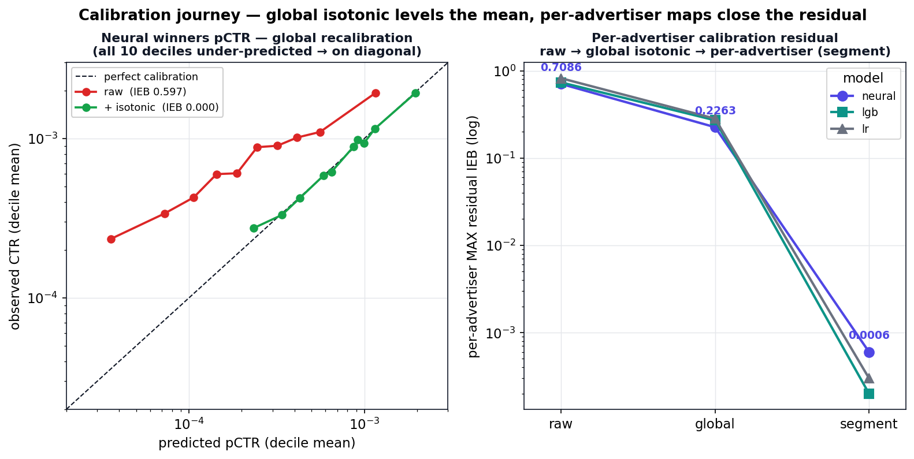
</p>

| model | winners IEB before→after (global isotonic) | per-adv max residual: raw → global → segment |
|---|---|---|
| neural | 0.597 → 0.000 | 0.709 → 0.226 → **0.0006** |
| LR | 0.435 → 0.000 | 0.823 → 0.284 → 0.0003 |
| LGB | 0.476 → 0.000 | 0.738 → 0.272 → 0.0002 |

Cross-fit isotonic (K=5, GPU 0) zeroes global bias rank-preservingly. A single global map cannot fix
per-advertiser bias; a **per-advertiser** map drives the residual three orders of magnitude to ~0 and
even lifts global AUC (neural 0.656→0.666). **Training-stage calibration is negative**: relaxing the
joint constraint worsens under-prediction, and activating `pos_weight` (which forces DR-BCE) over-
predicts wildly and collapses winners-AUC to ~0.52 at every value tested. Post-hoc isotonic is provably
the better bidder (native − isotonic surplus CI excludes 0 on the negative side for every model×strategy).

### 5.3 Decision value (second-price)

<p align="center">
  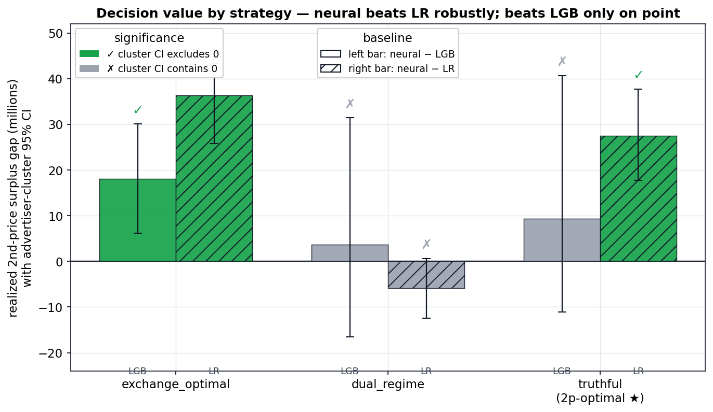
</p>

Recalibration pins every model's mean value to the empirical base rate (≈160.65 CPM), so among-recal
surplus differences are **pure ranking + slice-calibration**. Under the 2p-optimal `truthful` strategy:

| comparison | gap | advertiser-cluster CI | verdict |
|---|---|---|---|
| neural − LR | **+27.4M** | [17.7M, 37.8M] | **excludes 0 ✓** |
| neural − LGB | +9.4M | [−11.1M, 40.7M] | contains 0 ✗ |

### 5.4 Heterogeneity & power — the honest resolution

<p align="center">
  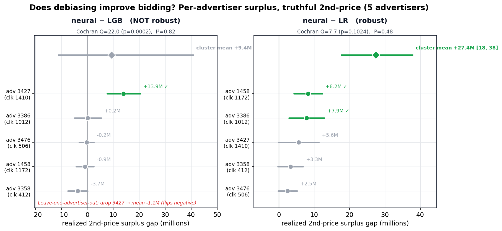
</p>

The neural−LGB cluster mean is below the design's detectability, and the per-advertiser view explains
why it should not be trusted as a robust win:

- **neural − LGB:** positive on **2/5** advertisers, CI-significant on **1/5** (only 3427, +13.9M);
  **Cochran's Q = 22.0 (p = 0.0002), I² = 0.82** ⇒ genuine heterogeneity, not homogeneous noise;
  **leave-one-advertiser-out** drops 3427 → mean **−1.1M** (flips negative). MDE(80%) ≈ 11.5M ≫
  observed mean ≈ 1.9M.
- **neural − LR:** positive on **5/5**, cluster CI [17.7M, 37.8M] excludes 0, low heterogeneity
  (I² = 0.48). The estimator detects a real effect when one exists.

> **Honest verdict:** debiasing's bidding value is **robust over a linear model** and **not robust over
> a strong GBM** — the latter edge is concentrated in one advertiser, not a population effect.

### 5.5 Full-inventory value

<p align="center">
  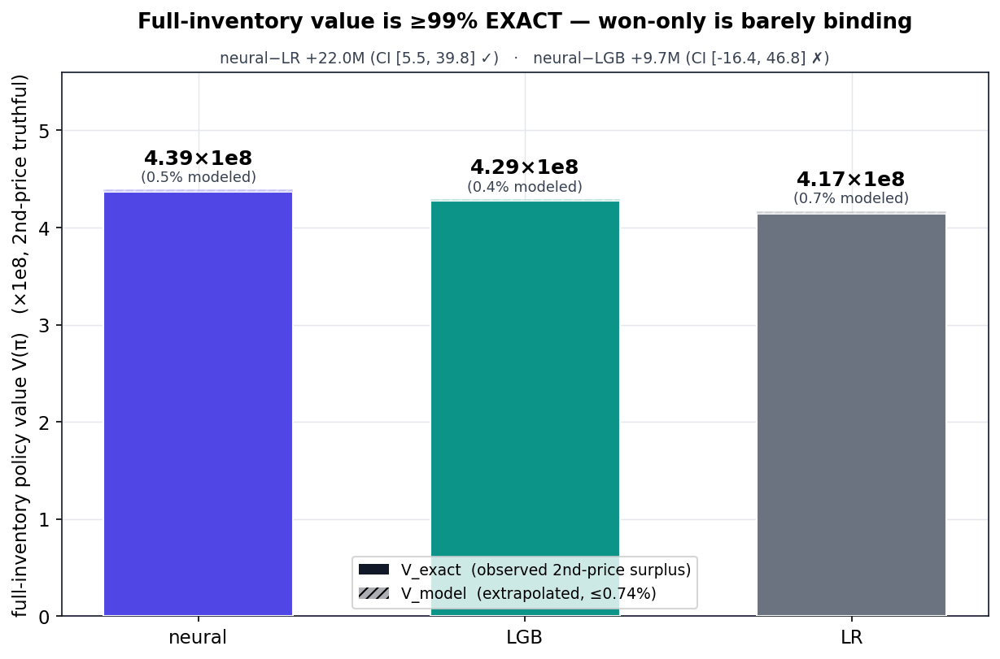
</p>

Projecting value over all 19.4M test bids under second-price: truthful bids sit below the logged flat
bids, so each policy re-wins an *observed* subset and **≥99.26% of value is exact** (≤0.74% modeled).
V(π): neural 4.39e8, LGB 4.29e8, LR 4.17e8. The full-inventory gap is consistent with §5.3:
neural−LR +22.0M (cluster CI excludes 0), neural−LGB +9.7M (cluster CI contains 0). The de-risk ladder
records a **NO-GO** for lost-inventory extrapolation: the contextual market model `F(b|x)` calibrates on
only 13% of cells (flat-bid logging makes it unidentifiable) — but with ≤0.74% modeled it barely binds.

### 5.6 Ablation ladder (fair split)

<p align="center">
  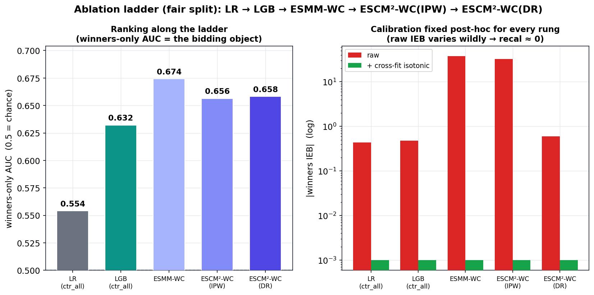
</p>

ESMM-WC and ESCM²-WC(IPW) were retrained on the fair split (2026-06) to close the headline ladder on one
split, with held-constant CTR supervision (ctr_weight=1, pos_weight=50, joint=0.1, embed=16) so only the
debiasing mechanism varies. Winners-only AUC: LR 0.554 · LGB 0.632 · **ESMM-WC 0.674 · IPW 0.656 · DR
0.658**. The neural variants cluster ~0.66 (all beat LR, at/above LGB); ESMM-WC edges raw AUC but at
catastrophic raw calibration (IEB −37.8, the direct-BCE+pos_weight over-prediction), and **every rung
recalibrates to IEB ≈ 0** regardless of raw (range −38 to +0.6). DR is primary for its calibration→
decision pipeline, not for maximizing AUC — an honest, clustered ladder rather than a clean monotone one.

### 5.7 Bid-shading & budget pacing (fair split, canonical)

<p align="center">
  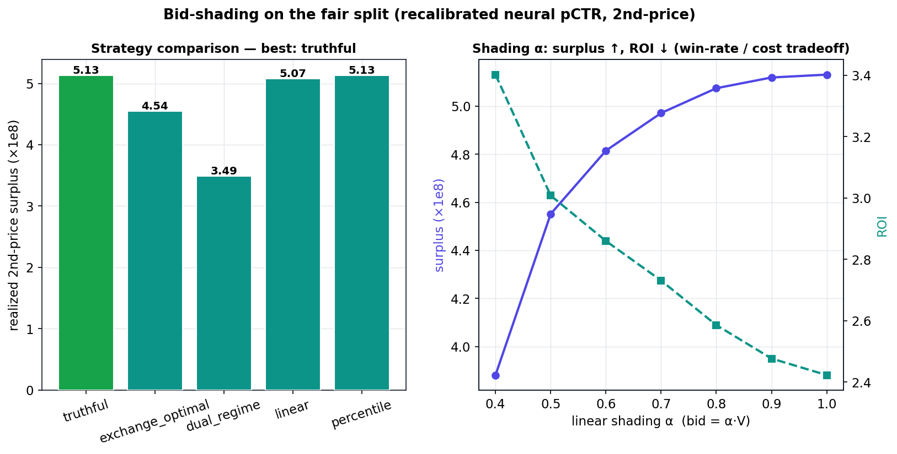
</p>

Re-run on the fair split (recalibrated neural pCTR, second-price), `truthful` (2p-optimal) tops realized
surplus at **5.13e8**; the linear α-sweep traces the win-rate/cost tradeoff (surplus ↑, ROI 3.40→2.42 as
α 0.4→1.0). A PID **budget pacing** controller shows WR-weighted hourly allocation lifts surplus
**+11–14%** over uniform across budget levels. These replace the original/unfair-split
`results/bidding/*` (advertisers 2259/2261/2821/2997).

### 5.8 Causal exploration (CATE + SCM/DAG) — *hypothesis-generating*

<p align="center">
  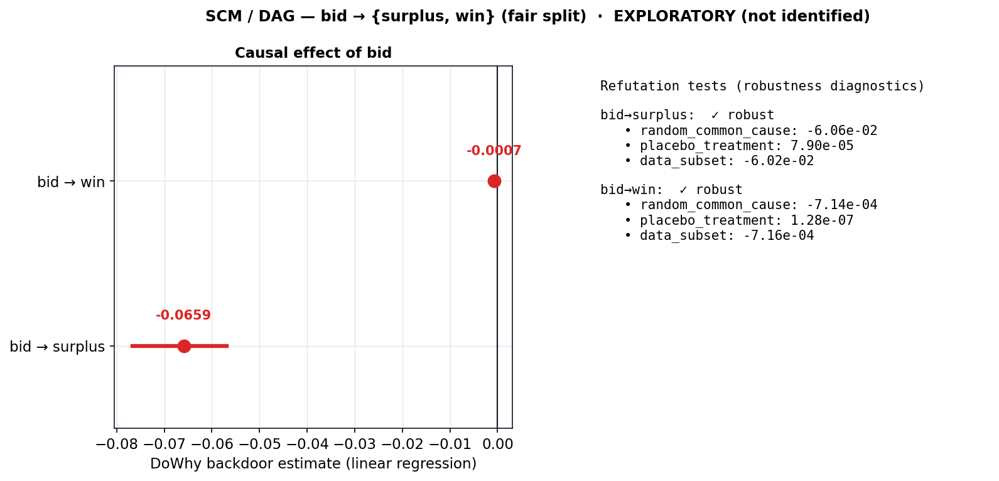
</p>

Treating bid as treatment on the fair split: a naive within-advertiser contrast gives τ_surplus **+21**
CPM (volume channel NIE −22.7, cost channel NDE +43.7) with a *negative* τ_win (−0.33) — a confounding
artifact; and a DoWhy backdoor estimate gives **bid → surplus −0.066** (CI [−0.077, −0.057]), **bid →
win −0.0007**, with all three refutation tests (random-common-cause, placebo, data-subset) **robust**.
These are **not identified causal claims** — iPinYou's flat-bid logging and won-only censoring put a
credible bid-causal estimate at the data ceiling (the P1 NO-GO of §5.5). Reported as exploratory.

## 6. Limitations

- **Won-only is a conservative lower bound** — lost inventory is untestable (P1 NO-GO above).
- **Five advertisers** is the entire shared-vocabulary population; cluster CIs are low-power by
  construction (9-advertiser eval is a dead end — the disjoint-advertiser artifact).
- **Heterogeneity** means the neural−LGB result must be read as a distribution, not a cluster mean.
- A 1.24% iPinYou data quirk (payprice > bidprice, violating second-price) is excluded as a
  data-quality finding.

## 7. Reproducibility

Portfolio figures/diagrams regenerate from committed JSONs with no training or data access:

```bash
python scripts/portfolio/make_figures.py     # results/figures/portfolio/*.png
python scripts/portfolio/make_diagrams.py     # assets/*.svg (+ .ko)
```

Stage A probes: `scripts/stage_a/{recalibrate, stage_b2_surplus, stage4_calibration,
segment_calibration, policy_value, power_analysis}.py`; machine-readable outputs in
`results/stage_a/*.json` indexed by [`results/stage_a/README.md`](../results/stage_a/README.md).

## References

- Ma et al., *Entire Space Multi-Task Model (ESMM)*, SIGIR 2018.
- Wang et al., *ESCM²: Entire Space Counterfactual Multi-Task Model*, SIGIR 2022.
- Zhang et al., *Real-Time Bidding Benchmarking with the iPinYou Dataset*.
