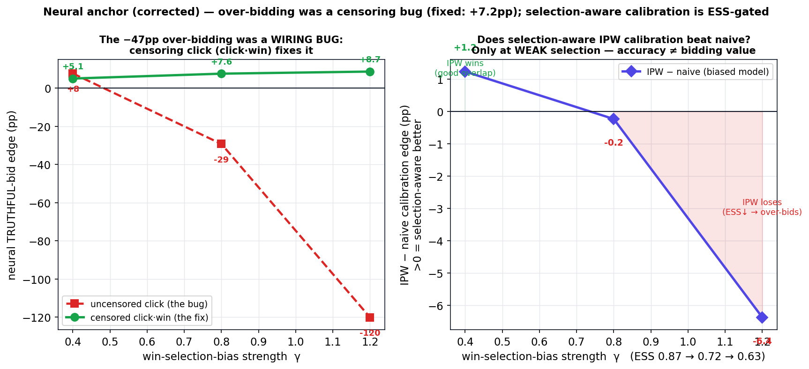

# Methods & Results — When does win-selection-bias debiasing improve the bid?

**Status:** `[sketch · 합성검증]` (semi-synthetic, observable-counterfactual). Numbers are verbatim from
`witnesses/phase_diagram.json` and `witnesses/recal_trap.json` (10 seeds). Real-world anchor = the iPinYou
study in [`old/`](old/).

> **Direction-correction (정직 기록).** An earlier version of this study reported a headline
> "debiasing edge **+24.2 pp** vs a linear competitor." That number **conflated model capacity with
> debiasing** — the debiaser was a GBM and the baseline was linear, so it mixed "a GBM out-ranks an LR"
> with "debiasing helps." This version **isolates debiasing within a fixed model class** and reports the
> capacity gap *separately*. The honest debiasing effect is much smaller (and negative in places); the
> capacity gap (**+26.3 pp**) is reported as what it is — model class, **not** debiasing.

## 1. Question & claim

RTB debiasing의 *방법*(ESMM/ESCM², win-tower-as-propensity)은 이미 확립돼 있다 (Foundation). 열려 있는 것은
**decision layer**의 질문이다:

> **win-selection-bias 보정은 *언제* 입찰(decision value / surplus)을 바꾸는가 — 그리고 단순
> recalibration은 왜 full inventory에서 역효과인가?**

핵심 주장 (falsifiable):
- **(C1) Competitor-strength governs the payoff (within capacity).** 모델 용량을 고정했을 때, IPW
  디바이어싱의 입찰 가치는 *경쟁 baseline의 강도*에 의존한다 — **약한(linear) 모델은 robust하게 돕고
  selection이 셀수록 커지지만, 강한(GBM) 모델은 돕지 못한다.**
- **(C2) Recalibration trap.** selection-biased 모델을 단순 recalibration하면 truthful 입찰가가 부풀려져
  *marginal inventory*(true value < clearing price)를 더 따내며 surplus가 **하락**한다; 원칙적 IPW
  디바이어싱은 레벨 인플레이션 없이 shape를 고친다.

## 2. Testbed (controllable, observable counterfactuals)

`witnesses/phase_diagram.py` (`make_pop`). iPinYou가 검열하는 두 가지(ground-truth pCTR, lost-inventory
결과)를 **관측 가능**하게 만든 semi-synthetic DGP:
- features x ∈ ℝ⁸; **nonlinear** ground-truth pCTR `σ(−3.9 + 1.1·xβ + 0.7 x₀x₁ + 0.6(x₂²−1) + 0.5 x₃x₄)`
  (base rate ~2%) → GBM이 linear보다 의미 있게 강함 (이 비선형성이 capacity gap의 원천 — 정직히 명시).
- **market price = lognormal, iPinYou 관측 통계로 calibration** (median 68). win-selection-bias:
  `m = exp(μ + σN + γ·z)`, `z = x·(cosθ·β + sinθ·β⊥)` → 강도 γ, 이질성 θ.
- click ~ Bernoulli(pCTR) — **모든 입찰에 대해 관측**(패찰 포함). 가치/잉여는 **expected**로 평가
  (`(pctr·CPC − m)·1[bid≥m]`) → click-sampling noise 제거.
- metric = **full-inventory decision-value regret** `(S_oracle − S_model)/S_oracle` (낮을수록 좋음).

## 3. Models — isolating debiasing from capacity

각 추정량을 **같은 capacity 안에서** 비교한다 (그래야 용량이 상쇄된다): **{linear (LogisticRegression ≈ LR),
GBM (LightGBM ≈ LGB)}**. 각 cap에서:
- biased (winners-only) · biased+recalibration (cross-fit isotonic) · **IPW** (winners-only + win-propensity
  weighting, *primary*) · **DR** (imputation + IPW pseudo-label, ESCM²-style, *secondary*).
- **within-capacity edge** ≡ `regret(biased cap) − regret(debiased cap)` — 같은 모델 클래스이므로 **용량이
  상쇄되고 디바이어싱 효과만 남는다.**
- **capacity gap** ≡ `regret(linear-biased) − regret(gbm-biased)` — "GBM이 LR을 이긴다", **디바이어싱 아님.**
  별도 보고.

## 4. Result — the within-capacity phase diagram

`phase_diagram.json:summary` (10 seeds, primary = IPW):

| | within **linear** (≈ LR) | within **GBM** (≈ LGB) |
|---|---|---|
| **IPW debiasing edge** (mean) | **+4.4 pp** | **−1.9 pp** |
| ↳ by selection strength γ=0.4 → 0.8 → 1.2 | −0.8 → +5.0 → **+8.9 pp** | (≈0 / slightly −) |
| ↳ strong-selection cell (γ=1.2, θ=0) | **+15.4 pp** | — |
| DR debiasing edge (secondary) | **−2.6 pp** (did **not** beat IPW) | −0.3 pp |
| **model CAPACITY gap** (lin-biased − gbm-biased) | **+26.3 pp** — *NOT debiasing* | — |

→ **C1 확인 (정직 버전).** 용량을 고정하면, IPW 디바이어싱은 **약한 linear 모델을 돕고**(selection이 셀수록
커져 강한 selection에서 +15.4pp), **강한 GBM 모델은 돕지 못한다**(−1.9pp). 이 비대칭은 iPinYou fair-split
결과(*robust vs LR, NOT robust vs LGB, I²=0.82*)와 **부호가 같다** — 단 실제 메커니즘(광고주 이질성)은 다르므로
"같은 방향"이라 하고 "메커니즘 동일"이라 주장하지 않는다.
→ **정직한 음성:** 더 정교한 **DR**(진짜 imputation+IPW)을 구현했으나 이 testbed에서 **IPW를 못 이겼다**(−2.6pp).
숨기지 않고 보고한다. 그리고 거대한 capacity gap(+26.3pp)은 디바이어싱이 아니라 모델 클래스 효과다.

## 5. Result — the recalibration trap

강한 selection + linear baseline (`recal_trap.json:linear_strong`, γ=1.2):

| | biased | + recalibration | debiased (IPW) | oracle |
|---|---|---|---|---|
| mean bid | 137.8 | **193.5** ↑ | 154.8 | — |
| unprofitable-win share | 0.495 | **0.509** | 0.493 | — |
| won surplus | 4.31M | **3.26M** ↓ | **5.92M** | 9.74M |

→ **C2 확인.** recalibration은 레벨을 올려 입찰가를 부풀리고(137.8→193.5), 낙찰의 더 많은 비율이
*unprofitable*(true value < price)이 되어 surplus가 **하락**(4.31M→3.26M). IPW 디바이어싱은 일괄 레벨
인플레이션 없이 shape를 고쳐 surplus를 **회복**(5.92M; oracle 9.74M의 61%, linear는 비선형 pCTR을 완전히 못
맞춤). **Robust:** 5 seeds 모두에서 recal은 surplus를 낮추고(5/5) IPW는 높였으며(5/5), recal 입찰 인플레는
평균 **+42.7%**. 강한 GBM baseline에선 trap이 약하다(`recal_trap.json:gbm_strong`: recal 8.96M→8.69M) — C1과 일관.

## 6. Neural anchor — real iPinYou features + the real ESCM²-WC

`witnesses/neural_anchor.py`. Closes the two residual critiques (Gaussian toys; the real neural model
unused) with an **iPinYou-grounded semi-synthetic**: **real feature vectors** (800K of the 90.6M-row
parquet, **29 features**), ground-truth **p\*(x) = LightGBM fit to REAL winner clicks** (base rate ~0.08),
market **lognormal fit to REAL winner payprices** (MU 3.89, SIG 0.92), selection strength γ a knob. The
debiaser is the **real ESCM²-WC** (Flax, DR loss, imported from `old/src/`) + a matching-capacity biased
tower; capacities {LR, LGB, neural}; **primary metric = truthful 2nd-price surplus** (bid = p̂·CPC).

> **2nd self-correction (a real bug, found by asking "can we fix it?").** A first pass reported the neural
> debiaser **over-bidding** under truthful bidding (edge **−47 pp**) and framed it as "restores ranking but
> overshoots calibration." Reading the ESCM²-WC loss revealed the overshoot was **mostly a wiring bug in
> the testbed, not the method**: `train_escm2wc_neural` fed *uncensored* synthetic click, but the joint-BCE
> term `BCE(p_win·p_ctr, click)` is written for the real-iPinYou contract where **click is censored to 0 on
> losses** (real data: click==0 wherever win==0). Uncensored, loser clicks inflate p_ctr (mean → 0.127).
> The pre-fix numbers are frozen in `neural_anchor.json:_meta.frozen_prefix_result` for audit.

**The fix — censor click (`click·win`).** The over-bidding disappears. The debiased pCTR no longer
overshoots (mean 0.083 → **0.064**, a slight *under*-shoot, vs the buggy 0.127), and the **neural truthful
edge becomes +7.2 pp** (was −47.2), positive in all six cells (by-γ 5.1 / 7.6 / 8.7). It is a genuine
recovery, not conservative bidding: the debiased model bids **higher** than biased and wins **more** surplus
in every cell. *Caveat:* only **n=2 neural seeds/γ** and the `p*` LGB fit is mildly non-deterministic
(~±0.3 pp run-to-run) — **trust the sign/direction; magnitudes are under-powered.**

**Can post-hoc calibration improve it further? And does the *selection-aware* IPW variant beat naive?** A
2×2 test — {biased, debiased} × {naive, IPW-weighted isotonic} (`calibrate_ipw` re-weights winners by
`1/P(win|x)` toward the marginal; naive does not). Generic calibration helps the debiased model
(+7.2 → **+11.1** IPW, **+11.2** naive). But the headline question — *does selection-awareness pay?* —
answers **no, net**, with an instructive regime structure (`summary.bias_ipw_minus_naive_by_gamma`,
edge = regret(naive) − regret(IPW), >0 ⇒ IPW better):

| IPW − naive, on the **biased** model | γ=0.4 (ESS 0.87) | γ=0.8 (0.72) | γ=1.2 (0.63) | mean |
|---|---|---|---|---|
| edge (pp) | **+1.2** ✓ | −0.2 | **−6.4** | **−1.8** |

→ IPW **does** beat naive at **weak selection / good overlap** (γ=0.4) — and it is doing its job:
IPW lifts the biased level toward the marginal (0.050 → **0.060** vs naive's **0.054**, true 0.083). But at
**strong selection / poor overlap** (ESS 0.63) its high-variance weights **over-lift → over-bid → it loses
to naive** (−6.4 pp). Net, naive ties/slightly wins (biased −1.8; debiased −0.1). **The driver is overlap
(ESS), not biased-vs-debiased** — which *revises* an earlier guess that IPW≈naive "because the model was
already debiased." Deeper lesson: a *more accurate* (level-correct) calibration is **not** a better
*bidding* calibration near the 2nd-price margin — being conservatively under-calibrated is safer. This is
the recalibration trap (C2) restated at the calibration layer: any level-raising calibration risks
over-bidding, even the principled selection-aware one. (Best-case optimal-shading edge +7.4 pp ≈ the
truthful +7.2 — no metric reversal now that the level is right.)

**C2 — recalibration trap on real features** (`summary`, truthful): still reproduces for **GBM** (recal
edge **−14.2 pp**) but not LR/neural — capacity-dependent, as before.

> Honest: `[sketch·합성검증]` on an iPinYou-GROUNDED semi-synthetic — p\*(x) a fitted surrogate, market fit
> to real payprices, selection synthesized; decision-value unmeasurable on real iPinYou (data ceiling);
> n=2 neural seeds + mild p* non-determinism ⇒ trust signs/direction, not magnitudes. Direct answers:
> **(1)** the over-bidding was a data-contract bug (censoring), not fundamental miscalibration — fixed, the
> ESCM²-WC helps (+7.2 pp). **(2)** selection-aware IPW calibration beats naive only when overlap is good
> (weak selection); it loses at strong selection and ties net — calibration *accuracy* ≠ bidding *value*.
> Numbers verbatim from `witnesses/neural_anchor.json`.

## 7. Honest scope
- `[sketch·합성검증]` — semi-synthetic. 결론은 *언제/왜*의 **특성화**이지 새 방법이 아니다.
- 헤드라인을 capacity-confound에서 **within-capacity**로 교정했고, capacity gap을 명시한다.
- 음성 영역을 보고한다: 디바이어싱은 강한 GBM을 못 이기고, DR은 IPW를 못 이겼다. 실 iPinYou anchor가 부호를 뒷받침.
- 한계·선점·확장 경로는 [`review.md`](review.md). 정본 수치는 `witnesses/*.json`, 재현은 [`repro/`](repro/).
